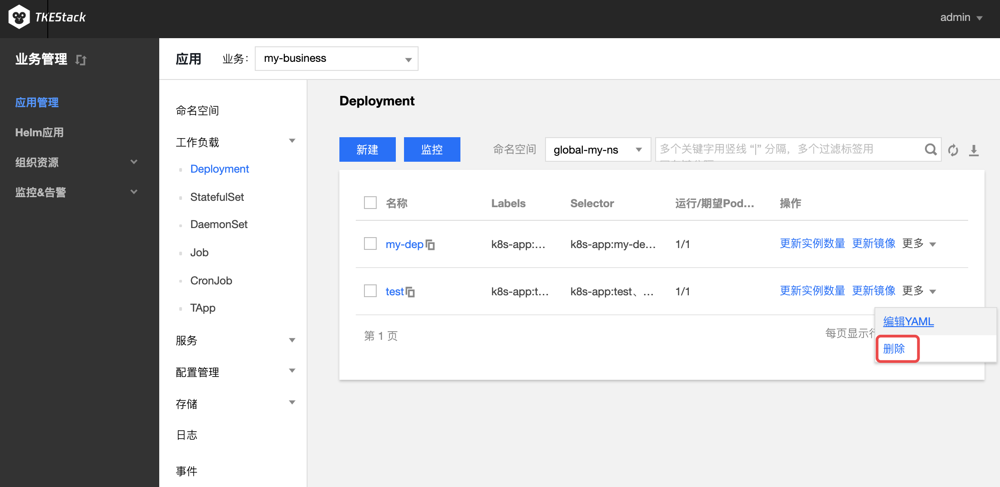
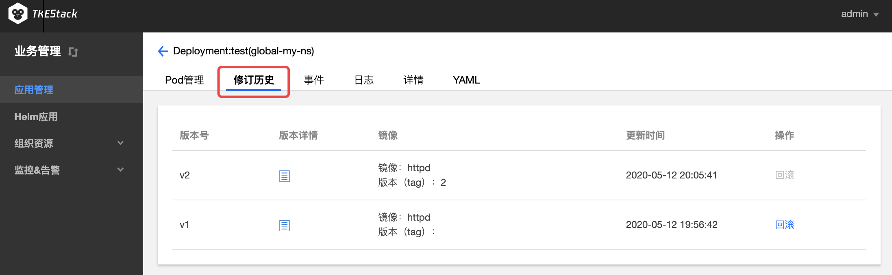
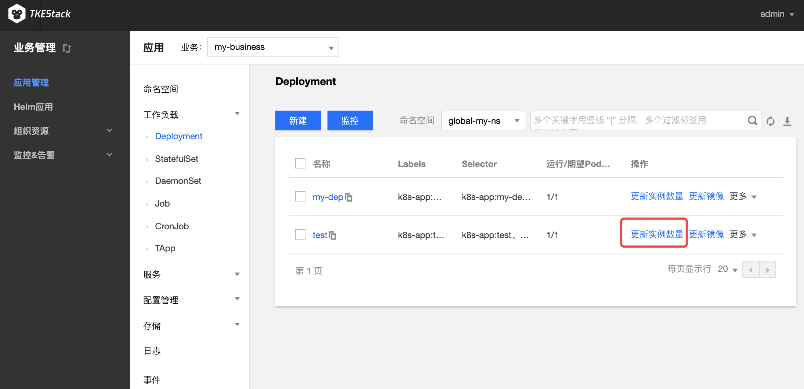

# Deployment

Deployment 声明了 Pod 的模板和控制 Pod 的运行策略，适用于部署无状态的应用程序。您可以根据业务需求，对 Deployment 中运行的 Pod 的副本数、调度策略、更新策略等进行声明。

## Deployment 控制台操作指引

<span id="creatDeployment"></span>
### 创建 Deployment
1. 登录TKEStack，切换到【业务管理】控制台，选择左侧导航栏中的【应用管理】。
2. 选择需要创建Deployment的【业务】下相应的【命名空间】，展开【工作负载】下拉项，进入【Deployment】管理页面。如下图所示：
   
3. 单击【新建】，进入 “新建Workload” 页面。根据实际需求，设置 Deployment 参数。关键参数信息如下，其中必填项为**工作负载名**、**实例内容器的名称和镜像**：
 - **工作负载名**：输入自定义名称。

 - **标签**：给工作负载添加标签

 - **命名空间**：根据实际需求进行选择。

 - **类型**：选择【Deployment（可扩展的部署 Pod）】。

 - **数据卷**：根据需求，为负载添加数据卷为容器提供存，目前支持临时路径、主机路径、云硬盘数据卷、文件存储NFS、配置文件、PVC，还需挂载到容器的指定路径中
   - **临时目录**：主机上的一个临时目录，生命周期和Pod一致
   - **主机路径**：主机上的真实路径，可以重复使用，不会随Pod一起销毁
   - **NFS盘**：挂载外部NFS到Pod，用户需要指定相应NFS地址，格式：127.0.0.1:/data
   - **ConfigMap**：用户在业务Namespace下创建的[ConfigMap](../configurations/ConfigMap.md)
   - **Secret**：用户在业务namespace下创建的[Secret](../configurations/Secret.md)
   - **PVC**：用户在业务namespace下创建的[PVC](../storage/persistent-volume-claim.md)
   
 - **实例内容器**：根据实际需求，为 Deployment 的一个 Pod 设置一个或多个不同的容器。
   
    - **名称**：自定义
    - **镜像**：根据实际需求进行选择
      - **镜像版本（Tag）**：根据实际需求进行填写，不填默认为`latest`
      - **CPU/内存限制**：可根据 [Kubernetes 资源限制](https://kubernetes.io/docs/concepts/configuration/manage-compute-resources-container/) 进行设置 CPU 和内存的限制范围，提高业务的健壮性（**建议使用默认值**）
      - **GPU限制**：如容器内需要使用GPU，此处填GPU需求
      - **环境变量**：用于设置容器内的变量，变量名只能包含大小写字母、数字及下划线，并且不能以数字开头
       * **新增变量**：自己设定变量键值对
       * **引用ConfigMap/Secret**：引用已有键值对
      - **高级设置**：可设置 “**工作目录**”、“**运行命令**”、“**运行参数**”、“**镜像更新策略**”、“**容器健康检查**”和“**特权级**”等参数。这里介绍一下镜像更新策略。
       * **镜像更新策略**：提供以下3种策略，请按需选择
         若不设置镜像拉取策略，当镜像版本为空或 `latest` 时，使用 Always 策略，否则使用 IfNotPresent 策略
         * **Always**：总是从远程拉取该镜像
         * **IfNotPresent**：默认使用本地镜像，若本地无该镜像则远程拉取该镜像
         * **Never**：只使用本地镜像，若本地没有该镜像将报异常
    
 - **实例数量**：根据实际需求选择调节方式，设置实例数量。
   - **手动调节**：直接设定实例个数
   - **自动调节**：根据设定的触发条件自动调节实例个数，目前支持根据CPU、内存利用率和利用量出入带宽等调节实例个数
   
 - **定时调节**：根据Crontab 语法周期性设置实例个数

 - **imagePullSecrets**：镜像拉取密钥，用于拉取用户的私有镜像

 - **节点调度策略**：根据配置的调度规则，将Pod调度到预期的节点。支持指定节点调度和条件选择调度

 - **注释（Annotations）**：给Deployment添加相应Annotation，如用户信息等

 - **网络模式**：选择Pod网络模式
    * **OverLay（虚拟网络）**：基于 IPIP 和 Host Gateway 的 Overlay 网络方案
    * **FloatingIP（浮动 IP）**：支持容器、物理机和虚拟机在同一个扁平面中直接通过IP进行通信的 Underlay 网络方案。提供了 IP 漂移能力，支持 Pod 重启或迁移时 IP 不变
    * **NAT（端口映射）**：Kubernetes 原生 NAT 网络方案
    * **Host（主机网络）**：Kubernetes 原生 Host 网络方案
    
 - **Service**：勾选【启用】按钮，配置负载端口访问

   > 注意：如果不勾选【启用】则不会创建Service

- **服务访问方式**：选择是【仅在集群内部访问】该负载还是集群外部通过【主机端口访问】该负载

    - **仅在集群内访问**：使用 Service 的 ClusterIP 模式，自动分配 Service 网段中的 IP，用于集群内访问。数据库类等服务如 MySQL 可以选择集群内访问，以保证服务网络隔离
    - **主机端口访问**：提供一个主机端口映射到容器的访问方式，支持 TCP、UDP、Ingress。可用于业务定制上层 LB 转发到 Node
    - **Headless Service**：不创建用于集群内访问的ClusterIP，访问Service名称时返回后端Pods IP地址，用于适配自有的服务发现机制。解析域名时返回相应 Pod IP 而不是 Cluster IP

- **端口映射**：输入负载要暴露的端口并指定通信协议类型（**容器和服务端口建议都使用80**）

- **Session Affinity:** 点击【显示高级设置】出现，会话保持，设置会话保持后，会根据请求IP把请求转发给这个IP之前访问过的Pod。默认None，按需使用
4. 单击【创建Workload】，完成创建。如下图所示：
当“运行/期望Pod数量”相等时，即表示 Deployment 下的所有 Pod 已创建完成。
    

### 更新 Deployment

#### 更新 YAML
1. 登录TKEStack，切换到【业务管理】控制台，选择左侧导航栏中的【应用管理】。 
2. 选择需要更新的【业务】下相应的【命名空间】，展开【工作负载】列表，进入【Deployment】管理页面。如下图所示：
   
3. 在需要更新 YAML 的 Deployment 行中，单击【更多】>【编辑YAML】，进入“更新 Deployment” 页面。如下图所示：
   
4. 在 “更新Deployment” 页面，编辑 YAML，单击【完成】，即可更新 YAML。如下图所示：


### 回滚 Deployment
1. 登录 TKEStack，切换到【业务管理】控制台，选择左侧导航栏中的【应用管理】。
2. 选择要变更的业务下相应的【命名空间】，展开【工作负载】列表，进入【 Deployment】 管理页面，点击进入要回滚的 Deployment 详情页面，单击【修订历史】。如下图所示：
   
3. 选择合适版本进行回顾。
4. 在弹出的 “回滚资源” 提示框中，单击【确定】即可完成回滚。

### 调整 Pod 数量
1. 登录 TKEStack，切换到【业务管理】控制台，选择左侧导航栏中的【应用管理】。
2. 选择要变更的业务下相应的命名空间，展开工作负载列表，进入 Deployment 管理页面。
3. 点击 Deployment 列表操作栏的【更新实例数量】按钮。如下图所示：
   
4. 根据实际需求调整 Pod 数量，单击【更新实例数目】即可完成调整。

### 查看Deployment监控数据
1. 登录 TKEStack，切换到【业务管理】控制台，选择左侧导航栏中的【应用管理】，。
2. 选择要变更的业务下相应的【命名空间】，点击进入 【Deployment】 管理页面。
3. 单击【监控】按钮，在弹出的工作负载监控页面选择工作负载查看监控信息。如下图所示：
   

## Kubectl 操作 Deployment 指引

### YAML 示例
```Yaml
apiVersion: apps/v1beta2
kind: Deployment
metadata:
  name: nginx-deployment
  namespace: default
  labels:
    app: nginx-deployment
spec:
  replicas: 3
  selector:
    matchLabels:
      app: nginx-deployment
  template:
    metadata:
      labels:
        app: nginx-deployment
    spec:
      containers:
      - name: nginx
        image: nginx:latest
        ports:
        - containerPort: 80
```
- **kind**：标识 Deployment 资源类型。
- **metadata**：Deployment 的名称、Namespace、Label 等基本信息。
- **metadata.annotations**：对 Deployment 的额外说明，可通过该参数设置腾讯云 TKE 的额外增强能力。
- **spec.replicas**：Deployment 管理的 Pod 数量。
- **spec.selector**：Deployment 管理 Seletor 选中的 Pod 的 Label。
- **spec.template**：Deployment 管理的 Pod 的详细模板配置。

更多参数详情可查看 [Kubernetes Deployment 官方文档](https://kubernetes.io/docs/concepts/workloads/controllers/deployment/)。

### Kubectl 创建 Deployment

1. 参考 [YAML 示例](#YAMLSample)，准备 Deployment YAML 文件。
2. 安装 Kubectl，并连接集群。操作详情请参考 [通过 Kubectl 连接集群](https://cloud.tencent.com/document/product/457/8438)。
3. 执行以下命令，创建 Deployment YAML 文件。
```shell
kubectl create -f 【Deployment YAML 文件名称】
```
例如，创建一个文件名为 nginx.Yaml 的 Deployment YAML 文件，则执行以下命令：
```shell
kubectl create -f nginx.yaml
```
4. 执行以下命令，验证创建是否成功。
```shell
kubectl get deployments
```
返回类似以下信息，即表示创建成功。
```
NAME             DESIRED   CURRENT   UP-TO-DATE   AVAILABLE   AGE
first-workload   1         1         1            0           6h
ng               1         1         1            1           42m
```

### Kubectl 更新 Deployment

通过 Kubectl 更新 Deployment 有以下三种方法。其中，[方法一](#方法一) 和 [方法二](#方法二) 均支持 **Recreate** 和 **RollingUpdate** 两种更新策略。
- Recreate 更新策略为先销毁全部 Pod，再重新创建 Deployment。
- RollingUpdate 更新策略为滚动更新策略，逐个更新 Deployment 的 Pod。RollingUpdate 还支持暂停、设置更新时间间隔等。

<span id="Method1"></span>
#### 方法一

执行以下命令，更新 Deployment。
```
kubectl edit  deployment/【name】
```
此方法适用于简单的调试验证，不建议在生产环境中直接使用。您可以通过此方法更新任意的 Deployment 参数。

<span id="Method2"></span>
#### 方法二

执行以下命令，更新指定容器的镜像。
```
kubectl set image deployment/【name】 【containerName】=【image:tag】
```
建议保持 Deployment 的其他参数不变，业务更新时，仅更新容器镜像。

<span id="Method3"></span>

#### 方法三

执行以下命令，滚动更新指定资源。
```
kubectl rolling-update 【NAME】 -f 【FILE】
```

### Kubectl 回滚 Deployment

1. 执行以下命令，查看 Deployment 的更新历史。
```
kubectl rollout history deployment/【name】
```
2. 执行以下命令，查看指定版本详情。
```
kubectl rollout history deployment/【name】 --revision=【REVISION】
```
3. 执行以下命令，回滚到前一个版本。
```
kubectl rollout undo deployment/【name】
```
如需指定回滚版本号，可执行以下命令。
```
kubectl rollout undo deployment/【name】 --to-revision=【REVISION】
```

### Kubectl 调整 Pod 数量

#### 手动更新 Pod 数量

执行以下命令，手动更新 Pod 数量。
```
kubectl scale deployment 【NAME】 --replicas=【NUMBER】
```

#### 自动更新 Pod 数量

**前提条件**

开启集群中的 HPA 功能。TKE 创建的集群默认开启 HPA 功能。

**操作步骤**

执行以下命令，设置 Deployment 的自动扩缩容。
```
kubectl autoscale deployment 【NAME】 --min=10 --max=15 --cpu-percent=80
```

### Kubectl 删除 Deployment

执行以下命令，删除 Deployment。
```
kubectl delete deployment 【NAME】
```