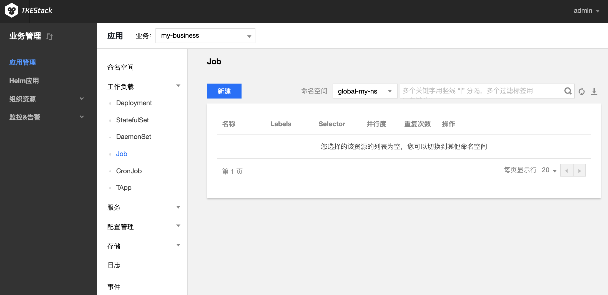

# Job

Job 控制器会创建 1-N 个 Pod，这些 Pod 按照运行规则运行，直至运行结束。Job 可用于批量计算、数据分析等场景。通过设置重复执行次数、并行度、重启策略等满足业务述求。
Job 执行完成后，不再创建新的 Pod，也不会删除 Pod，您可在 “日志” 中查看已完成的 Pod 的日志。如果您删除了 Job，Job 创建的 Pod 也会同时被删除，将查看不到该 Job 创建的 Pod 的日志。

## Job 控制台操作指引

### 创建 Job

1. 登录TKEStack，切换到【业务管理】控制台，选择左侧导航栏中的【应用管理】。
2. 选择需要创建 Job 的【业务】下相应的【命名空间】，展开【工作负载】下拉项，进入【 Job】 管理页面。
3. 单击【新建】，进入 “新建Workload” 页面。如下图所示：

4. 根据实际需求，设置 Job 参数。关键参数信息如下：
 - **工作负载名**：输入自定义名称。
 - **标签**：给工作负载添加标签
 - **命名空间**：根据实际需求进行选择。
 - **类型**：选择【Job（单次任务）】。
 - **Job设置**
    - **重复执行次数**：Job 管理的 Pod 需要重复执行的次数。
    - **并行度**：Job 并行执行的 Pod 数量。
    - **失败重启策略**：Pod下容器异常推出后的重启策略。
        - **Never**：不重启容器，直至 Pod 下所有容器退出。
        - **OnFailure**：Pod 继续运行，容器将重新启动。
 - **数据卷**：根据需求，为负载添加数据卷为容器提供存，目前支持临时路径、主机路径、云硬盘数据卷、文件存储NFS、配置文件、PVC，还需挂载到容器的指定路径中
   - **临时目录**：主机上的一个临时目录，生命周期和Pod一致
   - **主机路径**：主机上的真实路径，可以重复使用，不会随Pod一起销毁
   - **NFS盘**：挂载外部 NFS 到 Pod，用户需要指定相应 NFS 地址，格式：127.0.0.1:/data
   - **ConfigMap**：用户在业务Namespace下创建的[ConfigMap](../configurations/ConfigMap.md)
   - **Secret**：用户在业务namespace下创建的[Secret](../configurations/Secret.md)
   - **PVC**：用户在业务namespace下创建的[PVC](../storage/persistent-volume-claim.md)
 - **实例内容器**：根据实际需求，为 Job 的一个 Pod 设置一个或多个不同的容器。
    - **名称**：自定义。
    - **镜像**：根据实际需求进行选择。
    - **镜像版本（Tag）**：根据实际需求进行填写。
    - **CPU/内存限制**：可根据 [Kubernetes 资源限制](https://kubernetes.io/docs/concepts/configuration/manage-compute-resources-container/) 进行设置 CPU 和内存的限制范围，提高业务的健壮性。
    - **GPU限制**：如容器内需要使用GPU，此处填GPU需求
    - **环境变量**：用于设置容器内的变量，变量名只能包含大小写字母、数字及下划线，并且不能以数字开头
       * **新增变量**：自己设定变量键值对
       * **引用ConfigMap/Secret**：引用已有键值对
      - **高级设置**：可设置 “**工作目录**”、“**运行命令**”、“**运行参数**”、“**镜像更新策略**”、“**容器健康检查**”和“**特权级**”等参数。这里介绍一下镜像更新策略。
       * **镜像更新策略**：提供以下3种策略，请按需选择
         若不设置镜像拉取策略，当镜像版本为空或 `latest` 时，使用 Always 策略，否则使用 IfNotPresent 策略
         * **Always**：总是从远程拉取该镜像
         * **IfNotPresent**：默认使用本地镜像，若本地无该镜像则远程拉取该镜像
         * **Never**：只使用本地镜像，若本地没有该镜像将报异常
 - **imagePullSecrets**：镜像拉取密钥，用于拉取用户的私有镜像
 - **节点调度策略**：根据配置的调度规则，将Pod调度到预期的节点。支持指定节点调度和条件选择调度
 - **注释（Annotations）**：给Pod添加相应Annotation，如用户信息等
 - **网络模式**：选择Pod网络模式
    * **OverLay（虚拟网络）**：基于 IPIP 和 Host Gateway 的 Overlay 网络方案
    * **FloatingIP（浮动 IP）**：支持容器、物理机和虚拟机在同一个扁平面中直接通过IP进行通信的 Underlay 网络方案。提供了 IP 漂移能力，支持 Pod 重启或迁移时 IP 不变
    * **NAT（端口映射）**：Kubernetes 原生 NAT 网络方案
    * **Host（主机网络）**：Kubernetes 原生 Host 网络方案
 - 单击【创建Workload】，完成创建。
### 查看 Job 状态

1. 登录 TKEStack，切换到【业务管理】控制台，选择左侧导航栏中的【应用管理】。
2. 选择需要创建 Job 的业务下相应的【命名空间】，展开【工作负载】下拉项，进入【 Job 】管理页面。
3. 单击需要查看状态的【 Job 名称】，即可查看 Job 详情。

### 删除 Job

Job 执行完成后，不再创建新的 Pod，也不会删除 Pod，您可在【业务管理】控制台下的【应用管理】下的 【日志】 中查看已完成的 Pod 的日志。如果您删除了 Job，Job 创建的 Pod 也会同时被删除，将查看不到该 Job 创建的 Pod 的日志。

## Kubectl 操作 Job 指引

### YAML 示例

```Yaml
apiVersion: batch/v1
kind: Job
metadata:
  name: pi
spec:
  completions: 2
  parallelism: 2
  template:
    spec:
      containers:
      - name: pi
        image: perl
        command: ["perl",  "-Mbignum=bpi", "-wle", "print bpi(2000)"]
      restartPolicy: Never
  backoffLimit: 4
```
- kind：标识 Job 资源类型。
- metadata：Job 的名称、Label等基本信息。
- metadata.annotations：Job 的额外说明，可通过该参数设置腾讯云 TKE 的额外增强能力。
- spec.completions：Job 管理的 Pod 重复执行次数。
- spec.parallelism：Job 并行执行的 Pod 数。
- spec.template：Job 管理的 Pod 的详细模板配置。

### 创建 Job

1. 参考 [YAML 示例](#YAMLSample)，准备 Job YAML 文件。
2. 安装 Kubectl，并连接集群。操作详情请参考 [通过 Kubectl 连接集群](https://cloud.tencent.com/document/product/457/8438)。
3. 创建 Job YAML 文件。
```
kubectl create -f Job YAML 文件名称
```
例如，创建一个文件名为 pi.yaml 的 Job YAML 文件，则执行以下命令：
```shell
kubectl create -f pi.yaml
```
4. 执行以下命令，验证创建是否成功。
```shell
kubectl get job
```
返回类似以下信息，即表示创建成功。
```
NAME      DESIRED   SUCCESSFUL   AGE
job       1         0            1m
```

### 删除 Job

执行以下命令，删除 Job。
```
kubectl delete job [NAME]
```