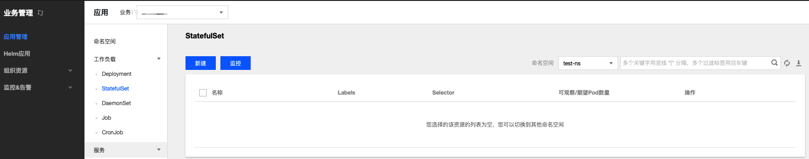

## 简介

StatefulSet 主要用于管理有状态的应用，创建的 Pod 拥有根据规范创建的持久型标识符。Pod 迁移或销毁重启后，标识符仍会保留。 在需要持久化存储时，您可以通过标识符对存储卷进行一一对应。如果应用程序不需要持久的标识符，建议您使用 Deployment 部署应用程序。

## StatefulSet 控制台操作指引


### 创建 StatefulSet<span id="createStatefulSet"></span>
1. 登录TKEStack，切换到业务管理控制台，选择左侧导航栏中的【应用管理】。
2. 选择需要创建StatefulSet的业务下相应的命名空间，展开工作负载下拉项，进入StatefulSet管理页面。如下图所示：
   
3. 单击【新建】，进入 “新建Workload” 页面。
根据实际需求，设置 StatefulSet 参数。关键参数信息如下：
 - **工作负载名**：输入自定义名称。
 - **标签**：给工作负载添加标签
 - **命名空间**：根据实际需求进行选择。
 - **类型**：选择【StatefulSet（有状态集的运行Pod）】。
 - **数据卷**：根据需求，为负载添加数据卷为容器提供存，目前支持临时路径、主机路径、云硬盘数据卷、文件存储NFS、配置文件、PVC，还需挂载到容器的指定路径中
   - **临时目录**：主机上的一个临时目录，生命周期和Pod一致
   - **主机路径**：主机上的真实路径，可以重复使用，不会随Pod一起销毁
   - **NFS盘**：挂载外部NFS到Pod，用户需要指定相应NFS地址，格式：127.0.0.1:/data
   - **ConfigMap**：用户在业务Namespace下创建的[ConfigMap](../configurations/ConfigMap.md)
   - **Secret**：用户在业务namespace下创建的[Secret](../configurations/Secret.md)
   - **PVC**：用户在业务namespace下创建的[PVC](../storage/persistent-volume-claim.md)
 - **实例内容器**：根据实际需求，为 StatefulSet 的一个 Pod 设置一个或多个不同的容器。
    - **名称**：自定义。
    - **镜像**：根据实际需求进行选择。
    - **镜像版本（Tag）**：根据实际需求进行填写。
    - **CPU/内存限制**：可根据 [Kubernetes 资源限制](https://kubernetes.io/docs/concepts/configuration/manage-compute-resources-container/) 进行设置 CPU 和内存的限制范围，提高业务的健壮性。
    - **GPU限制**：如容器内需要使用GPU，此处填GPU需求
    - **镜像拉取策略**：提供以下3种策略，请按需选择。
       若不设置镜像拉取策略，当镜像版本为空或 `latest` 时，使用 Always 策略，否则使用 IfNotPresent 策略。
         - **Always**：总是从远程拉取该镜像。
         - **IfNotPresent**：默认使用本地镜像，若本地无该镜像则远程拉取该镜像。
         - **Never**：只使用本地镜像，若本地没有该镜像将报异常。
    - **高级设置**：可设置 “**工作目录**”、“**运行命令**”、“**运行参数**”、“**容器健康检查**”和“**特权级**”等参数。
 - **实例数量**：根据实际需求选择调节方式，设置实例数量。
   - **手动调节**：直接设定实例个数
   - **自动调节**：根据设定的触发条件自动调节实例个数，目前支持根据CPU、内存利用率和利用量出入带宽等调节实例个数
 - **定时调节**：根据Crontab 语法周期性设置实例个数
 - **imagePullSecrets**：镜像拉取密钥，用于拉取用户的私有镜像
 - **节点调度策略**：根据配置的调度规则，将Pod调度到预期的节点。支持指定节点调度和条件选择调度
 - **注释（Annotations）**：给Pod添加相应Annotation，如用户信息等
 - **网络模式**：选择Pod网络模式
    * **OverLay（虚拟网络）**：基于 IPIP 和 Host Gateway 的 Overlay 网络方案
    * **FloatingIP（浮动 IP）**：支持容器、物理机和虚拟机在同一个扁平面中直接通过IP进行通信的 Underlay 网络方案。提供了 IP 漂移能力，支持 Pod 重启或迁移时 IP 不变
    * **NAT（端口映射）**：Kubernetes 原生 NAT 网络方案
    * **Host（主机网络）**：Kubernetes 原生 Host 网络方案
 - **访问设置（Service）**：勾选【启用】按钮，配置负载端口访问
   - **服务访问方式**：选择是在集群内部访问该负载还是集群外部访问负载
     - **Headless Service**：解析域名时返回相应Pod IP而不是Cluster IP
   - **端口映射**：输入负载要暴露的端口并指定通信协议类型
   - **Session Affinity**：会话保持，设置会话保持后，会根据请求IP把请求转发给这个IP之前访问过的Pod。
4. 单击【创建Workload】，完成创建。

### 更新 StatefulSet

#### 更新 YAML
1. 登录TKEStack，切换到业务管理控制台，选择左侧导航栏中的【应用管理】。
2. 选择需要更新的业务下相应的命名空间，展开工作负载列表，进入StatefulSet管理页面。
3. 在需要更新 YAML 的 StatefulSet 行中，选择【更多】>【编辑YAML】，进入更新 StatefulSet 页面。
4. 在 “更新StatefulSet” 页面编辑 YAML，并单击【完成】即可更新 YAML。

## Kubectl 操作 StatefulSet 指引


### YAML 示例<span id="YAMLSample"></span>

```Yaml
apiVersion: v1
kind: Service  ## 创建一个 Headless Service，用于控制网络域
metadata:
  name: nginx
  namespace: default
  labels:
    app: nginx
spec:
  ports:
  - port: 80
    name: web
  clusterIP: None
  selector:
    app: nginx
---
apiVersion: apps/v1
kind: StatefulSet ### 创建一个 Nginx的StatefulSet
metadata:
  name: web
  namespace: default
spec:
  selector:
    matchLabels:
      app: nginx
  serviceName: "nginx"
  replicas: 3 # by default is 1
  template:
    metadata:
      labels:
        app: nginx
    spec:
      terminationGracePeriodSeconds: 10
      containers:
      - name: nginx
        image: nginx:latest
        ports:
        - containerPort: 80
          name: web
        volumeMounts:
        - name: www
          mountPath: /usr/share/nginx/html
  volumeClaimTemplates:
  - metadata:
      name: www
    spec:
      accessModes: [ "ReadWriteOnce" ]
      storageClassName: "cbs"
      resources:
        requests:
          storage: 10Gi
```
- **kind**：标识 StatefulSet 资源类型。
- **metadata**：StatefulSet 的名称、Label等基本信息。
- **metadata.annotations**：对 StatefulSet 的额外说明，可通过该参数设置腾讯云 TKE 的额外增强能力。
- **spec.template**：StatefulSet 管理的 Pod 的详细模板配置。
- **spec.volumeClaimTemplates**：提供创建 PVC&PV 的模板。

更多参数详情可查看 [Kubernetes StatefulSet 官方文档](https://kubernetes.io/docs/concepts/workloads/controllers/statefulset/)。

### 创建 StatefulSet

1. 参考 [YAML 示例](#YAMLSample)，准备 StatefulSet YAML 文件。
2. 安装 Kubectl，并连接集群。操作详情请参考 [通过 Kubectl 连接集群](https://cloud.tencent.com/document/product/457/8438)。
3. 执行以下命令，创建 StatefulSet YAML 文件。
```shell
kubectl create -f StatefulSet YAML 文件名称
```
例如，创建一个文件名为 web.yaml 的 StatefulSet YAML 文件，则执行以下命令：
```shell
kubectl create -f web.yaml
```
4. 执行以下命令，验证创建是否成功。
```shell
kubectl get StatefulSet
```
返回类似以下信息，即表示创建成功。
```
NAME      DESIRED   CURRENT   AGE
test      1         1         10s
```

### 更新 StatefulSet

执行以下命令，查看 StatefulSet 的更新策略类型。
```
kubectl get ds/<daemonset-name> -o go-template='{{.spec.updateStrategy.type}}{{"\n"}}'
```
StatefulSet 有以下两种更新策略类型：
- OnDelete：默认更新策略。该更新策略在更新 StatefulSet 后，需手动删除旧的 StatefulSet Pod 才会创建新的 StatefulSet Pod。
- RollingUpdate：支持 Kubernetes 1.7或更高版本。该更新策略在更新 StatefulSet 模板后，旧的 StatefulSet Pod 将被终止，并且以滚动更新方式创建新的 StatefulSet Pod（Kubernetes 1.7或更高版本）。

#### 方法一

执行以下命令，更新 StatefulSet。
```
kubectl edit StatefulSet/[name]
```
此方法适用于简单的调试验证，不建议在生产环境中直接使用。您可以通过此方法更新任意的 StatefulSet 参数。

#### 方法二

执行以下命令，更新指定容器的镜像。
```
kubectl patch statefulset <NAME> --type='json' -p='[{"op": "replace", "path": "/spec/template/spec/containers/0/image", "value":"<newImage>"}]'
```
建议保持 StatefulSet 的其他参数不变，业务更新时，仅更新容器镜像。

如果更新的 StatefulSet 是滚动更新方式的策略，可执行以下命令查看更新状态：
```
kubectl rollout status sts/<StatefulSet-name>
```

### 删除 StatefulSet

执行以下命令，删除 StatefulSet。
```
kubectl delete  StatefulSet [NAME] --cascade=false
```
--cascade=false 参数表示 Kubernetes 仅删除 StatefulSet，且不删除任何 Pod。如需删除 Pod，则执行以下命令：
```
kubectl delete  StatefulSet [NAME]
```
更多 StatefulSet 相关操作可查看 [Kubernetes官方指引](https://kubernetes.io/docs/tutorials/stateful-application/basic-stateful-set/#scaling-a-statefulset)。