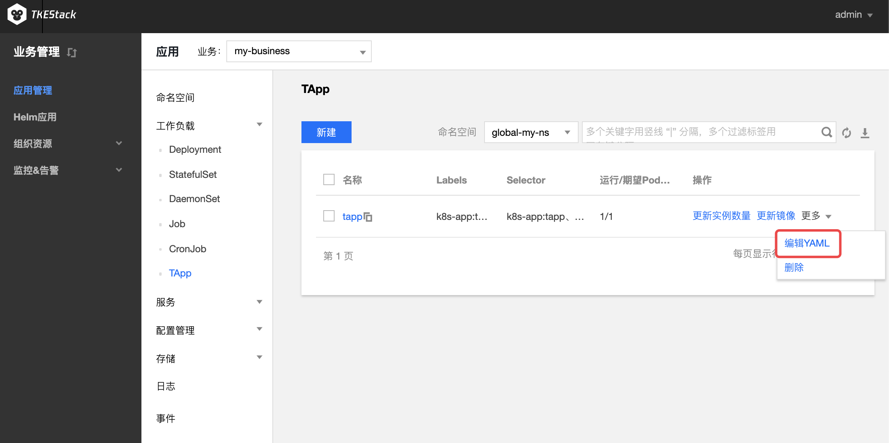

# TApp

Kubernetes 现有应用类型（如：Deployment、StatefulSet 等）无法满足很多非微服务应用的需求。比如：操作（升级、停止等）应用中的指定 pod；应用支持多版本的 pod。如果要将这些应用改造为适合于这些workload的应用，需要花费很大精力，这将使大多数用户望而却步。

为解决上述复杂应用管理场景，TKEStack 基于 Kubernetes CRD 开发了一种新的应用类型 TAPP，它是一种通用类型的 Workload，同时支持 service 和 batch 类型作业，满足绝大部分应用场景，它能让用户更好的将应用迁移到 Kubernetes 集群。

查询 [TApp](../../../../features/tapp.md) 可查看更多相关信息

## 创建 TApp

> 注意：使用前提，在[【扩展组件】](../../../platform/extender.md)安装TApp

1. 登录 TKEStack，切换到【业务管理】控制台，选择左侧导航栏中的【应用管理】
2. 选择需要创建 TApp 的【业务】下相应的【命名空间】，展开【工作负载】下拉项，进入【TApp】管理页面，如下图所示：
   
3. 单击【新建】，进入 “新建Workload” 页面。根据实际需求，设置 TApp 参数。关键参数信息如下，其中必填项为**工作负载名**、**实例内容器的名称和镜像**
   - **工作负载名**：输入自定义名称
   - **描述**：给工作负载添加描述
   - **标签**：给工作负载添加标签
   - **命名空间**：根据实际需求进行选择
   - **类型**：选择【TApp（可对指定pod进行删除、原地升级、独立挂盘等）】
   
   - **数据卷（选填）**：为容器提供存储，目前支持临时路径、主机路径、云硬盘数据卷、文件存储 NFS、配置文件、PVC，还需挂载到容器的指定路径中。如需指定容器挂载至指定路径时，单击【添加数据卷】
      > **数据卷的名称**：给数据卷一个名称，以方便容器使用数据卷
      * **临时目录**：主机上的一个临时目录，生命周期和 Pod 一致
      * **主机路径**：主机上的真实路径，可以重复使用，不会随 Pod 一起销毁
      * **NFS盘**：挂载外部 NFS 到 Pod，用户需要指定相应 NFS 地址，格式：127.0.0.1:/data。请确保节点当中已经安装 nfs-utils 包，才可正常使用 NFS 数据盘
      * **ConfigMap**：用户选择在业务 Namespace 下的 [ConfigMap](../products/business-control-pannel/application/configurations/ConfigMap.md)
      * **Secret**：用户选择在业务 Namespace 下的 [Secret](../products/business-control-pannel/application/configurations/secret.md)
      * **PVC**：用户选择在业务 Namespace 下的 [PVC](../products/business-control-pannel/application/storage/persistent-volume-claim.md)
   
   - **实例内容器**：根据实际需求，为 TApp 的 Pod 设置一个或多个不同的容器，如下图所示：
      
      * **名称**：自定义，这里以`my-container`为例
      * **镜像**：根据实际需求进行选择，这里以`nginx`为例
      * **镜像版本（Tag）**：根据实际需求进行填写，不填默认为`latest`
      * **CPU/内存限制**：可根据 [Kubernetes 资源限制](https://kubernetes.io/docs/concepts/configuration/manage-compute-resources-container/) 进行设置 CPU 和内存的限制范围，提高业务的健壮性（**建议使用默认值**）
         * Request 用于预分配资源,当集群中的节点没有request所要求的资源数量时，容器会创建失败
         * Limit 用于设置容器使用资源的最大上限,避免异常情况下节点资源消耗过多
      * **GPU 限制**：如容器内需要使用 GPU，此处填 GPU 需求
         
         > 前提：节点有 GPU，并安装了 GPU 组件
      * **环境变量**：用于设置容器内的变量，变量名只能包含大小写字母、数字及下划线，并且不能以数字开头
         * **自定义**：自己设定变量键值对
         * **引用 ConfigMap/Secret**：引用已有键值对
         * **Field**：自己设定变量名，变量值从负载的 YAML 文件中获取 metadata、spec、status数值
         * **ResourceFiled**：自己设定变量名，变量值从负载的 YAML 文件中获取 limit 和 request 数值
      
      * **高级设置**：可设置 “**工作目录**”、“**运行命令**”、“**运行参数**”、“**镜像更新策略**”、“**容器健康检查**”和“**特权级**”等参数。（按需使用）
         * **工作目录**：指定容器运行后的工作目录
         * **日志目录**：指定容器运行后的[日志目录](../../../../products/business-control-pannel/operation/logcollect.md/#指定容器运行后的日志目录)
            > 1. 需要首先启用集群的 [日志采集](../../../platform/cluster.md#基本信息) 功能
            > 2. 需要在创建应用时挂载数据盘
         * **运行命令**：控制容器运行的输入命令，这里可以输入多条命令，注意每个命令单独一行
          * **运行参数**：传递给容器运行命令的输入参数，这里可以输入多条参数，注意每个参数单独一行
         * **镜像更新策略**：提供以下3种策略，请按需选择，若不设置镜像拉取策略，当镜像版本为空或 `latest` 时，使用 Always 策略，否则使用 IfNotPresent 策略
            * **Always**：总是从远程拉取该镜像
            * **IfNotPresent**：默认使用本地镜像，若本地无该镜像则远程拉取该镜像
            * **Never**：只使用本地镜像，若本地没有该镜像将报异常
         * **容器健康检查**
            * **存活检查**：检查容器是否正常，不正常则重启实例。对于多活无状态的应用采用了存活探针 TCP 探测方式。存活探针组件包括 Gate、Keystone、Webshell、Nginx、Memcache 当连续探测容器端口不通，探针失败时，杀掉容器并重启。
            * **就绪检查**：检查容器是否就绪，不就绪则停止转发流量到当前实例。对于一主多备的服务采用就绪探针 TCP 探测方式，当探针失败时，将实例从 Service Endpoints 中移除。业务各个组件内部通过 Kube-DNS 访问 CVM-Agent，就绪探针可以保证处于备机状态的 CVM 实例不存在于 Service Endpoints 中，并且将流量转发至主 CVM-Agent 上，从而保证服务的高可用。
         * **特权级容器**：容器开启特权级，将拥有宿主机的root权限
         * **权限集-增加**：增加权限集
         * **权限集-删除**：减少权限集
   * **实例数量**：根据实际需求选择调节方式，设置实例数量：
    
      * **手动调节**：直接设定实例个数
      * **自动调节**：依赖 [HPA](https://kubernetes.io/zh/docs/tasks/run-application/horizontal-pod-autoscale/)，根据设定的触发条件自动调节实例个数，目前支持根据CPU、内存利用率等调节实例个数
      * **定时调节**：根据 [Crontab](https://baike.baidu.com/item/crontab) 语法周期性设置实例个数。前提：在[【扩展组件】](../../../../products/platform/extender.md)里安装CronHPA 
   * **显示高级设置**
   * **imagePullSecrets**：镜像拉取密钥，用于拉取用户的私有镜像，使用私有镜像首先需要新建 Secret。如果是公有镜像，即支持匿名拉取，则可以忽略此步骤
   - **节点调度策略**：根据配置的调度规则，将 Pod 调度到预期的节点
      - **不使用调度策略**：Kubernetes 自动调度
      - **指定节点调度**：Pod 只调度到指定节点
      - **自定义调度规则**：通过节点的 Label 来实现
         - **强制满足条件**：调度期间如果满足亲和性条件则调度到对应 Node，如果没有节点满足条件则调度失败
         - **尽量满足条件**：调度期间如果满足亲和性条件则调度到对应 Node，如果没有节点满足条件则随机调度到任意节点
   * **注释（Annotations）**：给 TApp 添加相应 Annotation，如用户信息等
     
   * **网络模式**：选择 Pod 网络模式
      * **OverLay（虚拟网络）**：基于 IPIP 和 Host Gateway 的 Overlay 网络方案，每个实例拥有一个虚拟IP，集群外无法直接访问该IP
      * **FloatingIP（浮动 IP）**：为每个实例分配物理 IP，外部可直接访问。支持容器、物理机和虚拟机在同一个扁平面中直接通过IP进行通信的 Underlay 网络方案。提供了 IP 漂移能力，**支持 Pod 重启或迁移时 IP 不变**，跨机器迁移，实例ip也不会发生变化
      * **NAT（端口映射）**：Kubernetes 原生 NAT 网络方案，实例的端口映射到物理机的某个端口，但 IP 还是虚拟 IP ，可通过宿主机 IP 和映射端口访问，即 Pod 的 Container 中指定了 [hostPorts](https://kubernetes.io/zh/docs/concepts/policy/pod-security-policy/#host-namespaces)
      * **Host（主机网络）**：Kubernetes 原生 Host 网络方案，可以直接采用宿主机 IP 和端口，即 Pod 指定了 [hostNetwork=true](https://kubernetes.io/zh/docs/concepts/policy/pod-security-policy/#host-namespaces)
   
   * **Service**：勾选【启用】按钮，配置负载端口访问，将会创建于负载同名的 Service（按需使用）
       
      > 注意：如果不勾选【启用】则不会创建 Service
      - **服务访问方式**：选择是【仅在集群内部访问】该负载还是集群外部通过【主机端口访问】该负载
         - **仅在集群内访问**：使用 Service 的 ClusterIP 模式，自动分配 Service 网段中的 IP，用于集群内访问。数据库类等服务如 MySQL 可以选择集群内访问，以保证服务网络隔离
         - **主机端口访问**：提供一个主机端口映射到容器的访问方式，支持 TCP、UDP、Ingress。可用于业务定制上层 LB 转发到 Node
         - **Headless Service**：不创建用于集群内访问的 ClusterIP，访问 Service 名称时返回后端 `Pods IP:port`，用于适配自有的服务发现机制
      
      - **端口映射**：输入负载要暴露的端口并指定通信协议类型（**容器和服务端口建议都使用80**）
   
      - **Session Affinity:** 点击【显示高级设置】出现，表示会话保持。Service 有负载均衡的作用，有两种模式：RoundRobin 和 SessionAffinity（默认 None，按需使用）
         - **ClientIP**：基于客户端 IP 地址进行会话保持的模式， 即第1次将某个客户端发起的请求转发到后端的某个 Pod 上，之后从相同的客户端发起的请求都将被转发到后端相同的 Pod 上。即 Service 启用了 Session Affinity 负载分发策略
         - **Node**：此时 Service 使用默认的 RoundRobin（轮询模式）进行负载分发，即轮询将请求转发到后端的各个 Pod 上

4. 单击【创建Workload】，完成创建，如下图所示：
    

## 更新 TApp

1. 登录 TKEStack，切换到【业务管理】控制台，选择左侧导航栏中的【应用管理】
2. 选择需要更新的【业务】下相应的【命名空间】，展开【工作负载】列表，进入【TApp】管理页面。在需要更新 YAML 的 TApp 行中，单击【更多】>【编辑YAML】，进入“更新 TApp” 页面，如下图所示：
   
4. 在 “更新TApp” 页面，编辑 YAML，单击【完成】，即可更新 YAML，如下图所示：

## 调整 Pod 数量
1. 登录 TKEStack，切换到【业务管理】控制台，选择左侧导航栏中的【应用管理】
2. 选择要变更的业务下相应的命名空间，展开工作负载列表，进入 TApp 管理页面
3. 点击 TApp 列表操作栏的【更新实例数量】按钮，如下图所示：
   
4. 根据实际需求调整 Pod 数量，如3，单击页面下方的【更新实例数目】即可完成调整

## TApp特色功能-指定pod灰度升级

1. 登录 TKEStack，切换到【业务管理】控制台，选择左侧导航栏中的【应用管理】

2. 选择要变更的业务下相应的【命名空间】，展开【工作负载】列表，进入【 TApp】 管理页面，点击进入要灰度升级的 TApp 名称，如下图所示：
   

3. 如下图标签1所示，可选指定需要灰度升级的 pod，然后点击下图中标签2 的【灰度升级】即可升级指定 pod

   

4. 在弹出的 “回滚资源” 提示框中，单击【确定】即可完成回滚。

   > 注意：此页面同时可完成指定 Pod 监控和删除

查询[TApp](../../../../features/tapp.md)可查看更多相关信息