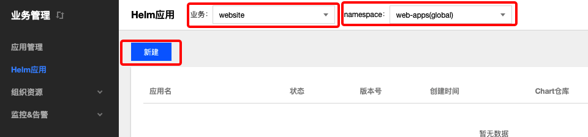

# Helm应用

## 概念
**这里业务端用户可以管理通过 helm 创建的应用。**

### 操作步骤
#### 新建Helm应用 
  1. 登录 TKEStack。
  2. 切换至 【业务管理】控制台，选择【 Helm应用】。
  3. 选择相应【业务】和【namespace】，单击【新建】按钮。如下图所示：
      
  4. 在“新建Helm应用”页面填写Helm应用信息。如下图所示：
      
   + **应用名：** 输入应用名，1～63字符，只能包含小写字母、数字及分隔符("-")，且必须以小写字母开头，数字或小写字母结尾
   + **命名空间：** 选择该应用运行的命名空间
   + **Chart_Url：** 输入Chart 文件地址
   + **类型：** 选择应用类型
     + **公有：** 公有类型
     + **私有：** 私有类型
       + **用户名：** 私有用户名
       + **密码：** 私有密码
   + **Key-Value：** 通过Key-Value替换Chart包中默认配置。
  5. 单击【完成】按钮。
