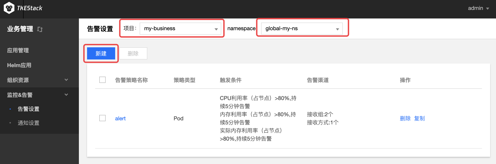
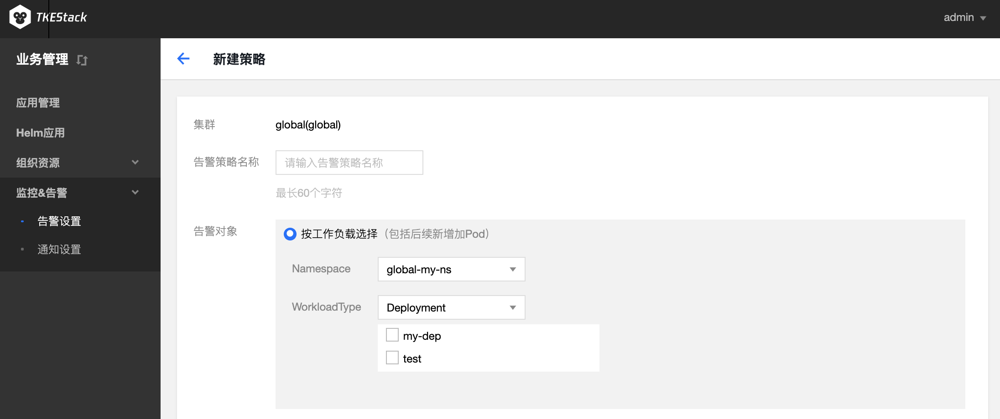
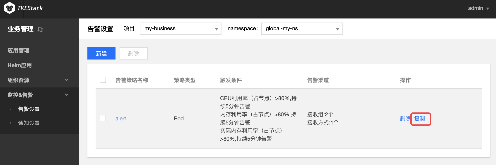
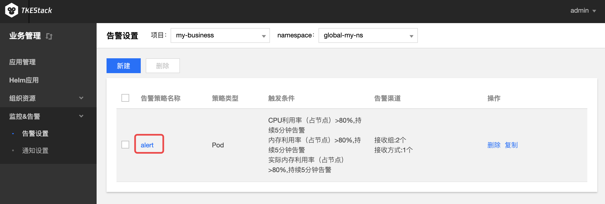
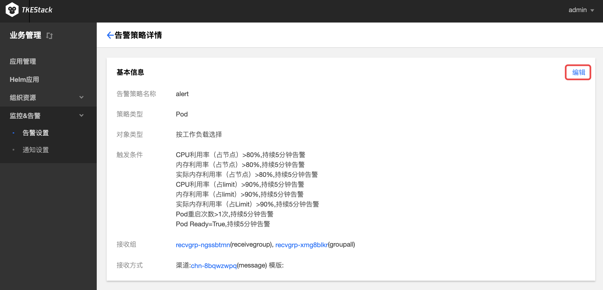
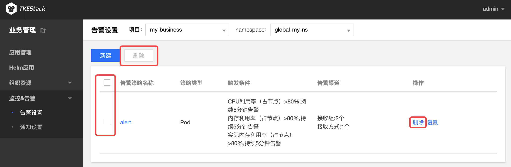

# 告警设置
## 概念
**这里用户配置平台告警**

## 前提条件

>需要设置告警的集群应该先在其 [基本信息](../../platform/cluster.md#基本信息) 页里开启**“监控告警”**

## 新建告警设置
  1. 登录 TKEStack
  2. 切换至【业务管理】控制台，选择【监控&告警】-> 【告警设置】，查看“告警设置”列表
  3. 选择相应【项目】和【namespace】，点击【新建】按钮,如下图所示：
      
4. 在“新建策略”页面填写告警策略信息,如下图所示：
   

+ **告警策略名称：** 输入告警策略名称，最长60字符
+ **策略类型：** 选择告警策略应用类型
  + **集群：** 集群监控告警
  + **Pod：** Pod 监控告警
    + **告警对象：** 选择Pod相关的告警对象，支持对namespace下不同对deployment、stateful和daemonset 进行监控报警
      + **按工作负载选择：** 选择namespace下的某个工作负载
      + **全部选择：** 不区分namespace，全部监控
  + **节点：** 节点监控告警
+ **统计周期：** 选择数据采集周期，支持1、2、3、4、5分钟
+ **指标：** 选择告警指标，支持对监测值与指标值进行【大于/小于】比较，选择结果持续周期。如下图：
  
+ **接收组：** 选择接收组，当出现满足条件当报警信息时，向组内人员发送消息。**接收组需要先在 [通知设置](./notification.md) 创建**
+ **通知方式：** 选择通知渠道和消息模版。**通知渠道 和 消息模版需要先在 [通知设置](./notification.md) 创建**
  + **添加通知方式** 如需要添加多种通知方式，点击该按钮
+ 单击【提交】按钮

## 复制告警设置
  1. 登录 TKEStack
  2. 切换至【业务管理】控制台，选择 【监控&告警】->【告警设置】，查看告警设置列表
    3. 选择相应【项目】和【Namespace】，点击“告警设置”列表最右侧的【复制】按钮,如下图所示：
      
    4. 在复制策略页面，编辑告警策略信息
    5. 单击【提交】按钮
## 编辑告警设置
  1. 登录 TKEStack
  2. 切换至 【业务管理】控制台，选择 【监控&告警】->【告警设置】，查看告警设置列表
  3. 选择相应【项目】和【Namespace】，点击【告警名称】，如下图所示：
      
  4. 在“告警策略详情”页面，单击【基本信息】右侧的【编辑】按钮，如下图所示：
      
  5. 在更新策略页面，编辑策略信息
  6. 单击【提交】按钮
## 删除告警设置
  1. 登录 TKEStack
  2. 切换至 【业务管理】控制台，选择 【监控&告警】->【告警设置】，查看“告警设置”列表
  3. 选择相应【项目】和【Namespace】，点击列表最右侧的【删除】按钮，如下图所示：
      
  4. 在弹出的删除告警窗口，单击【确定】按钮