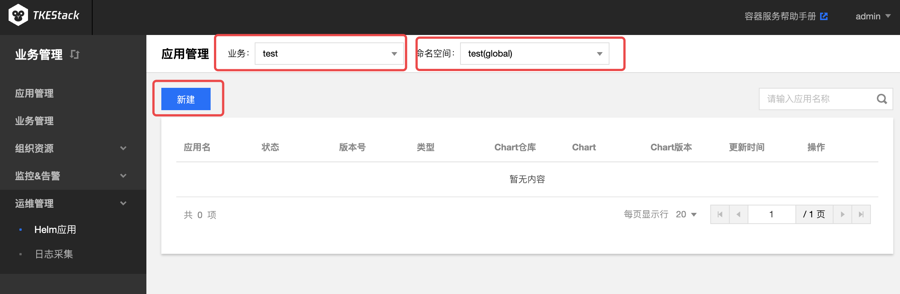
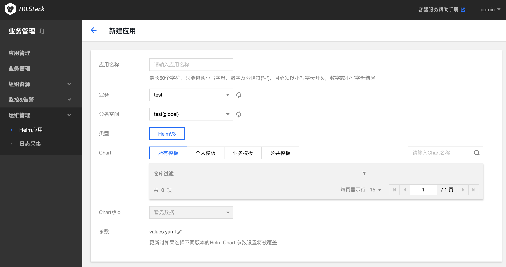

# Helm应用

## 新建Helm应用

1. 登录 TKEStack。
2. 切换至【业务管理】控制台，选择【运维中心】->【 Helm 应用】。
3. 选择相应【业务】和【命名空间】，单击【新建】按钮。如下图所示：
   
4. 在“新建Helm应用”页面填写Helm应用信息。如下图所示：
   
   + **应用名称：** 输入应用名，1～63字符，只能包含小写字母、数字及分隔符("-")，且必须以小写字母开头，数字或小写字母结尾
   + **业务：** 选择应用所在业务
   + **命名空间：** 选择应用所在集群的命名空间
   + **类型：** 当前仅支持HelmV3
   + **Chart：** 选择需要部署的chart
   + **Chart版本：** 选择chart的版本
   + **参数：** 更新时如果选择不同版本的Helm Chart，参数设置将被覆盖
5. 单击【完成】按钮。