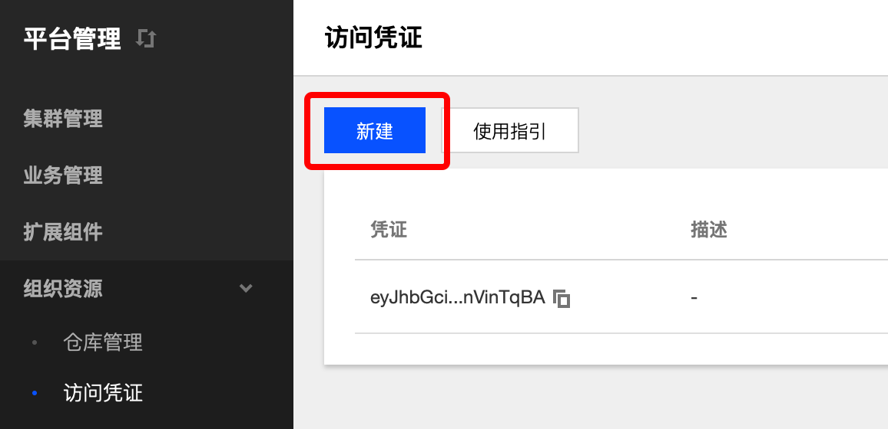
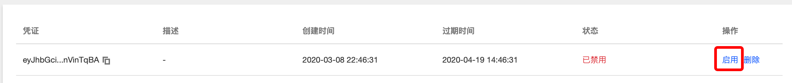
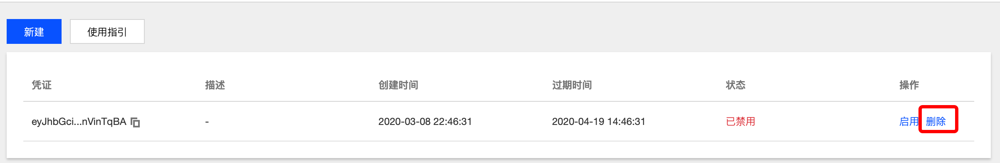

## 访问凭证
**这里用户可以管理自己的凭据。**

### 操作步骤
#### 新建访问凭证
  1. 登录 TKEStack。
  2. 切换至 业务管理控制台，选择 组织资源->访问凭证，点击【新建】按钮。
  3. 在弹出创建访问凭证页面，填写凭证信息。如下图所示：
      
      * 凭证描述：描述当前凭证信息
      * 过期时间：填写过期时间，选择小时/分钟为单位

  4. 单击【确认】按钮。
#### 停用/启用访问凭证
  1. 登录 TKEStack。
  2. 切换至 业务管理控制台，选择 组织资源->访问凭证，查看访问凭证列表。
  3. 单击列表右侧【禁用】/【启用】按钮。如下图所示：
      
  4. 单击【确认按钮】
#### 删除访问凭证
  1. 登录 TKEStack。
  2. 切换至 业务管理控制台，选择 组织资源->访问凭证，查看访问凭证列表。
  3. 单击列表最右侧【删除】按钮。如下图所示：
      
  4. 单击【确认按钮】
