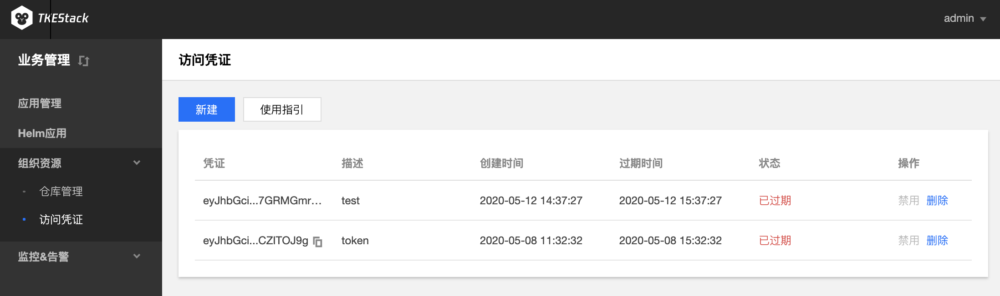
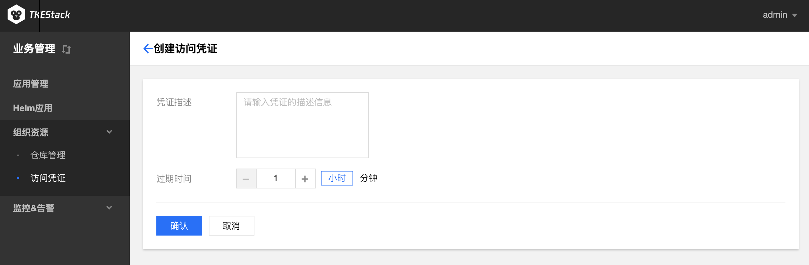
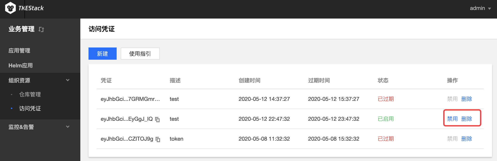

# 访问凭证

**这里用户可以管理自己的凭据**

## 新建访问凭证
  1. 登录 TKEStack

  2. 切换至 【业务管理】控制台，选择【组织资源】->【访问凭证】，点击【新建】按钮

      

  3. 在弹出“创建访问凭证”页面，填写凭证信息，如下图所示：

      

      * 凭证描述：描述当前凭证信息
      * 过期时间：填写过期时间，选择小时/分钟为单位

  4. 单击【确认】按钮

## 停用/启用/删除访问凭证

  1. 登录 TKEStack

  2. 切换至 【业务管理】控制台，选择 【组织资源】-> 【访问凭证】，查看“访问凭证”列表。单击列表右侧【禁用】/【启用】/【删除】按钮，如下图所示：

     > 注意：点击【禁用】之后，【禁用】按钮就变成了【启用】

     

  3. 单击【确认】按钮