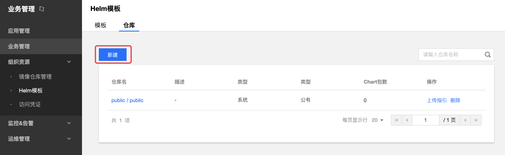
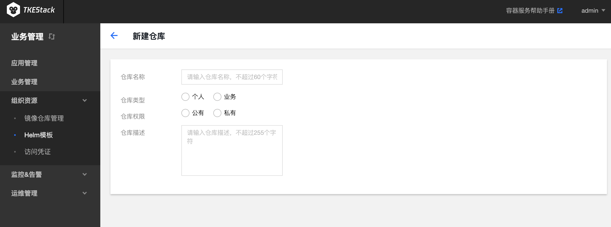
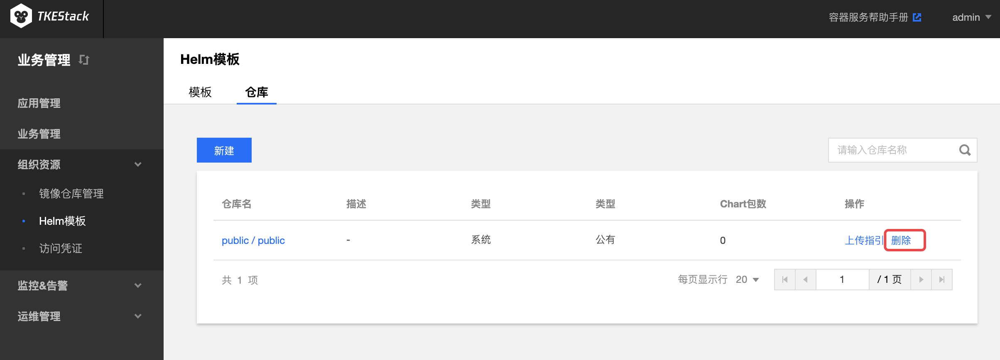

# Helm 模板

应用功能是 TKEStack 集成的 [Helm 3.0](https://helm.sh/) 相关功能，为您提供创建 Helm Chart、容器镜像、软件服务等各种产品和服务的能力。已创建的应用将在您指定的集群中运行，为您带来相应的能力。

TKEStack 的【Helm 模板】和【镜像仓库】里的数据都是存储于 利用 [tke-registry-api](../../../../../../cmd/tke-registry-api) 实现的 Registry 的模块。

控制台用户在使用 Helm 模板 里的 Chart 模板部署应用时，是通过 [tke-application-api](../../../../../../cmd/tke-application-api) 获取 Registry 里存储的 Chart 模板，然后渲染成 Kubernetes 资源的 YAML 文件，最后部署到集群里面。

如果想在后台使用 TKEStack 控制台上 Helm 模板里的 Chart，需要在本地安装 [Helm](https://helm.sh/docs/intro/quickstart/)，

## 模板

1. **所有模板**：包含下列所有模板
2. **个人模板**：当前用户可以访问到的**个人仓库**类型的模板，包括两种：
   1. 自己创建的个人仓库（个人仓库的权限是私有的或者公有的都可以拉取/修改/删除）
   2. 别人创建的具有公有权限的个人仓库
3. **业务模板**：当前用户可以访问的**业务仓库**类型的模板，包含两种：
   1. 当前用户是该业务的管理员（业务仓库的权限是私有的或者公有的都可以拉取/修改/删除）
   2. 所有人创建的具有公有权限的业务仓库
4. **平台模板**：主要是开源模板，由 TKEStack 默认内置的模板

## 仓库

  1. 登录 TKEStack
  2. 切换至 【业务管理】控制台，选择 【组织资源】->【应用商店】，点击【仓库】
  3. 点击【新建】按钮，如下图所示：
     
  4. 在弹出的“新建仓库”页面，填写“仓库"信息，如下图所示：
     
     + **仓库名称：** 仓库名字，不超过6个字符
     + **仓库类型**
       + **个人**：默认当前登录用户
         + **仓库权限：** 
           + **公有：** 所有人均可访问该仓库下的Chart
           + **私有：** 仅当前用户可以访问该仓库下的Chart
       + **业务**：选择业务类型后需要选择指定业务
         + **仓库权限：** 
           + **公有：** 所有人均可访问该仓库下的Chart
           + **私有：** 仅业务下的用户可以访问该仓库下的Chart
     + **仓库描述：** 请输入仓库描述，不超过255个字符
  5. 单击【确认】按钮

### 删除仓库

  1. 登录 TKEStack
  2. 切换至 【业务管理】控制台，选择 【组织资源】-> 【 Helm模板】，点击【仓库】，查看 “helm模板仓库”列表
  3. 点击列表最右侧【删除】按钮，如下图所示：
     

### Chart 上传指引

  1. 登录 TKEStack
        2. 切换至 【业务管理】控制台，选择 【组织资源】-> 【 Helm模板】，点击【仓库】，查看 “helm模板仓库”列表
            3. 点击列表最右侧【上传指引】按钮。如上图【删除】按钮的旁边所示
                4. 根据指引内容，在节点上执行相应命令，如下图所示：
     

