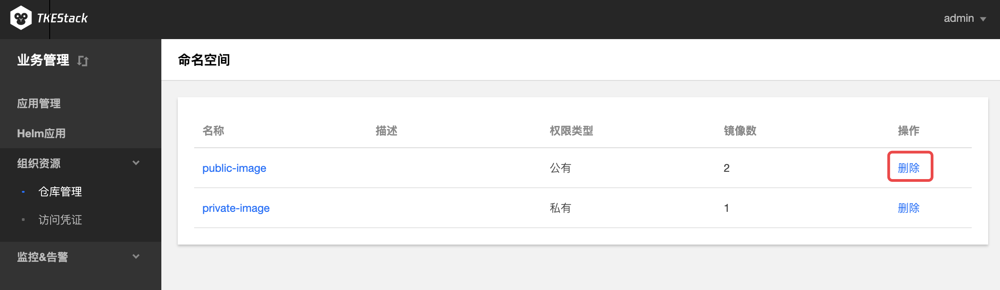
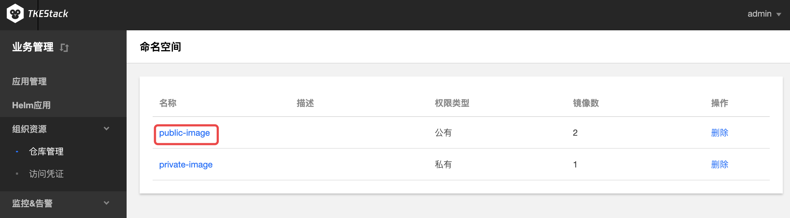
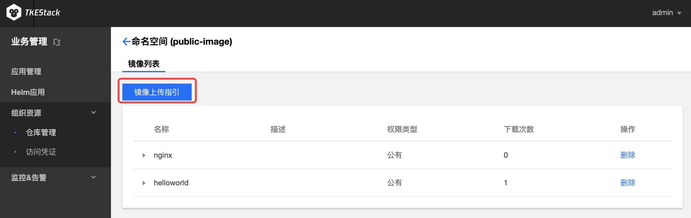
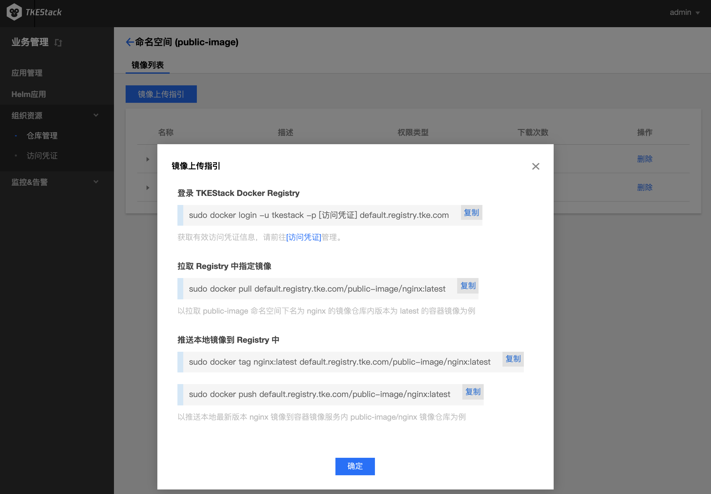

# 仓库管理

## 镜像仓库概述

**镜像仓库**：用于存放 Docker 镜像，Docker 镜像可用于部署容器服务，每个镜像有特定的唯一标识（镜像的 Registry 地址+镜像名称+镜像 Tag）

**镜像类型**：目前镜像支持 Docker Hub 官方镜像和用户私有镜像

**镜像生命周期**：主要包含镜像版本的生成、上传和删除

> 注意：TKEStack的【业务管理】控制台不支持命名空间的创建，可以在【平台管理】下的【组织资源】下的[【镜像仓库管理】](../../platform/resource/registry.md)新建命名空间。

## 删除命名空间

1. 登录 TKEStack
2. 切换至 【业务管理】控制台，选择 【组织资源】->【仓库管理】。点击列表最右侧【删除】按钮,如下图所示：
    
3. 点击【确认】

## 镜像上传

  1. 登录 TKEStack

  2. 切换至 【业务管理】控制台，选择 【组织资源】->【仓库管理】，查看“命名空间”列表。点击列表中命名空间【名称】，如下图所示：
     

  3. 此时进入了“镜像列表”页面，点击【镜像上传指引】按钮，如下图所示：

     > 注意：此页面可以通过上传的镜像最右边的【删除】按钮来删除上传的镜像

     

  4. 根据指引内容，在物理节点上执行相应命令，如下图所示：
     
