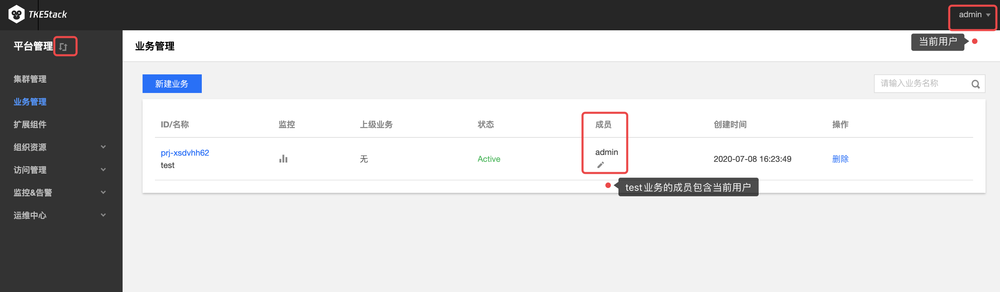
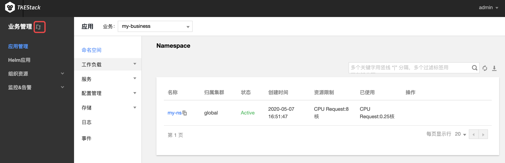

# 平台管理和业务管理切换

## 概念
**这里用户可以自由切换【平台管理】控制台和【业务管理】控制台。**

> 注意：
>
> 1. 如果没有业务，请先[创建业务](./platform/business.md)，并且业务的成员包含当前用户。
> 2. 只有当【平台管理】-> 【业务管理】中业务的成员包含当前登录的用户，当前用户才会出现并可以切换至【业务管理】控制台，如下图所示。

## 操作步骤

1. 登录 TKEStack，默认显示【平台管理】控制台，光标移动到【平台管理】旁，会出现切换提示，如下图：
    
    
    如果当前显示的是【业务管理】控制台，光标移动到【业务管理】旁，会出现切换提示，如下图：
    
    

2. 点击【 切换图标】 即可实现【平台管理】和【业务管理】控制台切换。

   