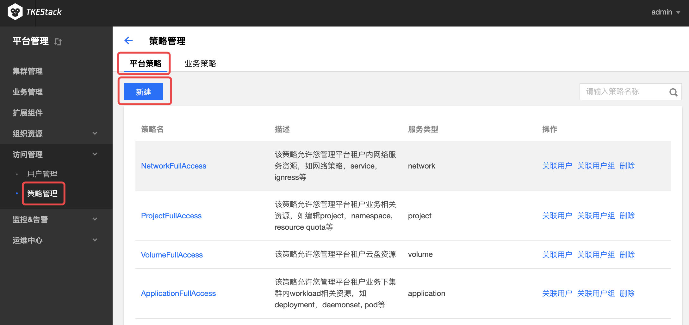
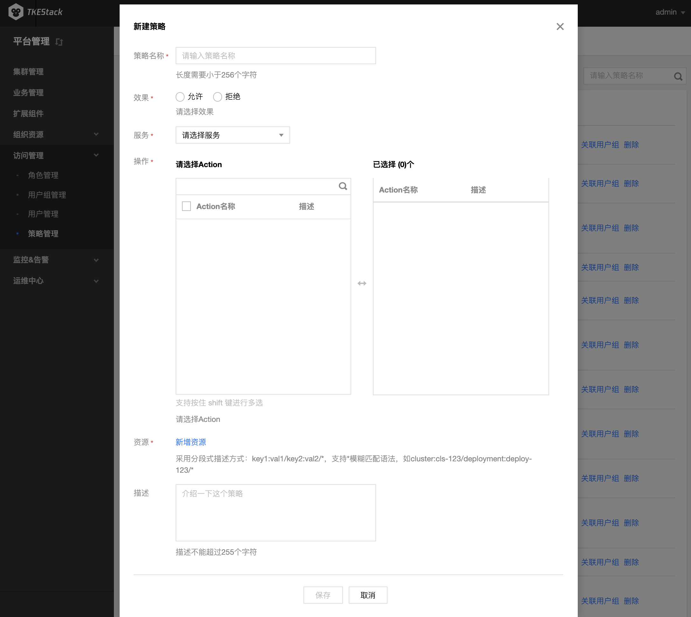
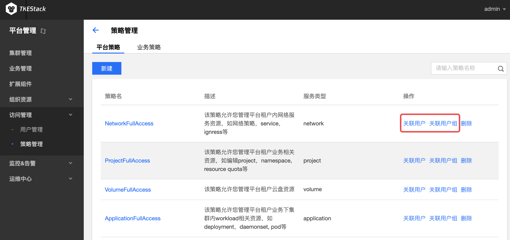
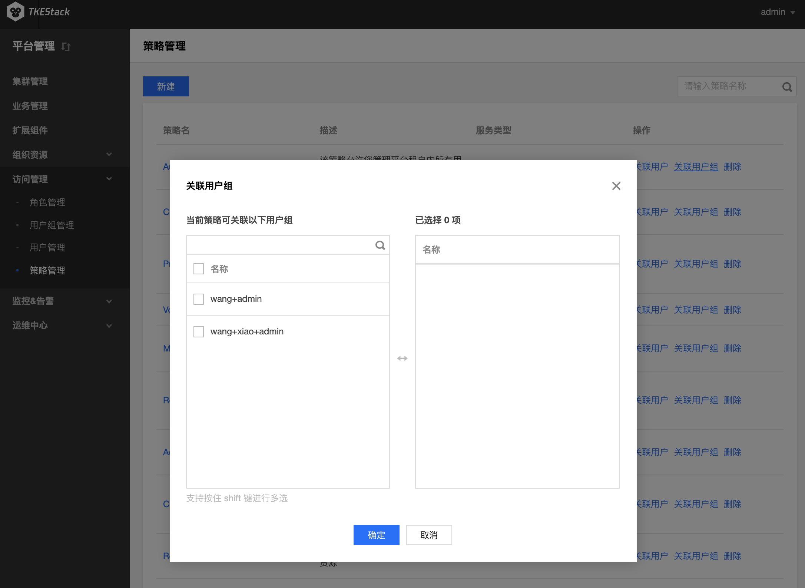
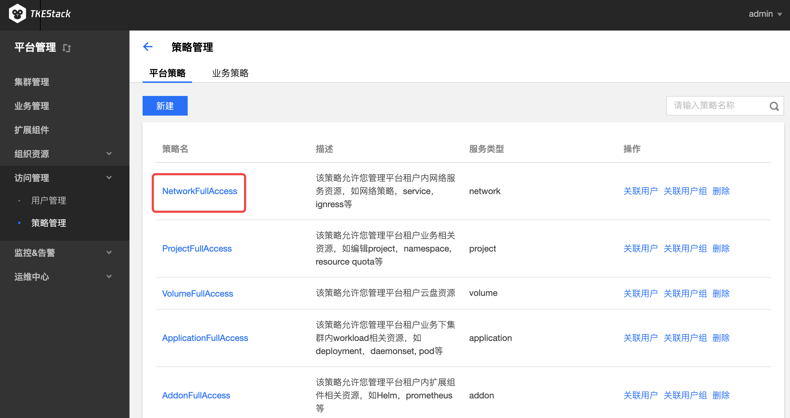
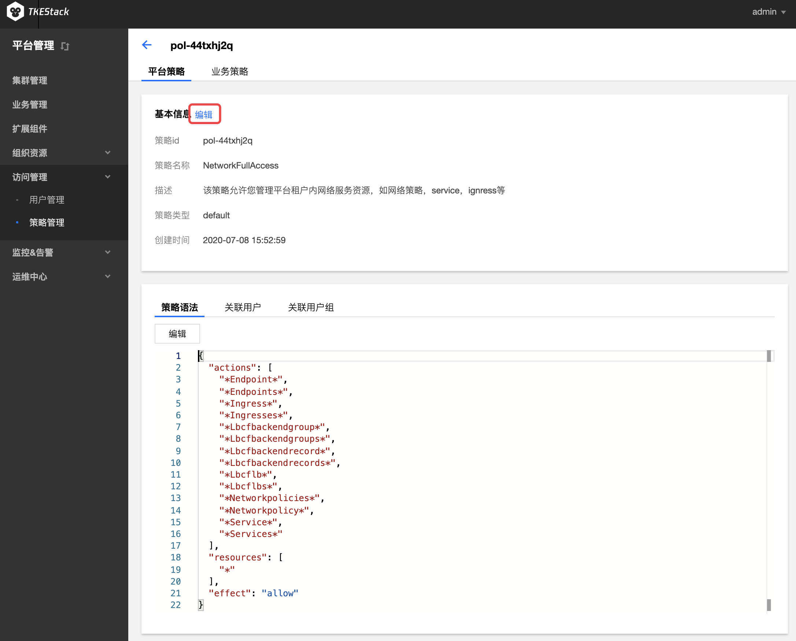
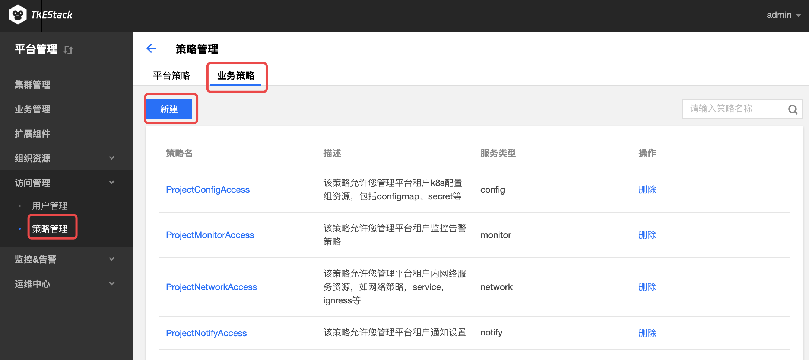
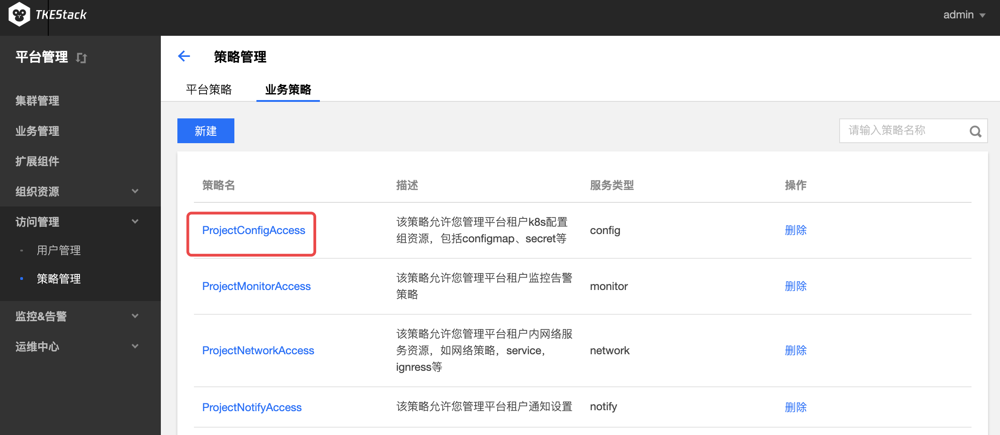
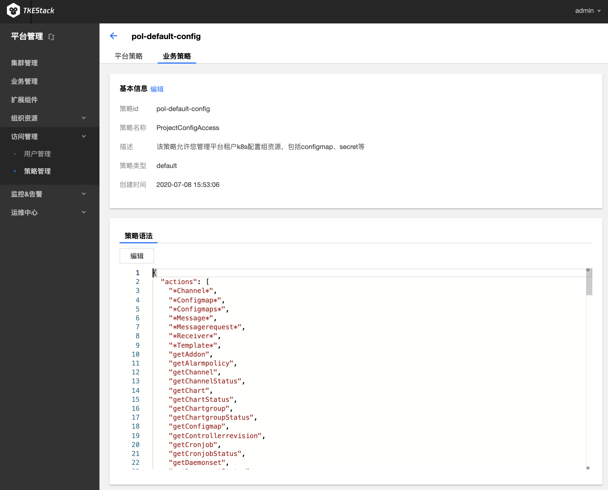

# 策略管理

## 平台策略

### 新建策略
  1. 登录 TKEStack
  2. 切换至【平台管理】控制台，选择【访问管理】->【策略管理】
  3. 点击【新建】按钮，如下图所示：
      
  4. 在弹出的新建策略窗口输入策略信息。如下图所示：
      
     + **策略名称：** 长度需要小于256个字符
     + **效果：** 策略动作，允许/拒绝
     + **服务：** 选择策略应用于哪项服务
     + **操作：** 选择对应服务的各项操作权限
     + **资源：** 输入资源label，支持模糊匹配，策略将应用于匹配到的资源
     + **描述：** 输入策略描述
  5. 单击【保存】按钮
### 关联用户和用户组
  1. 登录 TKEStack

  2. 切换至【平台管理】控制台，选择【访问管理】->【策略管理】，查看策略列表

  3. 点击列表中最右侧【关联用户】或【关联用户组】按钮，如下图所示：
      
      
      > 此界面也可以点击最右边的【删除】按钮来删除策略
      
  4. 在弹出的关联用户窗口选择用户或用户组，这里以用户组为例。如下图所示：
      

  5. 单击【确定】按钮

### 编辑策略基本信息

1. 登录 TKEStack
2. 切换至【平台管理】控制台，选择【访问管理】->【策略管理】，查看策略列表
3. 点击列表中的策略名称，如下图所示：  
4. 在策略基本信息页面，单击 “基本信息” 旁的【编辑】按钮，如下图所示：  
5. 在弹出的信息框内编辑策略名称和描述
6. 单击【保存】按钮

## 业务策略

### 新建策略

1. 登录 TKEStack
2. 切换至【平台管理】控制台，选择【访问管理】->【策略管理】->【业务策略】
3. 点击【新建】按钮，如下图所示：
   
4. 在弹出的新建策略窗口输入策略信息，如下图所示：
   
   + **策略名称：** 长度需要小于256个字符
   + **效果：** 策略动作，允许/拒绝
   + **服务：** 选择策略应用于哪项服务
   + **操作：** 选择对应服务的各项操作权限
   + **资源：** 输入资源label，支持模糊匹配，策略将应用于匹配到的资源
   + **描述：** 输入策略描述
5. 单击【保存】按钮

### 编辑策略基本信息

1. 登录 TKEStack
2. 切换至【平台管理】控制台，选择【访问管理】->【策略管理】，查看策略列表
3. 点击列表中的策略名称，如下图所示：  
4. 在策略基本信息页面，单击 “基本信息” 旁的【编辑】按钮，如下图所示：  
5. 在弹出的信息框内编辑策略名称和描述
6. 单击【保存】按钮
7. 此页面还可以编辑策略语法