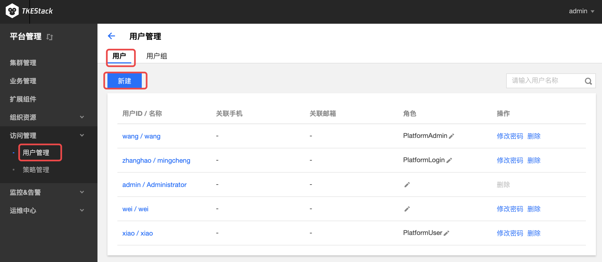
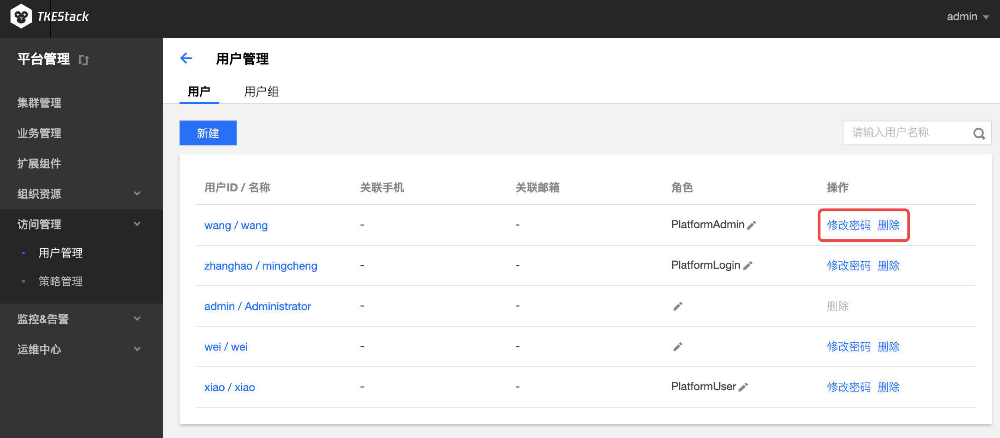
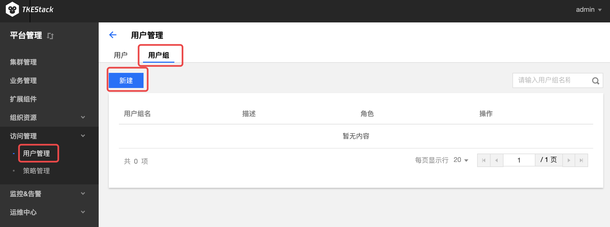
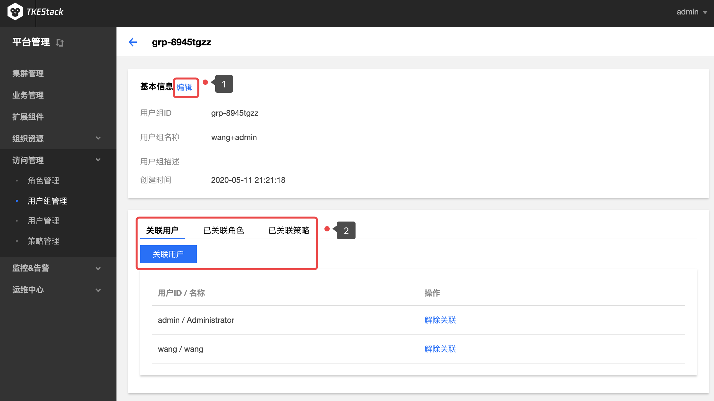

# 用户管理

## 用户

### 新建用户

1. 登录 TKEStack
2. 切换至【平台管理】控制台，选择【访问管理】->【用户管理】
3. 点击【新建】按钮，如下图所示： 
4. 在弹出的添加用户窗口填写用户信息，如下图所示： 
   - **用户账号：** 长度3～32位字符，小写字母或数字开头结尾，中间包含小写字母、数字、-
   - **用户名称：** 长度需小于256字符，用户名称会显示在页面右上角
   - **用户密码：** 10~16位字符，需包括大小写字母及数字
   - **确认密码：** 再次输入密码
   - **手机号：** 输入用户手机号
   - **邮箱：** 输入用户邮箱
   - **平台角色：**
     - **管理员：** 平台预设角色，允许访问和管理所有平台和业务的功能和资源
     - **平台用户：** 平台预设角色，允许访问和管理大部分平台功能，可以新建集群及业务
     - **租户：** 平台预设角色，不绑定任何平台权限，仅能登录
     - **自定义：**  通过勾选下面的策略给用户自定义独立的权限
5. 单击【保存】按钮

### 修改密码

1. 登录 TKEStack

2. 切换至【平台管理】控制台，选择【访问管理】->【用户管理】，查看用户列表

3. 点击用户列表最右侧的【修改密码】按钮，如下图所示：  

   > 注意：此页面也可以通过【修改密码】旁边的【删除】来删除用户

4. 在弹出的修改密码窗口里输入新的密码并确认，如下图所示：  

5. 单击【保存】按钮。

### 编辑用户基本信息

1. 登录 TKEStack
2. 切换至【平台管理】控制台，选择【访问管理】->【用户管理】，查看用户列表
3. 点击列表中的用户名称，如下图所示：  
4. 在用户基本信息页面，单击 基本信息 旁的【编辑】按钮，如下图所示：  
5. 在弹出的用户信息框内编辑用户信息。
6. 单击【保存】按钮。
7. 此页面下面可以查看当前用户的 已管理策略、已关联用户组 和 已关联角色

## 用户组
### 新建用户组
  1. 登录 TKEStack
  2. 切换至【平台管理】控制台，选择【访问管理】->【用户管理】-> 【用户组】
  3. 点击【新建】按钮，如下图所示：
      
  4. 在弹出的添加用户窗口填写用户信息，如下图所示：
      
      + **用户组名称：** 长度需小于60位字符，小写字母或数字开头结尾，中间包含小写字母、数字、-
      + **用户组描述：** 长度需小于255字符
      + **关联用户：** 点按用户ID/名称前面的方框可以关联相应的用户，支持全选和按住shift键多选
      + **平台角色：** 
        + **管理员：** 平台预设角色，允许访问和管理所有平台和业务的功能和资源
        + **平台用户：** 平台预设角色，允许访问和管理大部分平台功能，可以新建集群及业务
        + **租户：** 平台预设角色，不绑定任何平台权限，仅能登录
        + **自定义：**  通过勾选下面的策略给用户自定义独立的权限
  5. 单击【提交】按钮
### 编辑用户组基本信息
  1. 登录 TKEStack
  2. 切换至【平台管理】控制台，选择【访问管理】->【用户组管理】，查看用户组列表
  3. 点击列表中的用户组名称，如下图1所示：
       
> 此界面也可以更改关联用户，如上图中的2所示，和 新建用户组 ->添加用户组 中一样的步骤来关联用户

4. 在用户组基本信息页面，单击 基本信息 旁的【编辑】按钮，如下图1所示：
    

5. 在弹出的信息框内可以编辑 用户组名称 和 用户组描述，此时会出现【提交】按钮，点击后可更改用户组基本信息。

   > 如上图中的2所示，此界面也可以更改关联用户，点击蓝色【关联用户】按钮后，和 新建用户组 ->添加用户组 中一样的操作来关联用户。这里还可以点击查看【已关联角色】和【已关联策略】

### 删除用户组
  1. 登录 TKEStack
  2. 切换至【平台管理】控制台，选择【访问管理】->【用户组管理】，查看用户组列表
  3. 点击用户组列表最右侧的【删除】按钮，如下图所示：
       
  4. 在弹出的确认删除窗口，单击【确认】