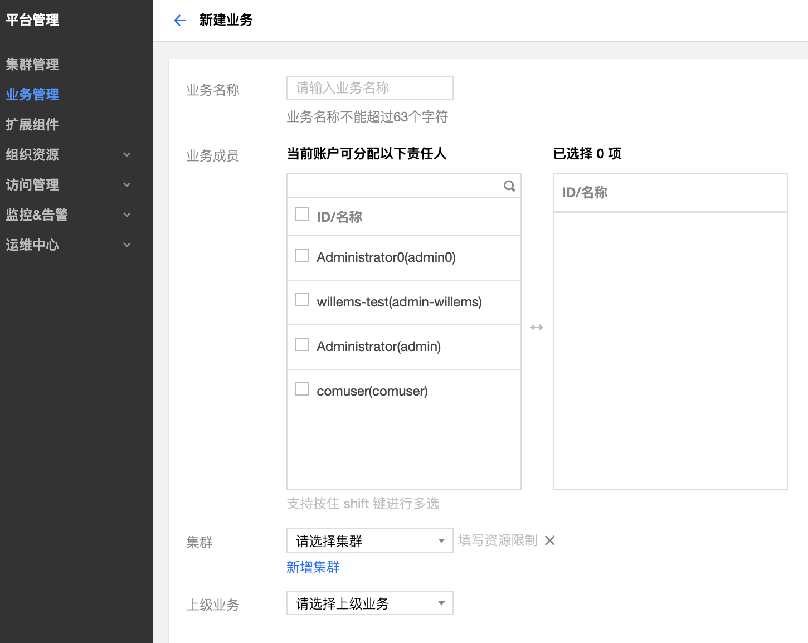
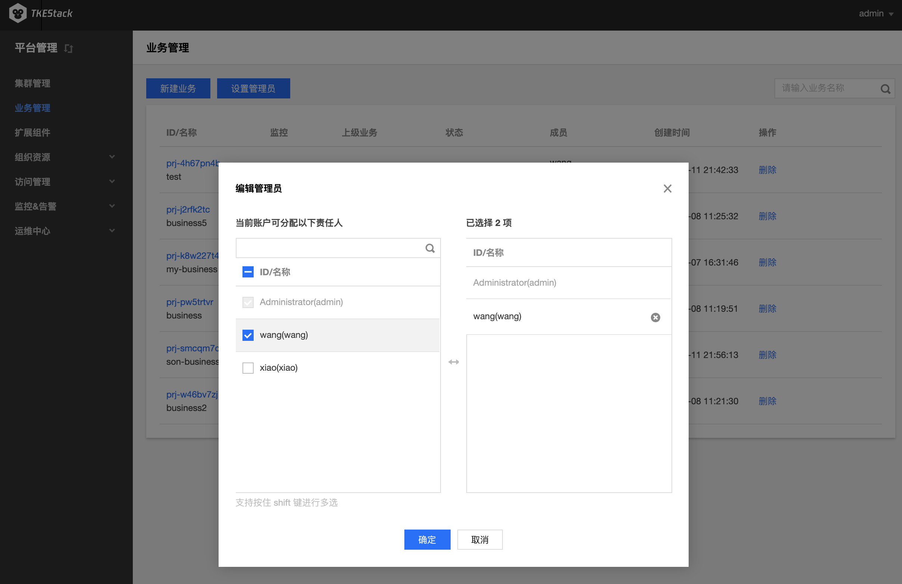

# 业务管理
## 概念
**在这里用户可以管理线上业务。**

## 操作步骤
### 新建业务

1. 登录 TKEStack。
2. 切换至【平台管理】控制台。
3. 在【业务管理】页面中，单击 【新建业务】。如下图所示：

4. 在新建业务页面，填写业务信息。如下图所示：

   + **业务名称：** 不能超过63个字符
   + **业务成员：** **用户管理**中的用户
   + **集群：** **集群管理**中的集群
   + **上级业务：** 可不选

### 设置管理员
1. 登录 TKEStack。
2. 切换至【平台管理】控制台。
3. 在【业务管理】页面中，单击 【设置管理员】。如下图所示：

4. 在弹出的设置管理员窗口，选择责任人。如下图所示：

 5. 单击【确定】

### 添加业务成员
1. 登录 TKEStack。
2. 切换至 【平台管理】控制台。
3. 在【业务管理】页面中，可以看到已创建的业务列表。如下图所示：

> 注意：修改业务成员仅限状态为Active的业务
4. 鼠标移动到要修改的业务上(无需点击)，成员列会出现修改图标按钮。如下图所示：

5. 单击修改图标 
6. 在弹出的编辑成员窗口，添加/删除成员。如下图所示：

7. 单击【确定】

### 查看业务监控
1. 登录 TKEStack。
2. 切换至 【平台管理】控制台。
3. 在【业务管理】页面中，可以看到已创建的业务列表。如下图所示：

4. 点击监控按钮，如下图所示：

5. 在右侧弹出窗口里查看业务监控情况，如下图所示：

### 删除业务
1. 登录 TKEStack。
2. 切换至 【平台管理】控制台。
3. 在【业务管理】页面中，可以看到已创建的业务列表。如下图所示：

4. 点击删除按钮，如下图所示：

> 注意：删除业务成员仅限状态为Active的业务