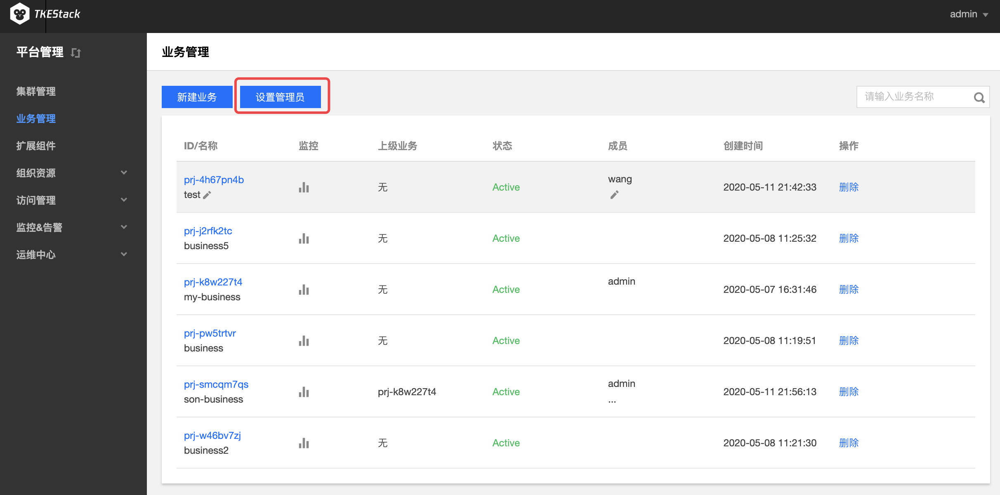
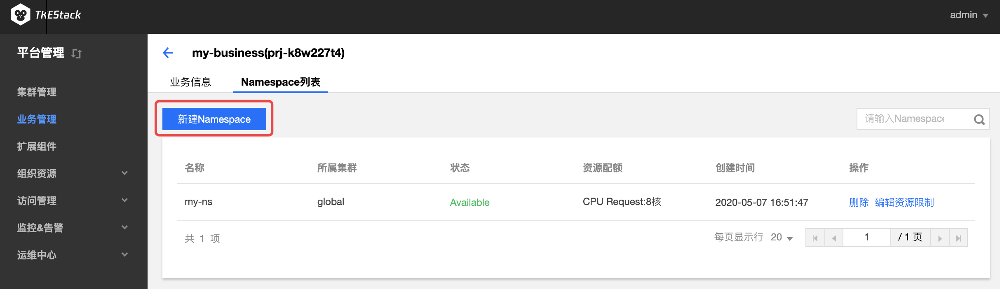

# 业务管理
## 概念
**在这里用户可以管理线上业务。**

## 操作步骤
### 新建业务

> 注：业务可以实现跨集群资源的使用

1. 登录 TKEStack。
2. 在【平台管理】控制台的【业务管理】中，单击 【新建业务】。如下图所示：
   
3. 在“新建业务”页面，填写业务信息。如下图所示：
   

- **业务名称**：不能超过63个字符，这里以`my-business`为例
- **业务成员**： [【访问管理】](../platform/access.md)中【用户管理】中的用户，这里以`admin`例，即该用户可以访问这个业务。
- **集群**：
  - 【集群管理】中的集群，这里以`gobal`集群为例
  - 【填写资源限制】可以设置当前业务使用该集群的资源上限（可不限制）
  - 【新增集群】可以添加多个集群，此业务可以使用多个集群的资源（按需添加）
- **上级业务**：支持多级业务管理，按需选择（可不选）

1. 单击最下方 【完成】 按钮即可创建业务。

### 设置管理员
1. 登录 TKEStack。

2. 切换至【平台管理】控制台。

3. 在【业务管理】页面中，单击 【设置管理员】。如下图所示：
    

4. 在弹出的设置管理员窗口，选择责任人。如下图所示：

  > 注意：这里设置的管理员拥有同admin一样的能力，有集群所有的操作权限。

  

 5. 单击【确定】

### 添加业务成员
1. 登录 TKEStack。
2. 切换至 【平台管理】控制台，点击【业务管理】。
3. 在“业务管理”页面中，可以看到已创建的业务列表。鼠标移动到要修改的业务上(无需点击)，成员列会出现修改图标按钮。如下图所示：
    

  > 注意：修改业务成员仅限状态为Active的业务

4. 单击修改图标 

5. 在弹出的编辑成员窗口，添加/删除成员。如下图所示：
    

6. 单击【确定】

### 查看业务监控
1. 登录 TKEStack。
2. 切换至 【平台管理】控制台，点击【业务管理】。
3. 在“业务管理”页面中，可以看到已创建的业务列表。点击监控按钮，如下图所示：

5. 在右侧弹出窗口里查看业务监控情况，如下图所示：

### 删除业务
1. 登录 TKEStack。
2. 切换至 【平台管理】控制台，点击【业务管理】。
3. 在“业务管理”页面中，可以看到已创建的业务列表。点击删除按钮，如下图所示：

> 注意：删除业务成员仅限状态为Active的业务

### 创建业务下的命名空间

1. 登录 TKEStack。

2. 在【平台管理】控制台的【业务管理】中，单击【业务id】。如下图所示： 

3. 单击【Namespace列表】。如下图标签1所示：

   > 该页面可以更改业务名称、成员、以及业务下集群资源的限制。

   

4. 单击【新建Namespace】。如下图所示： 

5. 在“新建Namespace”页面中，填写相关信息。如下图所示： 

- **名称**：不能超过63个字符，这里以`new-ns`为例
- **集群**：`my-business`业务中的集群，这里以`global`集群为例
- **资源限制**：这里可以限制当前命名空间下各种资源的使用量，可以不设置。