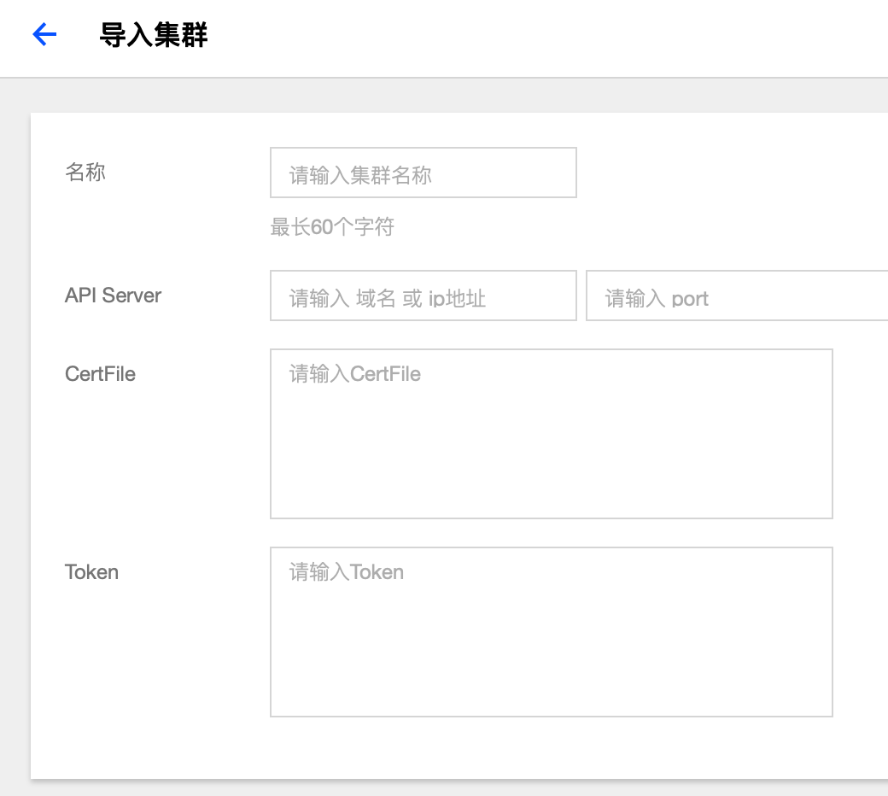

# 集群管理

## 概念
**在这里可以管理你的 Kubernetes 集群。**

## 操作步骤

### 新建独立集群

1. 登录 TKEStack。
2. 切换至【平台管理】控制台。
3. 在【集群管理】页面中，单击 【新建独立集群】。如下图所示：
   

4. 在 新建独立集群 页面，填写集群的基本信息。如下图所示：
   

- **集群名称：** 支持**中文**，小于60字符

+ **Kubernetes版本：** 选择合适的kubernetes版本，各版本特性对比请查看 [Supported Versions of the Kubernetes Documentation](https://kubernetes.io/docs/home/supported-doc-versions/)。
+ **网卡名称：** 最长63个字符，只能包含小写字母、数字及分隔符(' - ')，且必须以小写字母开头，数字或小写字母结尾
+ **VIP** ：高可用 VIP 地址
+ **GPU**：选择是否安装 GPU 相关依赖
  + **pGPU**：平台会自动为集群安装 [GPUManager](https://github.com/tkestack/docs/blob/master/features/gpumanager.md) 扩展组件
  + **vGPU**：平台会自动为集群安装 [Nvidia-k8s-device-plugin](https://github.com/NVIDIA/k8s-device-plugin)
+ **容器网络** ：将为集群内容器分配在容器网络地址范围内的 IP 地址，您可以自定义三大私有网段作为容器网络， 根据您选择的集群内服务数量的上限，自动分配适当大小的 CIDR 段用于 kubernetes service；根据您选择 Pod 数量上限/节点，自动为集群内每台云服务器分配一个适当大小的网段用于该主机分配 Pod 的 IP 地址。
  + **CIDR**： 集群内 Sevice、 Pod 等资源所在网段。

  + **Pod数量上限/节点**： 决定分配给每个 Node 的 CIDR 的大小。

  + **Service数量上限/集群** ：决定分配给 Sevice 的 CIDR 大小。

+ **目标机器** ：输入目标机器信息后单击保存，若保存按钮是灰色，单击边上空白处即可变蓝
  +  **目标机器**：建议: Master&Etcd 节点配置4核及以上的机型
  +  **SSH端口**： 请确保目标机器安全组开放 22 端口和 ICMP 协议，否则无法远程登录和 PING 云服务器。
  +  **主机label**：给主机设置Label,可用于指定容器调度
  +  **认证方式**：连接目标机器的方式
     +  **密码认证**：
        +  **密码**：目标机器密码
     +  **密钥认证**：
        +  **私钥**：目标机器秘钥
        +  **私钥密码**：目标机器私钥密码，可选填
  +  **GPU**： 使用GPU机器需提前安装驱动和runtime

5. **提交**： 集群信息填写完毕后，提交按钮变为可提交状态，单击即可提交。

### 导入集群

1. 登录 TKEStack。
2. 切换至【 平台管理】控制台。
3. 在【集群管理】页面，单击【导入集群】。如下图所示：
   

4. 在 导入集群 页面，填写被导入的集群信息。如下图所示：
   

- **名称**： 被导入集群的名称，最长60字符
- **API Server**： 输入要被导入集群的API server的IP和端口
- **CertFile**： 输入被导入集群的cert 文件内容
- **Token**： 输入被导入集群创建时的token值

5. 单击最下方 【提交】 按钮 。
