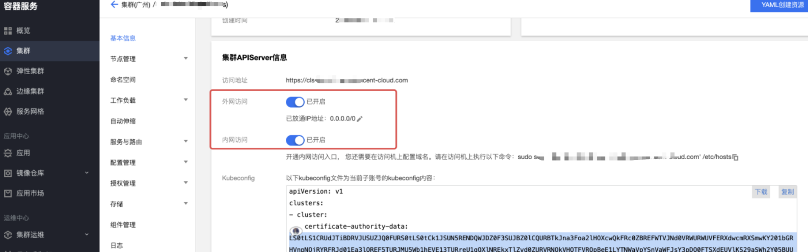
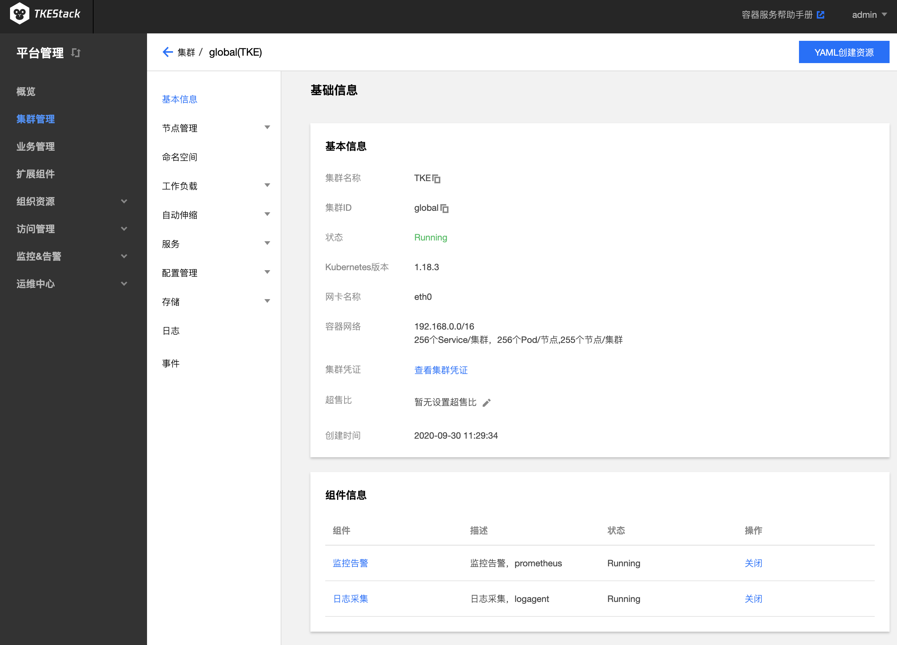

# 集群管理

## 概念
**在这里可以管理你的 Kubernetes 集群**


平台安装之后，可在【平台管理】控制台的【集群管理】中看到 global 集群，如下图所示：
   

TKEStack还可以另外**新建独立集群**以及**导入已有集群**实现**多集群的管理**

> 注意：**新建独立集群**和**导入已有集群**都属于[TKEStack架构](../../installation/installation-architecture.md)中的**业务集群**。

## 新建独立集群

1. 登录 TKEStack，右上角会出现当前登录的用户名，示例为admin
2. 切换至【平台管理】控制台
3. 在“集群管理”页面中，单击【新建独立集群】，如下图所示：
   
4. 在“新建独立集群”页面，填写集群的基本信息。新建的集群节点需满足[部署环境要求](../../installation/installation-requirement.md)，在满足需求之后，TKEStack的集群添加非常便利。如下图所示,只需填写【集群名称】、【目标机器】、【SSH端口】（默认22）、【密码】，其他保持默认即可添加新的集群。
   > 注意：若【保存】按钮是灰色，单击页面空白处即可变蓝

   
   + **集群名称：** 支持**中文**，小于60字符即可

   + **Kubernetes版本：** 选择合适的kubernetes版本，各版本特性对比请查看 [Supported Versions of the Kubernetes Documentation](https://kubernetes.io/docs/home/supported-doc-versions/)（**建议使用默认值**）

   + **网卡名称：** 可以通过 ifconfig 查看设备的网卡名称，一般默认都是 eth0。但有一些特殊情况：如下图所示为 eth1，如果非 eth0 一定要填入正确的网卡名称，否则跨设备通信容易出现问题

     

   + **高可用类型** ：高可用 VIP 地址（**按需使用**）

     > 注意：如果使用高可用，至少需要三个 master 节点才可组成高可用集群，否则会出现 ***脑裂*** 现象。

     - **不设置**：第一台 master 节点的 IP 地址作为 APIServer 地址
  - **TKE 提供**：用户只需提供高可用的 IP 地址。TKE 部署 Keepalive，配置该 IP 为 Global 集群所有 Master 节点的VIP，以实现 Global 集群和控制台的高可用，此时该 VIP 和所有 Master 节点 IP 地址都是 APIServer 地址
     - **使用已有**：对接配置好的外部 LB 实例。VIP 绑定 Global 集群所有 Master 节点的 80（TKEStack 控制台）、443（TKEStack 控制台）、6443（kube-apiserver 端口）、31138（tke-auth-api 端口）端口，同时确保该 VIP 有至少两个 LB 后端（Master 节点），以避免 LB 单后端不可用风险

   + **GPU**：选择是否安装 GPU 相关依赖。（**按需使用**）

     > 注意：使用 GPU 首先确保节点有物理 GPU 卡，选择 GPU 类型后，平台将自动为节点安装相应的 GPU 驱动和运行时工具

     + **vGPU**：平台会自动为集群安装 [GPUManager](https://github.com/tkestack/docs/blob/master/features/gpumanager.md) 此时GPU可以被虚拟化，可以给负载分配非整数张GPU卡，例如可以给一个负载分配0.3个GPU
     + **pGPU**：平台会自动为集群安装 [Nvidia-k8s-device-plugin](https://github.com/NVIDIA/k8s-device-plugin)，此时可以给负载分配任意整数张卡

   + **容器网络** ：将为集群内容器分配在容器网络地址范围内的 IP 地址，您可以自定义三大私有网段作为容器网络， 根据您选择的集群内服务数量的上限，自动分配适当大小的 CIDR 段用于 kubernetes service；根据您选择 Pod 数量上限/节点，自动为集群内每台云服务器分配一个适当大小的网段用于该主机分配 Pod 的 IP 地址。（**建议使用默认值**）
     + **CIDR：** 集群内 Sevice、 Pod 等资源所在网段，注意：CIDR不能与目标机器IP段重叠， 否则会造成初始化失败
     + **Pod数量上限/节点：** 决定分配给每个 Node 的 CIDR 的大小
     + **Service数量上限/集群**：决定分配给 Sevice 的 CIDR 大小

   + **Master** ：输入目标机器信息后单击保存，**若保存按钮是灰色，单击网页空白处即可变蓝**

     > 注意：如果在之前选择了高可用，至少需要三个 master 节点才可组成高可用集群，否则会出现 ***脑裂*** 现象。

     + **目标机器**：Master 节点**内网 IP**，请配置**至少 8 Cores & 16G 内存** 及以上的机型，**否则会部署失败**。注意：如上图所示，如果节点密码一样，这里可以通过英文的分号“;”分隔多个 IP 地址实现快速添加多个节点
     + **SSH 端口**： 请确保目标机器安全组开放 22 端口和 ICMP 协议，否则无法远程登录和 ping 通云服务器。（**建议使用默认值22**）
     + **主机label**：给主机设置 Label,可用于指定容器调度。（**按需使用**）
     +  **认证方式**：连接目标机器的方式

        +  **密码认证**：
           +  **密码**：目标机器密码
        +  **密钥认证**：
           +  **密码**：目标机器密码
           +  **证书**：目标机器登陆证书
     + **GPU**： 使用 GPU 机器需提前安装驱动和 runtime。（**按需使用**）

       > **添加机器**：可以通过节点下面的**【添加】**蓝色字体增加不同密码的master节点（**按需添加**）
5. **提交**： 集群信息填写完毕后，【提交】按钮变为可提交状态，单击即可提交。

## 导入已有集群

1. 登录 TKEStack

2. 切换至【平台管理】控制台

3. 在“集群管理”页面，单击【导入集群】，如下图所示：
   

4. 在“导入集群”页面，填写被导入的集群信息，如下图所示：
   

   - **名称**： 被导入集群的名称，最长60字符

   - **API Server**： 被导入集群的 API Server 的域名或 IP 地址

   - **CertFile**： 输入被导入集群的 CertFile 文件内容

   - **Token**： 输入被导入集群创建时的 token 值

     > 注意：若不清楚集群的这些信息如何获取，可以参照下面导入 TKE/ACK/RKE 的方式导入自己的集群。

5. 单击最下方 【提交】 按钮

#### TKEStack 导入腾讯的 TKE 集群

1. 首先需要在 TKE 控制台所要导入的集群“基本信息”页里开启内/外网访问

   

2. **APIServer 地址**：即上图中的访问地址，也可以根据上图中 kubeconfig 文件里的“server”字段内容填写。

3. **CertFile**：集群证书，kubeconfig 中“certificate-authority-data”字段内容。

4. **Token**：由于目前 TKE 没有自动创建具有 admin 权限的 token，这里需要手动创建，具体方式如下：

   1. 生成 kubernetes 集群最高权限 admin 用户的 token

      ```yaml
      cat <<EOF | kubectl apply -f -
      kind: ClusterRoleBinding
      apiVersion: rbac.authorization.k8s.io/v1beta1
      metadata:
        name: admin
        annotations:
          rbac.authorization.kubernetes.io/autoupdate: "true"
      roleRef:
        kind: ClusterRole
        name: cluster-admin
        apiGroup: rbac.authorization.k8s.io
      subjects:
      - kind: ServiceAccount
        name: admin
        namespace: kube-system
      ---
      apiVersion: v1
      kind: ServiceAccount
      metadata:
        name: admin
        namespace: kube-system
        labels:
          kubernetes.io/cluster-service: "true"
          addonmanager.kubernetes.io/mode: Reconcile
   EOF
      ```

   2. 创建完成后获取 secret 中 token 的值

      ```shell
      # 获取admin-token的secret名字
      $ kubectl -n kube-system get secret|grep admin-token
   admin-token-nwphb                          kubernetes.io/service-account-token   3         6m
      # 获取token的值
   $ kubectl -n kube-system describe secret admin-token-nwphb | grep token
      Name:         admin-token-w4wcd
      Type:  kubernetes.io/service-account-token
      token:            非常长的字符串
      ```


#### TKEStack 中导入 Rancher 的 RKE 集群

> 特别注意：RKE 集群的 kubeconfig 中 clusters 字段里面的第一个 cluster 一般都是 Rancher 平台，而不是 RKE 集群。输入以下信息时，要确定选择正确的集群。

1. 获取 RKE 的 kubeconfig 文件

2. **APIServer 地址**：获取文件里面的“cluster”字段下“server”的内容。注意是引号里的全部内容

3. **CertFile**：集群证书，在上面的“server”地址的正下方，有集群证书字段“certificate-authority-data”。

   > 注意，Rancher 的 kubeconfig 这里的字段内容默认有“\”换行符，需要手动把内容里的换行符和空格全部去除。

4. **Token**：在“user”字段里面拥有用户的 token

#### TKEStack 中导入阿里的 ACK 集群

1. 和 TKE 一样，需要获取开启外网访问的 ACK 的 kubeconfig 文件
2. **APIServer 地址**：获取文件里面的“cluster”字段下“server”的内容
3. **CertFile**：集群证书，在上面的“server”地址正下方有集群证书字段“certificate-authority-data”
4. **Token**：获取方式同 TKE，需要手动创建

## **对集群的操作**

### 基本信息

1. 登录 TKEStack

2. 切换至【平台管理】控制台

3. 在“集群管理”页面中，点击要操作的集群ID，如下图“global”所示：

   

4. 点击【基本信息】，可查看集群基础信息

   

   1. **基本信息**
      1. **集群名称**：用户自定义，可以通过第3步“集群列表页”中 “ID/名称” 下的笔型图案修改
      2. **集群 ID** ：TKEStack 自动给每个集群一个唯一的 ID 标识符
      3. **状态**：集群运行状态，Running 表示正常运行
      4. **Kubernetes 版本**：当前集群的 Kubernetes 版本
      5. **网卡名称**：当前集群的网卡名称，默认为 eth0
      6. **容器网络**：当前集群的容器网络
      7. **集群凭证**：可以在本地配置 Kubectl 连接 当前 Kubernetes 集群
      8. **超售比**：Kubernetes 对象在申请资源时，如果申请总额大于硬件配置，则无法申请，但是很多时候部分对象并没有占用这么多资源，因此可以设置超售比来扩大资源申请总额，以提高硬件资源利用率
      9.  **创建时间**：当前集群的创建时间
   2. **组件信息**：这里可以开启或关闭集群的 日志采集 和 监控告警 功能
      1. **监控告警**：通过在集群安装 prometheus 实现，可以在【监控&告警】下的[【告警设置】](../platform/monitor&alert/alertsetting.md)进一步设置
      2. **日志采集**：通过在集群安装 logagent 实现，可以在【运维中心】下的[【日志采集】](../platform/operation/log.md)进一步设置

### 节点管理

节点是容器集群组成的基本元素。节点取决于业务，既可以是虚拟机，也可以是物理机。每个节点都包含运行 Pod 所需要的基本组件，包括 Kubelet、Kube-proxy 等。

#### 添加节点

1. 登录 TKEStack

2. 切换至【平台管理】控制台

3. 在“集群管理”页面中，点击要操作的集群ID，如下图“global”所示：

   

4. 点击【节点管理】中的【节点】，可查看当前集群的“节点列表”

   

5. 点击蓝色【添加节点】按钮可增加当前集群的 Worker 节点

   1. 目标机器：建议内网地址，要求添加的节点和当前集群的其他机器在同一内网。注意：如果节点密码一样，这里可以通过英文的分号“;”分隔多个 IP 地址实现快速添加多个节点
   2. SSH端口：默认 22
   3. 主机label：按需添加，给主机设置 Label，可用于指定容器调度
   4. 认证方式：连接目标机器的方式，根据实际情况设置
   5. 用户名：默认 root
   6. 密码：目标机器用户名为 root 的密码
   7. GPU：按需选择，使用 GPU 机器需提前安装驱动和 runtime
   8. 添加机器：可以通过节点下面的**【添加】**蓝色字体增加不同密码的节点（按需添加）

#### 节点监控

点击上图中的蓝色【监控】按钮可监控节点，可以从Pod、CPU、内存、硬盘、网络等维度监控。

> 前提：在集群的 [基本信息](#基本信息) 页里开启了 监控告警

#### 节点操作

对节点的可以的操作如下图所示：


1. **移出**：仅针对 worker 节点，将节点移出集群

2. **驱逐**：节点驱逐后，将会把节点内的所有 Pod（不包含 DaemonSet 管理的 Pod）从节点中驱逐到集群内其他节点，并将节点设置为封锁状态

   > 注意：本地存储的 Pod 被驱逐后数据将丢失，请谨慎操作

3. **编辑标签**：编辑节点标签

4. **编辑 Taint**：编辑 Taint 后，新的 pod 不能被调度到该节点，但可以通过编辑 pod 的 toleration 使其可以调度到具有匹配的 taint 节点上

5. **封锁**：封锁节点后，将不接受新的Pod调度到该节点，需要手动取消封锁的节点

#### 节点 Pod 管理

点击其中一个节点名，例如上图中的【172.19.0.154】，可以看到该节点更多的信息，具体包括：


1. **Pod 管理**：可查看当前节点下的 pod
   1. 销毁重建：销毁该 pod，重新新建该 pod
   2. 远程登录：登录到该 pod 里
2. **事件**：关于该节点上资源的事件，资源事件只在 ETCD 里保存最近1小时内发生的事件，请尽快查阅
3. **详情**：包括节点主机信息以及 Kubernetes 信息
4. **YAML**：此处可以查看节点的 YAML 文件，点击【编辑YAML】可以手动修改节点的 YAML 文件

### 其他操作

注意：由于【平台管理】控制台下对集群的大多数操作与【业务管理】控制台完全一致，因此除了集群的【基本信息】和【节点管理】之外，其他栏目（包括 命名空间、负载、服务、配置、存储、日志、事件）请参考【业务管理】控制台下[【应用管理】](../business-control-pannel/application)的相应部分。
