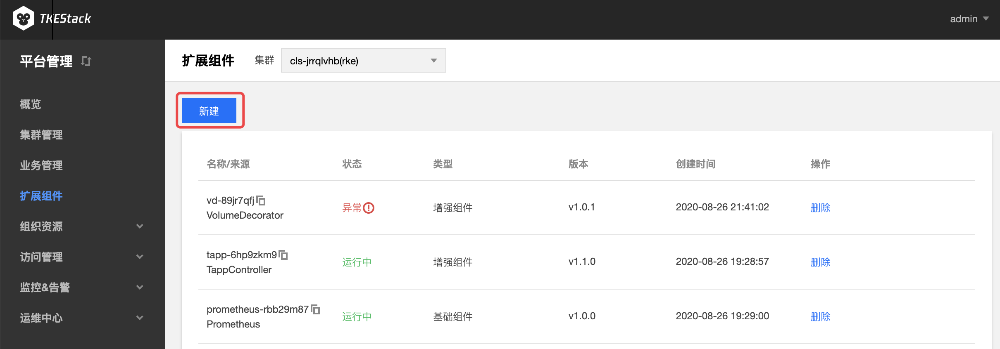
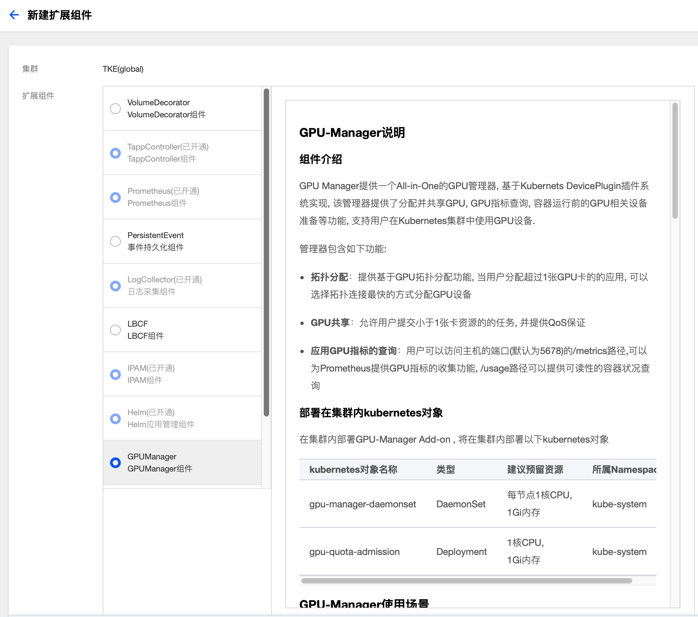

# 扩展组件

## 概念
**这里用户可以管理集群扩展组件。**

## 创建组件
  1. 登录 TKEStack。

  2. 切换至 【平台管理】控制台，选择【扩展组件】页面。

  3. 选择需要安装组件的集群，点击【新建】按钮。如下图所示：
      
      
      > 注意：此页面右边的【删除】按钮可以删除安装了的组件
      
  4. 在弹出的扩展组件列表里，选择要安装的组件。如下图所示：
      

      > 注意：如果选择的是PersistentEvent，需要在下方输入地址和索引。

  5. 单击【完成】。