# 监控和告警
## 概念
**这里用户可以管理设置平台告警和消息通知。**

## 告警设置
### 概念
**这里用户配置平台告警。**

### 前提条件

> 需要设置告警的集群应该先在[【扩展组件】](extender.md)安装**Prometheus组件**

### 操作步骤
#### 新建告警设置
  1. 登录 TKEStack。
  2. 切换至【平台管理】控制台，选择 【监控&告警】下的【告警设置】，查看“告警设置”列表。
  3. 选择相应【集群】，点击【新建】按钮。如下图所示：
      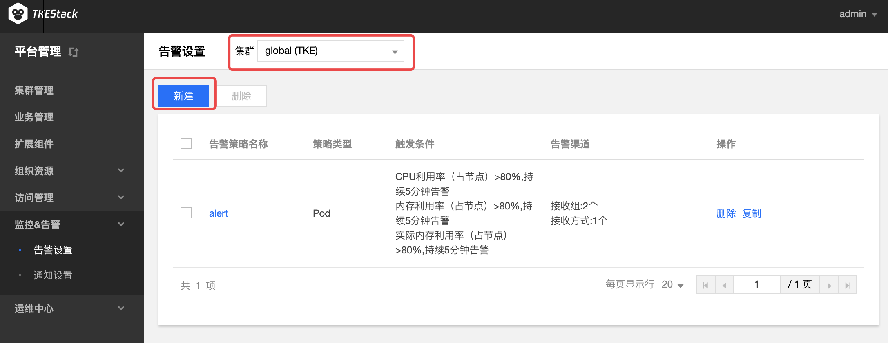
  4. 在“新建策略”页面填写告警策略信息。如下图所示：
      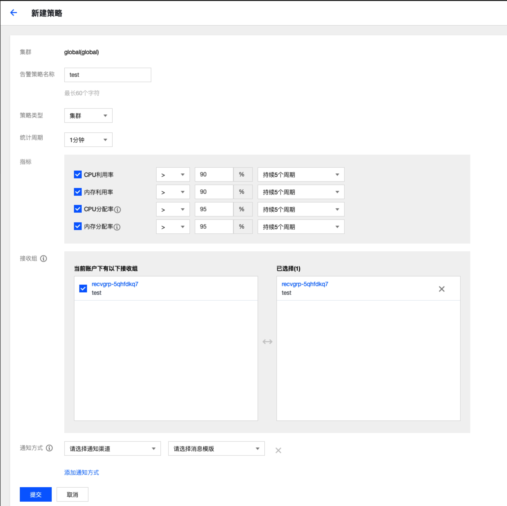
      + **告警策略名称：** 输入告警策略名称，最长60字符
      + **策略类型：** 选择告警策略应用类型
        + **集群：** 集群监控告警
        + **Pod：** Pod 监控告警
          + **告警对象：** 选择Pod相关的告警对象，支持对namespace下不同对deployment、stateful和daemonset 进行监控报警
            + **按工作负载选择：** 选择namespace下的某个工作负载
            + **全部选择：** 不区分namespace，全部监控
        + **节点：** 节点监控告警
      + **统计周期：** 选择数据采集周期，支持1、2、3、4、5分钟
      + **指标：** 选择告警指标，支持对监测值与指标值进行【大于/小于】比较，选择结果持续周期。如下图：
        
      + **接收组：** 选择接收组，当出现满足条件当报警信息时，向组内人员发送消息。**接收组需要先在 [通知设置](#通知设置) 创建**
      + **通知方式：** 选择通知渠道和消息模版。**通知渠道 和 消息模版需要先在 [通知设置](#通知设置) 创建**
        + **添加通知方式** 如需要添加多种通知方式，点击该按钮。
  5. 单击【提交】按钮。
#### 复制告警设置
  1. 登录 TKEStack。
  2. 切换至【平台管理】控制台，选择 【监控&告警】下的【告警设置】，查看“告警设置”列表。
  3. 选择相应【集群】，点击告警设置列表最右侧的【复制】按钮。如下图所示：
      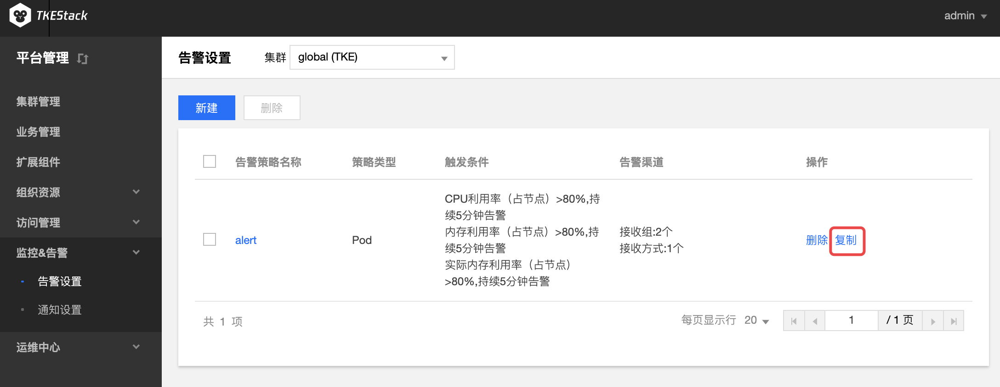  
  4. 在“复制策略”页面，编辑告警策略信息。
  5. 单击【提交】按钮。
#### 编辑告警设置
  1. 登录TKEStack
  2. 切换至【平台管理】控制台，选择 【监控&告警】下的【告警设置】，查看“告警设置”列表。
  3. 选择相应【集群】，点击【告警名称】。如下图所示：
      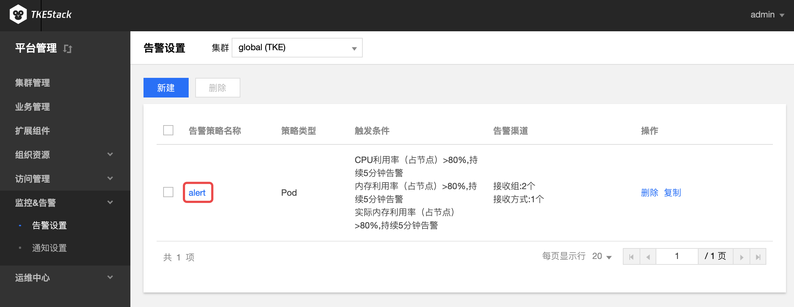
  4. 在“告警策略详情”页面，单击【基本信息】右侧的【编辑】按钮。如下图所示：
      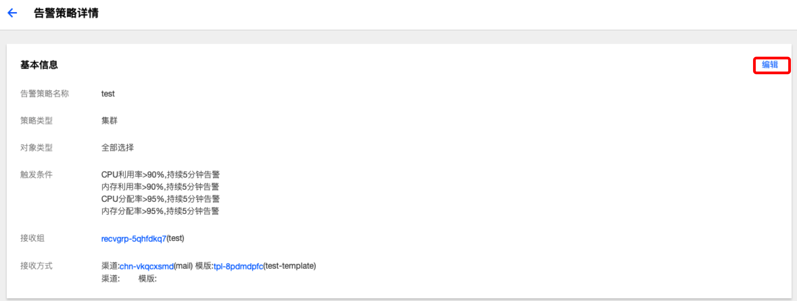
  5. 在“更新策略”页面，编辑策略信息。
  6. 单击【提交】按钮。
#### 删除告警设置
  1. 登录 TKEStack。
  2. 切换至【平台管理】控制台，选择 【监控&告警】下的【告警设置】，查看“告警设置”列表。
  3. 选择相应【集群】，点击列表最右侧的【删除】按钮。如下图所示：
      
  4. 在弹出的删除告警窗口，单击【确定】按钮。
#### 批量删除告警设置
  1. 登录TKEStack
  2. 切换至【平台管理】控制台，选择 【监控&告警】下的【告警设置】，查看“告警设置”列表。
  3. 选择相应【集群】，选择多个告警策略，单击告警设置下方的【删除】按钮。如下图所示：
      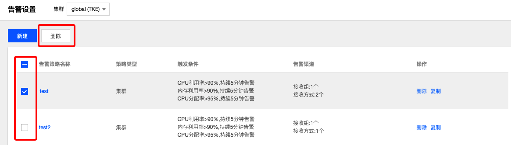
  4. 在弹出的删除告警窗口，单击【确定】按钮。

## 通知设置
### 概念

**这里用户配置平台通知。**

### 操作步骤

#### 通知渠道

##### 新建通知渠道

 1. 登录 TKEStack。
 2. 切换至【平台管理】控制台，选择 【监控&告警】->【通知设置】->【通知渠道】，查看“通知渠道”列表。
 3. 点击【新建】按钮。如下图所示：
    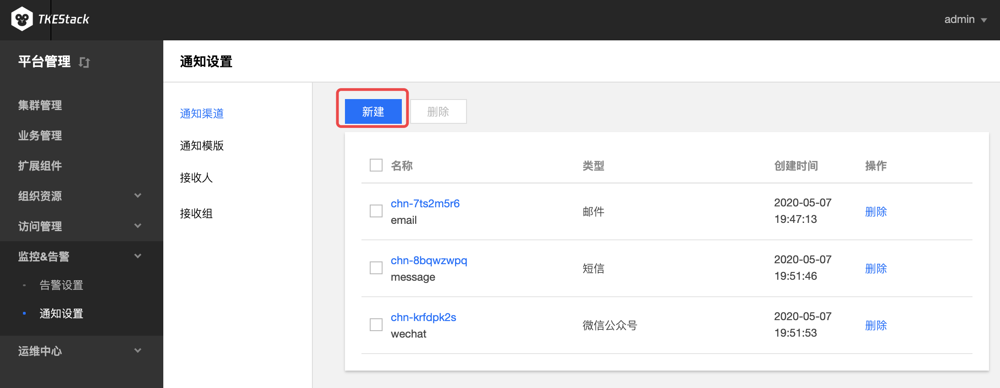
 4. 在“新建通知渠道”页面填写渠道信息。如下图所示：
    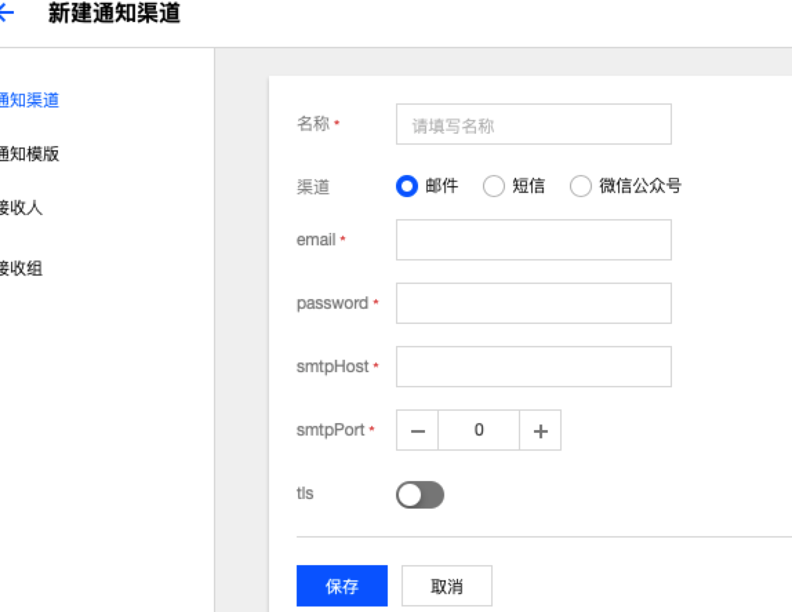

   + **名称：** 填写渠道名称
   + **渠道：** 选择渠道类型，输入渠道信息
     + **邮件：** 邮件类型
       + **email：** 邮件发送放地址
       + **password：** 邮件发送方密码
       + **smtpHost：** smtp IP地址
       + **smtpPort：** smtp端口
       + **tls：**  是否tls加密
     + **短信：** 短信方式
        + **appKey：** 短信发送方的appKey
        + **sdkAppID：** sdkAppID
        + **extend：** extend 信息
     + **微信公众号：** 微信公众号方式
        + **appID：** 微信公众号appID
        + **appSecret：** 微信公众号app密钥

5. 单击【保存】按钮。

##### 编辑通知渠道

 1. 登录 TKEStack。
 2. 切换至【平台管理】控制台，选择 【监控&告警】->【通知设置】->【通知渠道】，查看“通知渠道”列表。
 3. 单击渠道名称。如下图所示：
    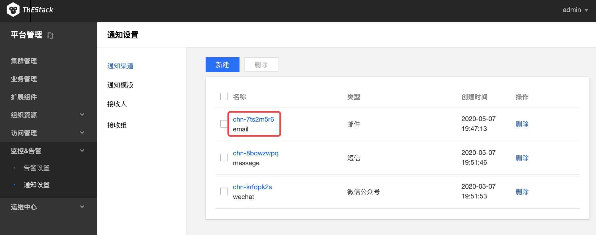
 4. 在“基本信息”页面，单击【基本信息】右侧的【编辑】按钮。如下图所示：
    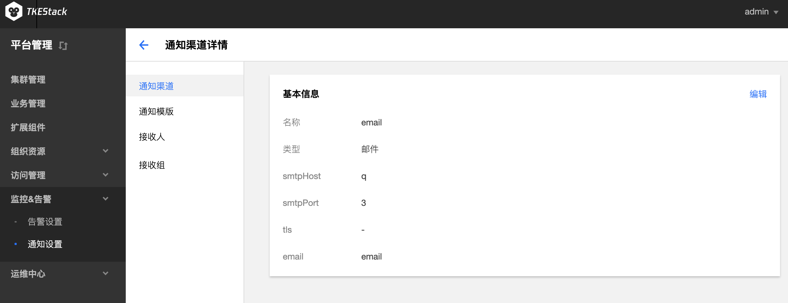
 5. 在“更新渠道通知”页面，编辑渠道信息。
 6. 单击【保存】按钮。

##### 删除通知渠道

 1. 登录 TKEStack。
 2. 切换至【平台管理】控制台，选择 【监控&告警】->【通知设置】->【通知渠道】，查看“通知渠道”列表。
 3. 选择要删除的渠道，点击【删除】按钮。如下图所示：
    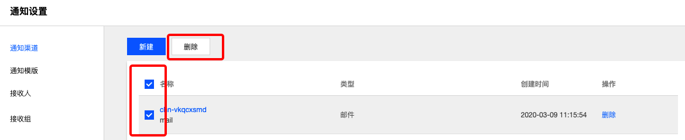
 4. 单击删除窗口的【确定】按钮。

#### 通知模板

##### 新建通知模版

 1. 登录 TKEStack。
 2. 切换至【平台管理】控制台，选择 【监控&告警】->【通知设置】->【通知模板】，查看“通知模板”列表。
 3. 点击【新建】按钮。如下图所示：
    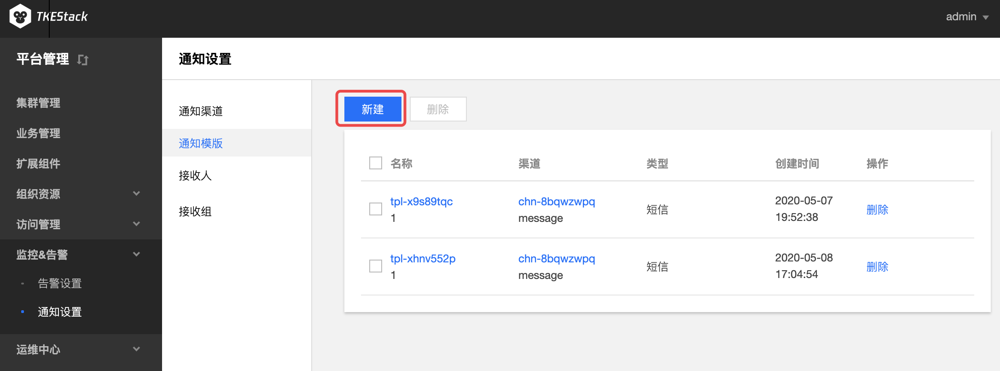
 4. 在“新建通知模版”页面填写模版信息。如下图所示：
    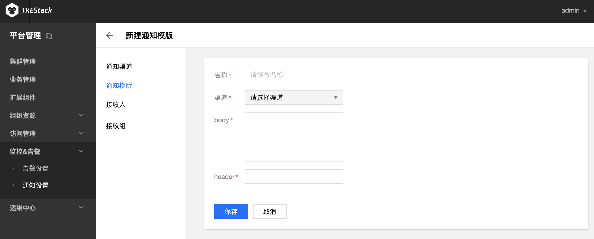

 + **名称：** 模版名称
 + **渠道：** 选择已创建的渠道
 + **body：** 填写消息body体
 + **header：** 填写消息标题

 5. 单击【保存】按钮。

##### 编辑通知模版

 1. 登录 TKEStack。
 2. 切换至【平台管理】控制台，选择 【监控&告警】->【通知设置】->【通知模板】，查看“通知模板”列表。
 3. 单击模版名称。如下图所示：
    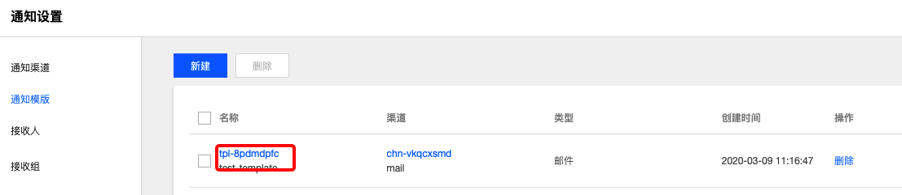
 4. 在基本信息页面，单击【基本信息】右侧的【编辑】按钮。如下图所示：
    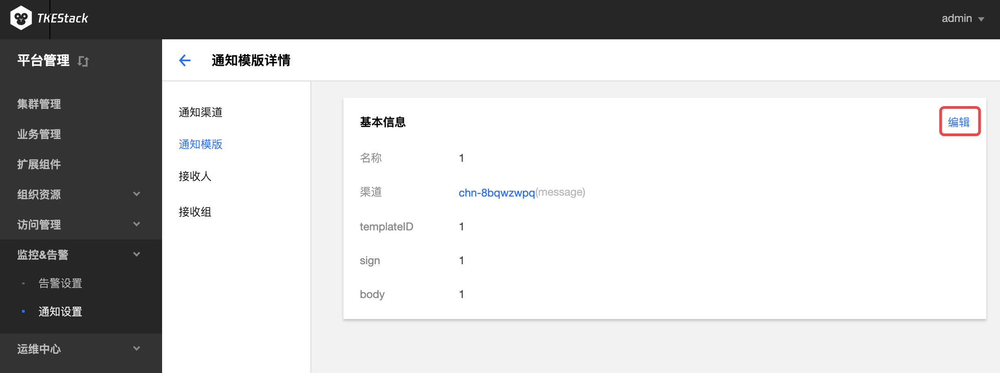
 5. 在“更新通知模版”页面，编辑模版信息。
 6. 单击【保存】按钮。

##### 删除通知模版

 1. 登录 TKEStack。
 2. 切换至【平台管理】控制台，选择 【监控&告警】->【通知设置】->【通知模板】，查看"通知模板"列表。
 3. 选择要删除的模版，点击【删除】按钮。如下图所示：
    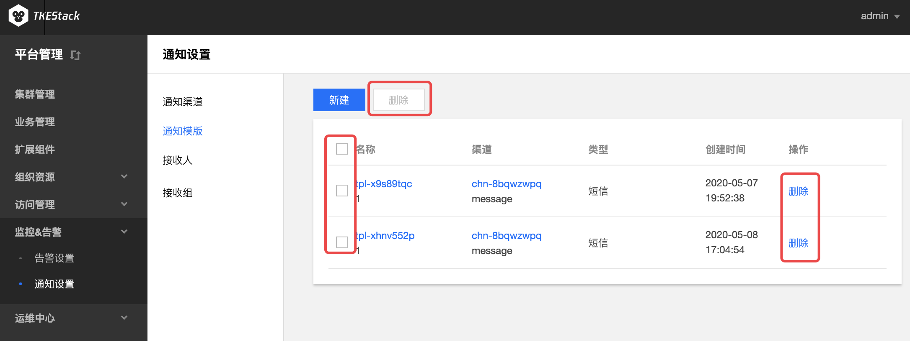
 4. 单击删除窗口的【确定】按钮。

#### 接收人

##### 新建接收人

 1. 登录 TKEStack。
 2. 切换至【平台管理】控制台，选择 【监控&告警】->【通知设置】->【接收人】，查看"接收人"列表。
 3. 点击【新建】按钮。如下图所示：
    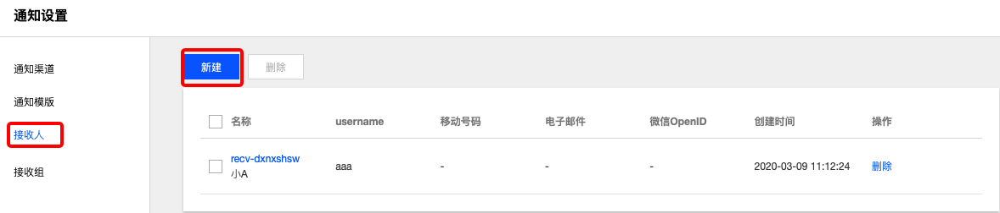
 4. 在“新建接收人”页面填写模版信息。如下图所示：
    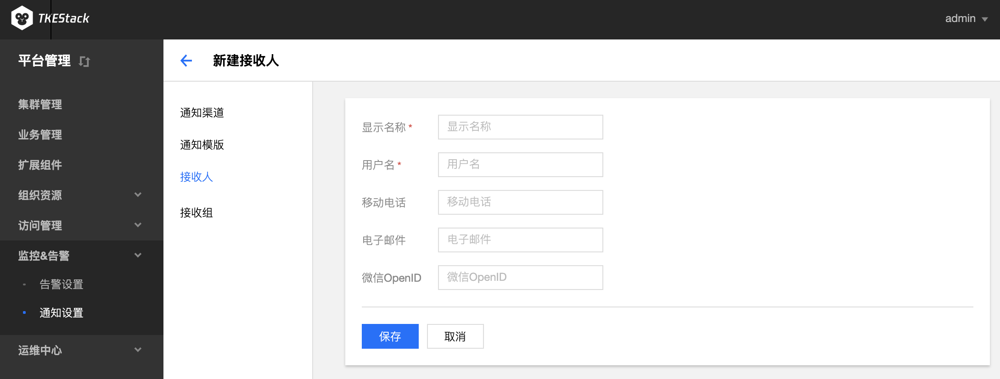

 + **显示名称：** 接收人显示名称
 + **用户名：** 接收人用户名
 + **移动电话：** 手机号
 + **电子邮件：** 接收人邮箱
 + **微信OpenID：** 接收人微信ID

 5. 单击【保存】按钮。

##### 编辑接收人信息

 1. 登录 TKEStack。
 2. 切换至【平台管理】控制台，选择 【监控&告警】->【通知设置】->【接收人】，查看“接收人”列表。
 3. 单击接收人名称。如下图所示：
    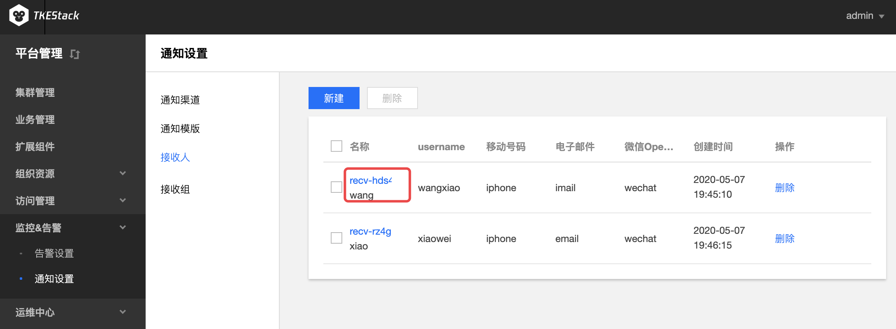
 4. 在“基本信息”页面，单击【基本信息】右侧的【编辑】按钮。如下图所示：
    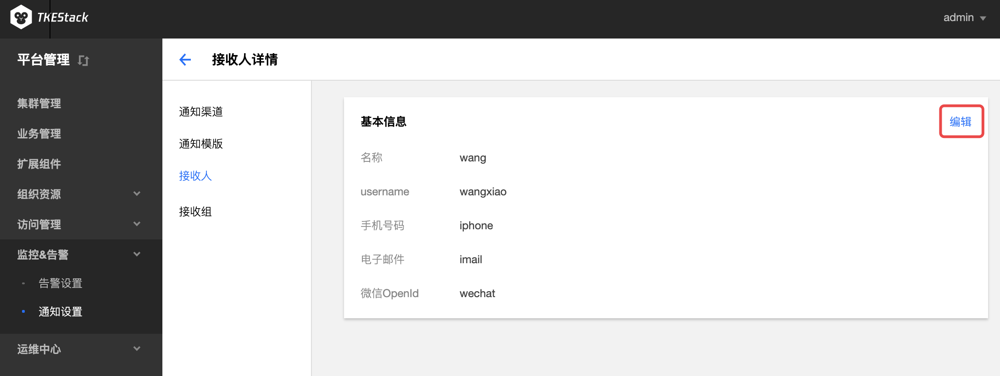
 5. 在“更新接收人”页面，编辑接收人信息。
 6. 单击【保存】按钮。

##### 删除接收人

 1. 登录 TKEStack。
 2. 切换至【平台管理】控制台，选择 【监控&告警】->【通知设置】->【接收人】，查看“接收人”列表。
 3. 选择要删除的接收人，点击【删除】按钮。如下图所示：
    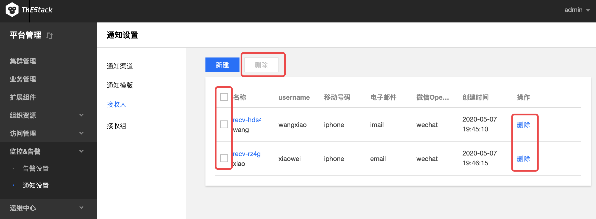
 4. 单击删除窗口的【确定】按钮。

#### 接收组

##### 新建接收组

 1. 登录 TKEStack。
 2. 切换至【平台管理】控制台，选择 【监控&告警】->【通知设置】->【接收组】，查看“接收组”列表。
 3. 点击【新建】按钮。如下图所示：
    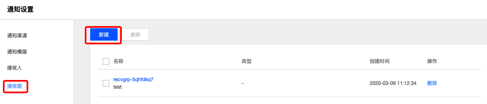
 4. 在“新建接收组”页面填写模版信息。如下图所示：
    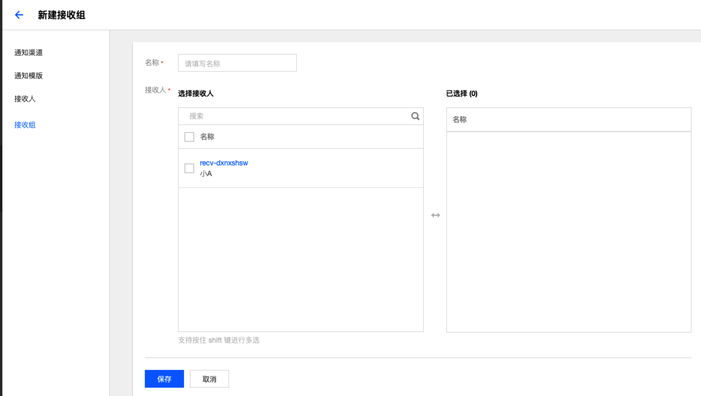
    
    * **名称：** 接收组显示名称
    * **接收组：** 从列表里选择接收人。如没有想要的接收人，请在[接收人](#接收人)里创建。

 5. 单击【保存】按钮。

##### 编辑接收组信息

 1. 登录 TKEStack。
 2. 切换至【平台管理】控制台，选择 【监控&告警】->【通知设置】->【接收组】，查看“接收组”列表。
 3. 单击接收组名称。如下图所示：
    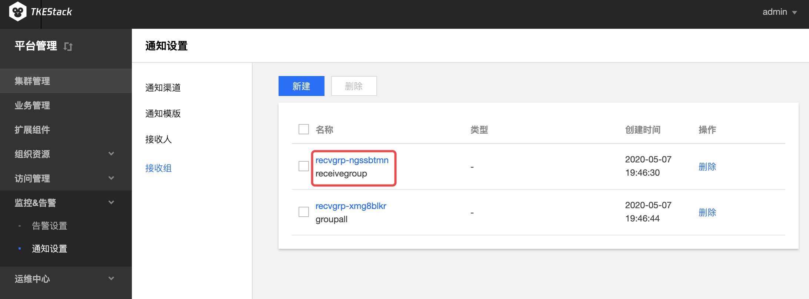
 4. 在“基本信息”页面，单击【基本信息】右侧的【编辑】按钮。如下图所示：
    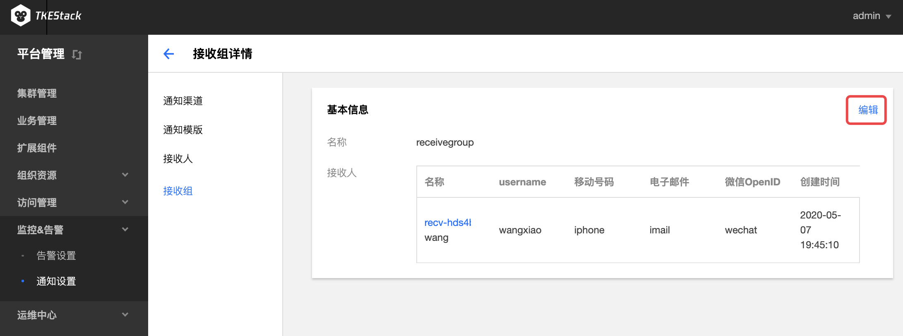
 5. 在“更新接收组”页面，编辑接收组信息。
 6. 单击【保存】按钮。

##### 删除接收组

 1. 登录 TKEStack。
 2. 切换至【平台管理】控制台，选择 【监控&告警】->【通知设置】->【接收组】，查看“接收组”列表。
 3. 选择要删除的接收组，点击【删除】按钮。如下图所示：
    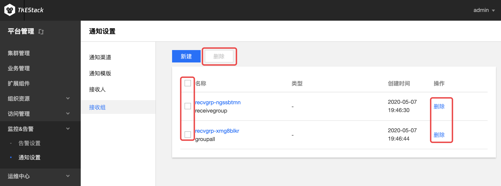
 4. 单击删除窗口的【确定】按钮。