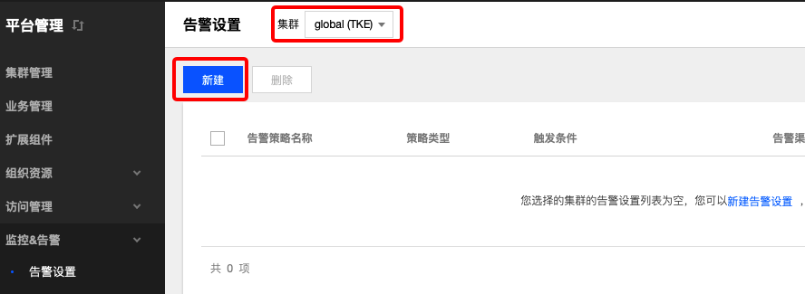

# 监控和告警
## 概念
**这里用户可以管理设置平台告警和消息通知。**

## 告警设置
### 概念
**这里用户配置平台告警。**
### 操作步骤
#### 新建告警设置
  1. 登录 TKEStack。
  2. 切换至 平台管理控制台，选择 监控&告警->告警设置。
  3. 选择相应【集群】，点击【新建】按钮。如下图所示：
      
  4. 在新建策略页面填写告警策略信息。如下图所示：
      
      + **告警策略名称：** 输入告警策略名称，最长60字符
      + **策略类型：** 选择告警策略应用类型
        + **集群：** 集群监控告警
        + **Pod：** Pod 监控告警
          + **告警对象：** 选择Pod相关的告警对象，支持对namespace下不同对deployment、stateful和daemonset 进行监控报警
            + **按工作负载选择：** 选择namespace下的某个工作负载
            + **全部选择：** 不区分namespace，全部监控
        + **节点：** 节点监控告警
      + **统计周期：** 选择数据采集周期，支持1、2、3、4、5分钟
      + **指标：** 选择告警指标，支持对监测值与指标值进行【大于/小于】比较，选择结果持续周期。如下图：
        
      + **接收组：** 选择接收组，当出现满足条件当报警信息时，向组内人员发送消息。**接收组需要先在 监控&告警 -> 通知设置 创建**
      + **通知方式：** 选择通知渠道和消息模版。**通知渠道和消息模版需要先在 监控&告警 -> 通知设置 创建**
        + **添加通知方式** 如需要添加多种通知方式，点击该按钮。
  5. 单击【提交】按钮。
#### 复制告警设置
  1. 登录 TKEStack。
  2. 切换至 平台管理控制台，选择 监控&告警->告警设置，查看告警设置列表。
  3. 选择相应【集群】，点击告警设置列表最右侧的【复制】按钮。如下图所示：
        
  4. 在复制策略页面，编辑告警策略信息，这里需要修改告警策略名称。
  5. 单击【提交】按钮。
#### 编辑告警设置
  1. 登录TKEStack
  2. 切换至 平台管理控制台，选择 监控&告警->告警设置，查看告警设置列表。
  3. 选择相应【集群】，点击【告警名称】。如下图所示：
      
  4. 在告警策略详情页面，单击【基本信息】右侧的【编辑】按钮。如下图所示：
      
  5. 在更新策略页面，编辑策略信息。
  6. 单击【提交】按钮。
#### 删除告警设置
  1. 登录 TKEStack。
  2. 切换至 平台管理控制台，选择 监控&告警->告警设置，查看告警设置列表。
  3. 选择相应【集群】，点击列表最右侧的【删除】按钮。如下图所示：
      
  4. 在弹出的删除告警窗口，单击【确定】按钮。
#### 批量删除告警设置
  1. 登录TKEStack
  2. 切换至 平台管理控制台，选择 监控&告警->告警设置，查看告警设置列表。
  3. 选择相应【集群】，选择多个告警策略，单击告警设置下方的【删除】按钮。如下图所示：
      
  4. 在弹出的删除告警窗口，单击【确定】按钮。

## 通知设置
### 概念
**这里用户配置平台通知**
### 操作步骤
#### 新建通知渠道
  1. 登录 TKEStack。
  2. 切换至 平台管理控制台，选择 监控&告警->通知设置->通知渠道。
  3. 点击【新建】按钮。如下图所示：
      
  4. 在新建通知渠道页面填写渠道信息。如下图所示：
      
     + **名称：** 填写渠道名称
     + **渠道：** 选择渠道类型，输入渠道信息
       + **邮件：** 邮件类型
         + **email：** 邮件发送放地址
         + **password：** 邮件发送方密码
         + **smtpHost：** smtp IP地址
         + **smtpPort：** smtp端口
         + **tls：**  是否tls加密
     + **短信：** 短信方式
       + **appKey：** 短信发送方的appKey
       + **sdkAppID：** sdkAppID
       + **extend：** extend 信息
     + **微信公众号：** 微信公众号方式
       + **appID：** 微信公众号appID
       + **appSecret：** 微信公众号app密钥
  5. 单击【保存】按钮。
#### 编辑通知渠道
  1. 登录 TKEStack。
  2. 切换至 平台管理控制台，选择 监控&告警->通知设置->通知渠道，查看通知渠道列表。
  3. 单击渠道名称。如下图所示：
      
  4. 在在基本信息页面，单击【基本信息】右侧的【编辑】按钮。如下图所示：
      
  5. 在更新渠道通知页面，编辑渠道信息。
  6. 单击【保存】按钮。
#### 删除通知渠道
  1. 登录 TKEStack。
  2. 切换至 平台管理控制台，选择 监控&告警->通知设置 -> 通知渠道。
  3. 选择要删除的渠道，点击【删除】按钮。如下图所示：
      
  4. 单击删除窗口的【确定】按钮。

#### 新建通知模版
  1. 登录TKEStack
  2. 切换至 平台管理控制台，选择 监控&告警->通知设置->通知模版。
  3. 点击【新建】按钮。如下图所示：
      
  4. 在新建通知模版页面填写模版信息。如下图所示：
      
     + **名称：** 模版名称
     + **渠道：** 选择已创建的渠道
     + **body：** 填写消息body体
     + **header：** 填写消息标题
  5. 单击【保存】按钮。
#### 编辑通知模版
  1. 登录 TKEStack。
  2. 切换至 平台管理控制台，选择 监控&告警->通知设置->通知模版，查看通知模版列表。
  3. 单击模版名称。如下图所示：
      
  4. 在基本信息页面，单击【基本信息】右侧的【编辑】按钮。如下图所示：
      
  5. 在更新通知模版页面，编辑模版信息。
  6. 单击【保存】按钮。
#### 删除通知模版
  1. 登录 TKEStack。
  2. 切换至 平台管理控制台，选择 监控&告警->通知设置->通知模版，查看通知模版列表。
  3. 选择要删除的模版，点击【删除】按钮。如下图所示：
      
  4. 单击删除窗口的【确定】按钮。

#### 新建接收人
  1. 登录 TKEStack。
  2. 切换至 平台管理控制台，选择 监控&告警->通知设置->接收人。
  3. 点击【新建】按钮。如下图所示：
      
  4. 在新建接收人页面填写模版信息。如下图所示：
      
     + **显示名称：** 接收人显示名称
     + **用户名：** 接收人用户名
     + **移动电话：** 手机号
     + **电子邮件：** 接收人邮箱
     + **微信OpenID：** 接收人微信ID
  5. 单击【保存】按钮。
#### 编辑接收人信息
  1. 登录 TKEStack。
  2. 切换至 平台管理控制台，选择 监控&告警->通知设置->接收人，查看接收人列表。
  3. 单击接收人名称。如下图所示：
      
  4. 在基本信息页面，单击【基本信息】右侧的【编辑】按钮。如下图所示：
      
  5. 在更新接收人页面，编辑接收人信息。
  6. 单击【保存】按钮。
#### 删除接收人
  1. 登录 TKEStack。
  2. 切换至 平台管理控制台，选择 监控&告警->通知设置->接收人，查看接收人列表。
  3. 选择要删除的接收人，点击【删除】按钮。如下图所示：
      
  4. 单击删除窗口的【确定】按钮。

#### 新建接收组
  1. 登录 TKEStack。
  2. 切换至 平台管理控制台，选择 监控&告警->通知设置->接收组。
  3. 点击【新建】按钮。如下图所示：
      
  4. 在新建接收组页面填写模版信息。如下图所示：
      

    + **名称：** 接收组显示名称
    + **接收组：** 从列表里选择接收人。如没有想要的接收人，请在接收人里创建{新建接收人}。
  5. 单击【保存】按钮。
#### 编辑接收组信息
  1. 登录 TKEStack。
  2. 切换至 平台管理控制台，选择 监控&告警->通知设置->接收组，查看接收组列表。
  3. 单击接收组名称。如下图所示：
      
  4. 在基本信息页面，单击【基本信息】右侧的【编辑】按钮。如下图所示：
      
  5. 在更新接收组页面，编辑接收组信息。
  6. 单击【保存】按钮。
#### 删除接收组
  1. 登录 TKEStack。
  2. 切换至 平台管理控制台，选择 监控&告警->通知设置->接收组，查看接收组列表。
  3. 选择要删除的接收组，点击【删除】按钮。如下图所示：
      
  4. 单击删除窗口的【确定】按钮。
