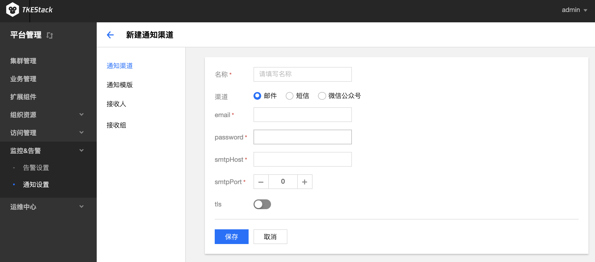
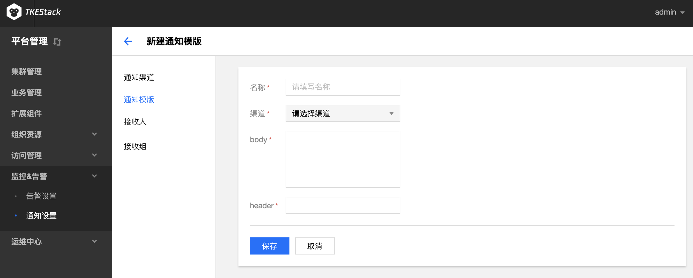
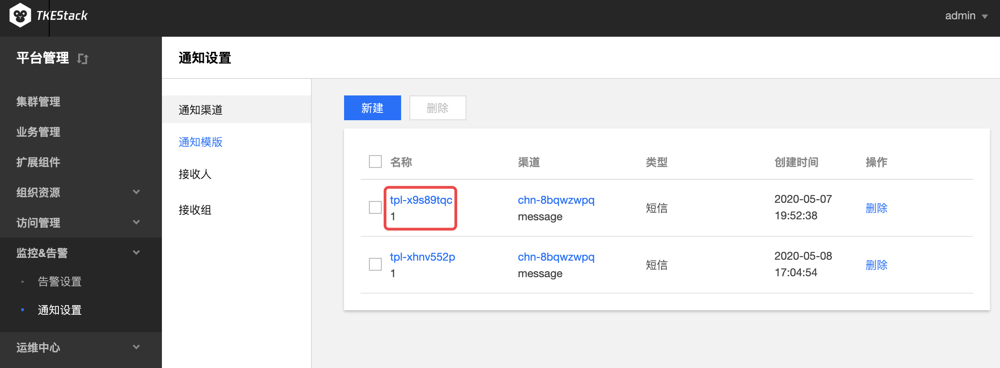
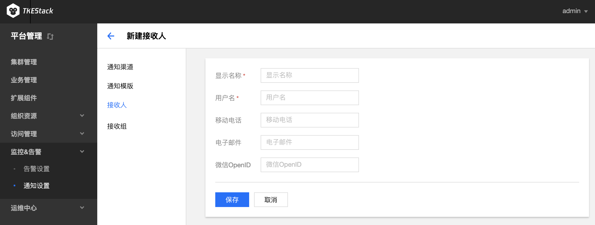
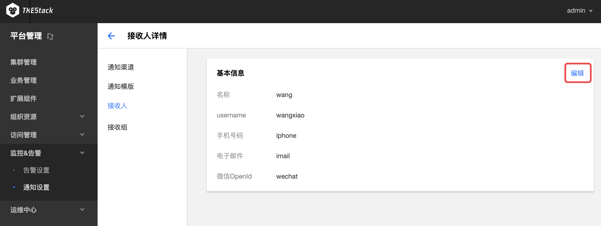
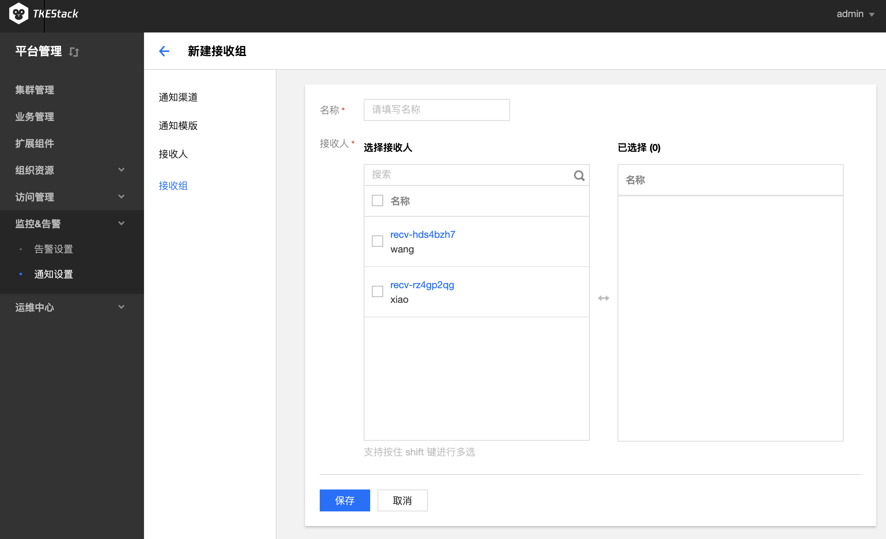
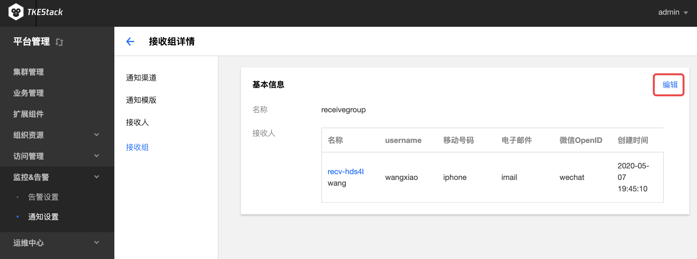

# 通知设置
## 概念

**这里用户配置平台通知。**

## 通知渠道

### 新建通知渠道

 1. 登录 TKEStack。
 2. 切换至【平台管理】控制台，选择 【监控&告警】->【通知设置】->【通知渠道】，查看“通知渠道”列表。
 3. 点击【新建】按钮。如下图所示：
    
 4. 在“新建通知渠道”页面填写渠道信息。如下图所示：
    

   + **名称：** 填写渠道名称
   + **渠道：** 选择渠道类型，输入渠道信息
     + **邮件：** 邮件类型
       + **email：** 邮件发送放地址
       + **password：** 邮件发送方密码
       + **smtpHost：** smtp IP地址
       + **smtpPort：** smtp端口
       + **tls：**  是否tls加密
     + **短信：** 短信方式
        + **appKey：** 短信发送方的appKey
        + **sdkAppID：** sdkAppID
        + **extend：** extend 信息
     + **微信公众号：** 微信公众号方式
        + **appID：** 微信公众号appID
        + **appSecret：** 微信公众号app密钥

5. 单击【保存】按钮。

### 编辑通知渠道

 1. 登录 TKEStack。
 2. 切换至【平台管理】控制台，选择 【监控&告警】->【通知设置】->【通知渠道】，查看“通知渠道”列表。
 3. 单击渠道名称。如下图所示：
    
 4. 在“基本信息”页面，单击【基本信息】右侧的【编辑】按钮。如下图所示：
    
 5. 在“更新渠道通知”页面，编辑渠道信息。
 6. 单击【保存】按钮。

### 删除通知渠道

 1. 登录 TKEStack。
 2. 切换至【平台管理】控制台，选择 【监控&告警】->【通知设置】->【通知渠道】，查看“通知渠道”列表。
 3. 选择要删除的渠道，点击【删除】按钮。如下图所示：
    
 4. 单击删除窗口的【确定】按钮。

## 通知模板

### 新建通知模版

 1. 登录 TKEStack。
 2. 切换至【平台管理】控制台，选择 【监控&告警】->【通知设置】->【通知模板】，查看“通知模板”列表。
 3. 点击【新建】按钮。如下图所示：
    
 4. 在“新建通知模版”页面填写模版信息。如下图所示：
    

 + **名称：** 模版名称
 + **渠道：** 选择已创建的渠道
 + **body：** 填写消息body体
 + **header：** 填写消息标题

 5. 单击【保存】按钮。

### 编辑通知模版

 1. 登录 TKEStack。
 2. 切换至【平台管理】控制台，选择 【监控&告警】->【通知设置】->【通知模板】，查看“通知模板”列表。
 3. 单击模版名称。如下图所示：
    
 4. 在基本信息页面，单击【基本信息】右侧的【编辑】按钮。如下图所示：
    
 5. 在“更新通知模版”页面，编辑模版信息。
 6. 单击【保存】按钮。

### 删除通知模版

 1. 登录 TKEStack。
 2. 切换至【平台管理】控制台，选择 【监控&告警】->【通知设置】->【通知模板】，查看"通知模板"列表。
 3. 选择要删除的模版，点击【删除】按钮。如下图所示：
    
 4. 单击删除窗口的【确定】按钮。

## 接收人

### 新建接收人

 1. 登录 TKEStack。
 2. 切换至【平台管理】控制台，选择 【监控&告警】->【通知设置】->【接收人】，查看"接收人"列表。
 3. 点击【新建】按钮。如下图所示：
    
 4. 在“新建接收人”页面填写模版信息。如下图所示：
    

 + **显示名称：** 接收人显示名称
 + **用户名：** 接收人用户名
 + **移动电话：** 手机号
 + **电子邮件：** 接收人邮箱
 + **微信OpenID：** 接收人微信ID

 5. 单击【保存】按钮。

### 编辑接收人信息

 1. 登录 TKEStack。
 2. 切换至【平台管理】控制台，选择 【监控&告警】->【通知设置】->【接收人】，查看“接收人”列表。
 3. 单击接收人名称。如下图所示：
    
 4. 在“基本信息”页面，单击【基本信息】右侧的【编辑】按钮。如下图所示：
    
 5. 在“更新接收人”页面，编辑接收人信息。
 6. 单击【保存】按钮。

### 删除接收人

 1. 登录 TKEStack。
 2. 切换至【平台管理】控制台，选择 【监控&告警】->【通知设置】->【接收人】，查看“接收人”列表。
 3. 选择要删除的接收人，点击【删除】按钮。如下图所示：
    
 4. 单击删除窗口的【确定】按钮。

## 接收组

### 新建接收组

 1. 登录 TKEStack。
 2. 切换至【平台管理】控制台，选择 【监控&告警】->【通知设置】->【接收组】，查看“接收组”列表。
 3. 点击【新建】按钮。如下图所示：
    
 4. 在“新建接收组”页面填写模版信息。如下图所示：
    
    
    * **名称：** 接收组显示名称
    * **接收组：** 从列表里选择接收人。如没有想要的接收人，请在[接收人](#接收人)里创建。

 5. 单击【保存】按钮。

### 编辑接收组信息

 1. 登录 TKEStack。
 2. 切换至【平台管理】控制台，选择 【监控&告警】->【通知设置】->【接收组】，查看“接收组”列表。
 3. 单击接收组名称。如下图所示：
    
 4. 在“基本信息”页面，单击【基本信息】右侧的【编辑】按钮。如下图所示：
    
 5. 在“更新接收组”页面，编辑接收组信息。
 6. 单击【保存】按钮。

### 删除接收组

 1. 登录 TKEStack。
 2. 切换至【平台管理】控制台，选择 【监控&告警】->【通知设置】->【接收组】，查看“接收组”列表。
 3. 选择要删除的接收组，点击【删除】按钮。如下图所示：
    
 4. 单击删除窗口的【确定】按钮。