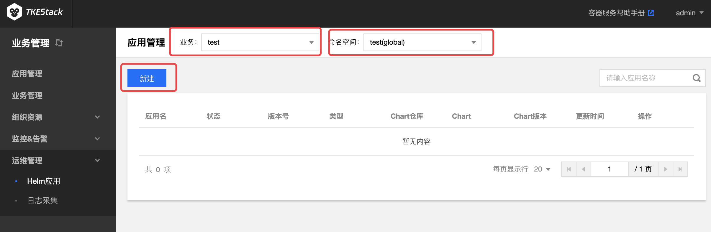
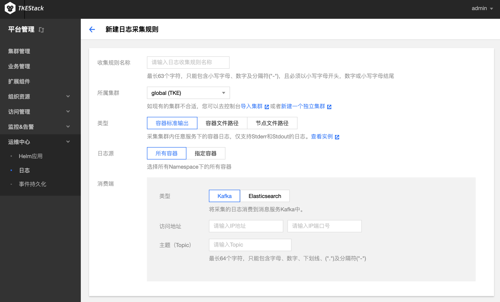

# 运维中心
## 概念
**这里用户可以管理 Helm 应用、日志和集群事件持久化。**

## Helm应用
### 概念
**这里给集群创建 Helm 应用。**

### 前提条件

>需要使用Helm应用的集群应该先在[【扩展组件】](extender.md)安装**Helm组件**

### 操作步骤
#### 新建Helm应用
  1. 登录 TKEStack。
  2. 切换至【平台管理】控制台，选择【运维中心】->【 Helm 应用】。
  3. 选择相应【集群】，单击【新建】按钮。如下图所示：
      
  4. 在“新建Helm应用”页面填写Helm应用信息。如下图所示：
      
     + **应用名：** 输入应用名，1～63字符，只能包含小写字母、数字及分隔符("-")，且必须以小写字母开头，数字或小写字母结尾
     + **Chart_Url：** 输入Chart 文件地址
     + **类型：** 选择应用类型
       + **公有：** 公有类型
       + **私有：** 私有类型
         + **用户名：** 私有用户名
         + **密码：** 私有密码
     + **Key-Value：** 通过新增变量替换Chart包中默认配置
  5. 单击【完成】按钮。

## 日志
### 概念
**这里用户可以管理各个集群的日志采集**
### 操作步骤
#### 新建日志采集应用
  1. 登录 TKEStack。
  2. 切换至【平台管理】控制台，选择 【运维中心】->【日志】。
  3. 选择相应【集群】和【命名空间】，单击【新建】按钮。如下图所示：
      
  4. 在“新建日志采集”页面填写日志采集信息。如下图所示：
      
     + **收集规则名称：** 输入规则名，1～63字符，只能包含小写字母、数字及分隔符("-")，且必须以小写字母开头，数字或小写字母结尾
     + **所属集群：** 选择所属集群
     + **类型：** 选择采集类型
       + **容器标准输出：** 容器Stdout信息采集
         + **日志源：** 可以选择所有容器或者某个namespace下的所有容器或者工作负载
           + **所有容器：** 所有容器
           + **指定容器：** 某个Namespace下的所有容器或者工作负载
       + **容器文件路径：** 容器内文件内容采集
         + **日志源：** 可以采集具体容器内的某个文件路径下的文件内容
           + **工作负载选项：** 选择某个namespace下的某种工作负载类型下的某个工作负载
           + **配置采集路径：** 选择某个容器下的某个文件路径
       + **节点文件路径：**  收集节点上某个路径下的文件内容
             + **日志源：** 
               + **收集路径：** 节点上日志收集路径
               + **metadata：** key：value格式，收集的日志会带上metadata信息上报给消费端
     + **消费端：** 选择日志消费端
       + **Kafka：** 
         + **访问地址：** kafka ip和端口
         + **主题（Topic）：** kafka topic名
       + **Elasticsearch：** 
         + **Elasticsearch地址：** ES 地址，如：http://190.0.0.1:200
         + **索引：** ES索引，最长60个字符，只能包含小写字母、数字及分隔符("-"、"_"、"+")，且必须以小写字母开头
  5. 单击【完成】按钮。

## 事件持久化
### 概念
**这里用户可以管理各个集群的事件**
### 操作步骤
#### 设置事件持久化
  1. 登录 TKEStack。
  2. 切换至【平台管理】控制台，选择 【运维中心】->【事件持久化】，查看事件持久化列表。
  3. 单击列表最右侧【设置】按钮。如下图所示：
      
  4. 在“设置事件持久化”页面填写持久化信息。如下图所示：
      
     + **事件持久化存储：** 是否进行持久化存储
     + **Elasticsearch地址：** ES 地址，如：http://190.0.0.1:200
     + **索引：** ES索引，最长60个字符，只能包含小写字母、数字及分隔符("-"、"_"、"+")，且必须以小写字母开头
  5. 单击【完成】按钮。

