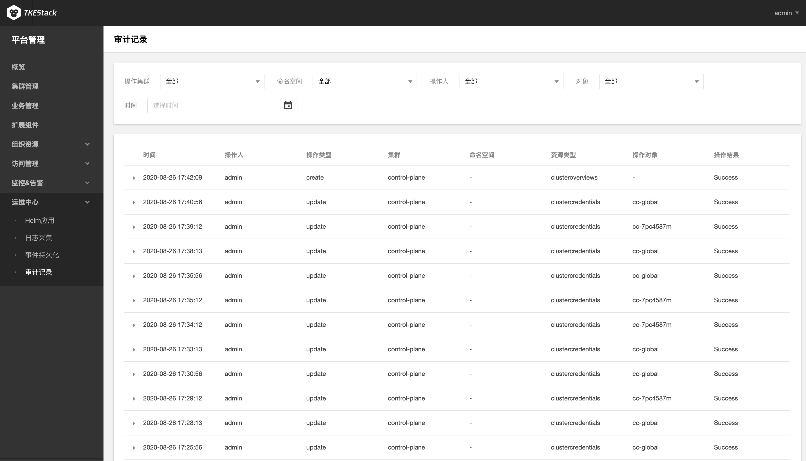

# 审计记录

## 简介

集群审计是基于 [Kubernetes Audit](https://kubernetes.io/docs/tasks/debug-application-cluster/audit) 对 kube-apiserver 产生的可配置策略的 JSON 结构日志的记录存储及检索功能。本功能记录了对 kube-apiserver 的访问事件，会按顺序记录每个用户、管理员或系统组件影响集群的活动。

### 功能优势

集群审计功能提供了区别于 metrics 的另一种集群观测维度。开启集群审计后，Kubernetes 可以记录每一次对集群操作的审计日志。每一条审计日志是一个 JSON 格式的结构化记录，包括元数据（metadata）、请求内容（requestObject）和响应内容（responseObject）三个部分。其中元数据（包含了请求的上下文信息，例如谁发起的请求、从哪里发起的、访问的 URI 等信息）一定会存在，请求和响应内容是否存在取决于审计级别。通过日志可以了解到以下内容：

- 集群里发生的活动
- 活动的发生时间及发生对象。
- 活动的触发时间、触发位置及观察点
- 活动的结果以及后续处理行为

### 阅读审计日志

```json
{
  "kind":"Event",
  "apiVersion":"audit.k8s.io/v1",
  "level":"RequestResponse",
  "auditID":0a4376d5-307a-4e16-a049-24e017******,
  "stage":"ResponseComplete",
  // 发生了什么
  "requestURI":"/apis/apps/v1/namespaces/default/deployments",
  "verb":"create",
  // 谁发起的
  "user":{
    "username":"admin",
      "uid":"admin",
      "groups":[
        "system:masters",
        "system:authenticated"
      ]
  },
  // 从哪里发起
  "sourceIPs":[
    "10.0.6.68"
  ],
  "userAgent":"kubectl/v1.16.3 (linux/amd64) kubernetes/ald64d8",
  // 发生了什么
  "objectRef":{
    "resource":"deployments",
    "namespace":"default",
    "name":"nginx-deployment",
    "apiGroup":"apps",
    "apiVersion":"v1"
  },
  // 结果是什么
  "responseStatus":{
    "metadata":{
    },
    "code":201
  },
  // 请求及返回具体信息
  "requestObject":Object{...},
  "responseObject":Object{...},
  // 什么时候开始/结束
  "requestReceivedTimestamp":"2020-04-10T10:47:34.315746Z",
  "stageTimestamp":"2020-04-10T10:47:34.328942Z",
  // 请求被接收/拒绝的原因是什么
  "annotations":{
    "authorization.k8s.io/decision":"allow",
    "authorization.k8s.io/reason":""
  }
}
```

## 前提条件

>在 [Installer安装页面](../../../installation/installation-procedures.md)的控制台安装的第5步中，如下图所示，已经开启平台审计功能，并配置好 ElasticSearch：
>

## 查看审计
  1. 登录 TKEStack

  2. 切换至【平台管理】控制台，选择 【运维中心】->【审计记录】，查看审计列表：

     

