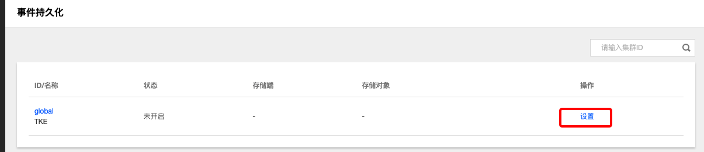
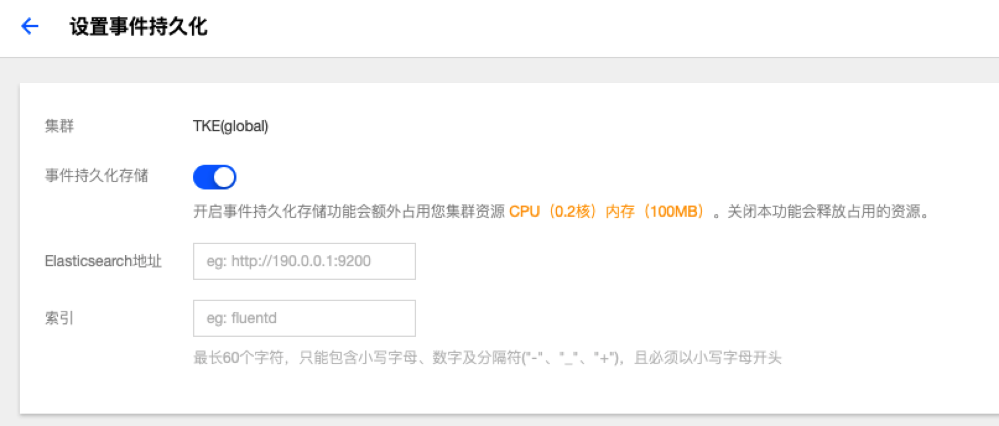

# 事件持久化
## 概念
**这里用户可以管理各个集群的事件**

## 设置事件持久化
  1. 登录 TKEStack
  2. 切换至【平台管理】控制台，选择 【运维中心】->【事件持久化】，查看事件持久化列表
  3. 单击列表最右侧【设置】按钮，如下图所示：
      
  4. 在“设置事件持久化”页面填写持久化信息，如下图所示：
      
          
     + **事件持久化存储：** 是否进行持久化存储
     
     + **Elasticsearch地址：** ES 地址，如：http://190.0.0.1:200
     
       > 注意：当前只支持版本号为5的 ES，且未开启 ES 集群的用户登录认证
     
     + **索引：** ES索引，最长60个字符，只能包含小写字母、数字及分隔符("-"、"_"、"+")，且必须以小写字母开头
  5. 单击【完成】按钮