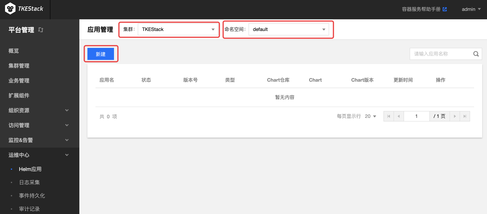
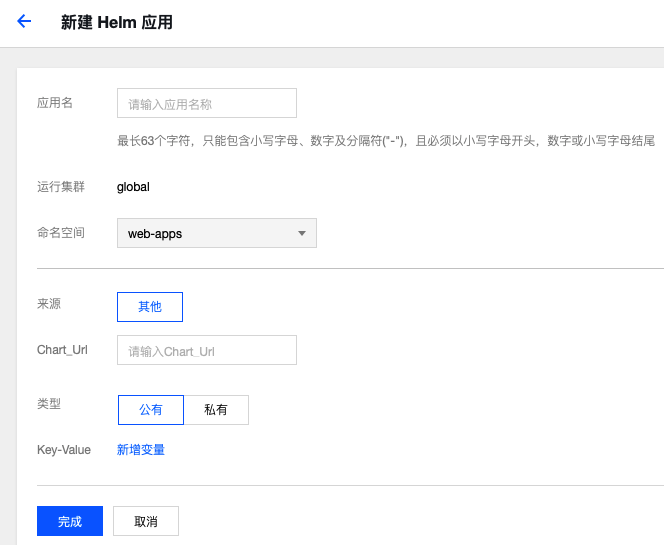
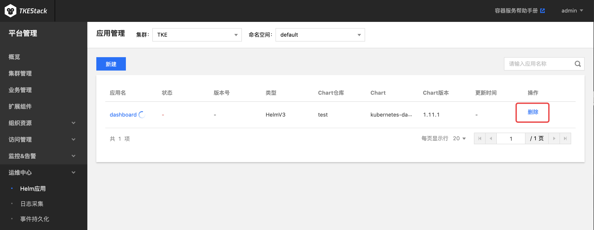
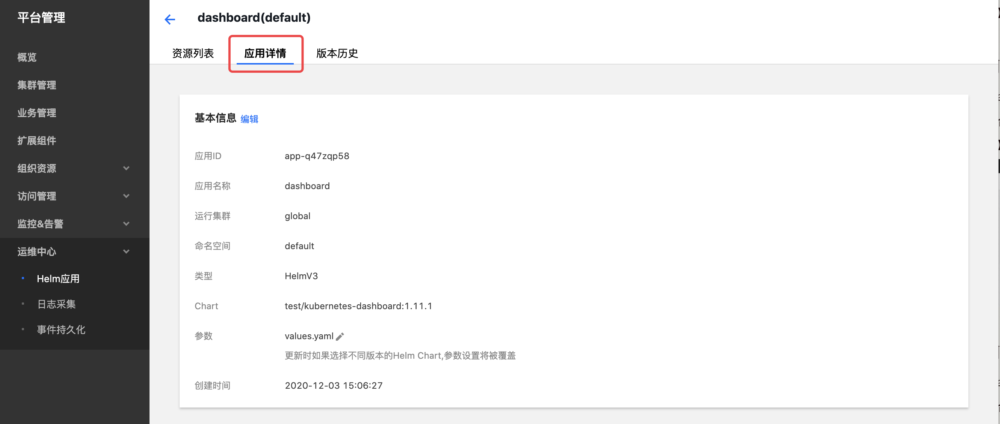
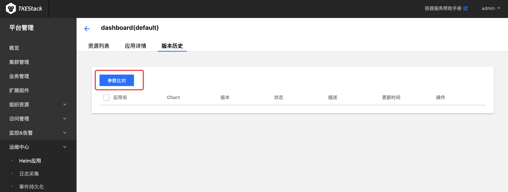

# Helm应用
应用功能是 TKEStack 集成的 [Helm 3.0](https://helm.sh/) 相关功能，为您提供创建 helm chart、容器镜像、软件服务等各种产品和服务的能力。已创建的应用将在您指定的集群中运行，为您带来相应的能力。

## 新建 Helm 应用
  1. 登录 TKEStack
  2. 切换至【平台管理】控制台，选择【运维中心】->【 Helm 应用】
  3. 选择相应【集群】，单击【新建】按钮，如下图所示：
      
  4. 在“新建 Helm 应用”页面填写Helm应用信息，如下图所示：
      
     + **应用名称：** 输入应用名，1～63字符，只能包含小写字母、数字及分隔符("-")，且必须以小写字母开头，数字或小写字母结尾
     + **运行集群：** 选择应用所在集群
     + **命名空间：** 选择应用所在集群的命名空间
     + **类型：** 当前仅支持 HelmV3
     + **Chart：** 选择需要部署的 chart
     + **Chart版本：** 选择 chart 的版本
     + **参数：** 更新时如果选择不同版本的 Helm Chart，参数设置将被覆盖
     + **拟运行：** 会返回模板渲染清单，即最终将部署到集群的 YAML 资源，不会真正执行安装
  5. 单击【完成】按钮

## 删除 Helm 应用

  1. 登录 TKEStack

  2. 切换至【平台管理】控制台，选择【运维中心】->【 Helm 应用】

  3. 点击【删除】

     

## 查看 Helm 应用资源列表

  1. 登录 TKEStack

  2. 切换至【平台管理】控制台，选择【运维中心】->【 Helm 应用】

  3. 点击【应用名】后，点击【资源列表】，可查看该应用所有 Kubernetes 资源对象

     

## 查看 Helm 应用详情

  1. 登录 TKEStack

  2. 切换至【平台管理】控制台，选择【运维中心】->【 Helm 应用】

  3. 点击【应用名】后，点击【应用详情】

     

## 查看 Helm 应用版本历史

  1. 登录 TKEStack

  2. 切换至【平台管理】控制台，选择【运维中心】->【 Helm 应用】

  3. 点击【应用名】后，点击【版本历史】，可查看该应用所部署的历史版本。可以通过选择不同的版本进行参数对比查看其版本区别

     