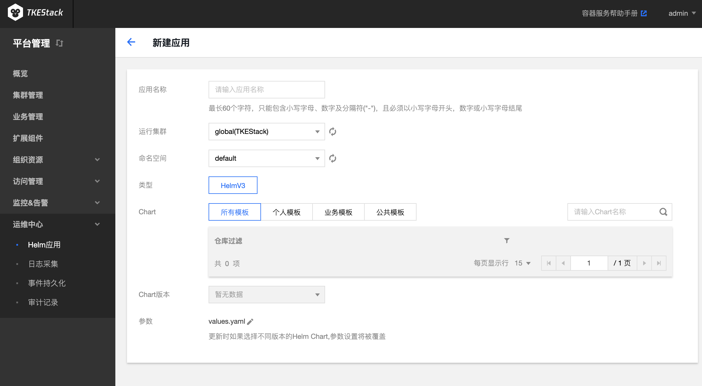

# Helm应用
## 概念
**这里给集群创建 Helm 应用。**

## 前提条件

>- 需要使用Helm应用的集群应该先在[【扩展组件】](extender.md)安装**Helm组件**

## 新建Helm应用
  1. 登录 TKEStack。
  2. 切换至【平台管理】控制台，选择【运维中心】->【 Helm 应用】。
  3. 选择相应【集群】，单击【新建】按钮。如下图所示：
      
  4. 在“新建Helm应用”页面填写Helm应用信息。如下图所示：
      
     + **应用名称：** 输入应用名，1～63字符，只能包含小写字母、数字及分隔符("-")，且必须以小写字母开头，数字或小写字母结尾
     + **运行集群：** 选择应用所在集群
     + **命名空间：** 选择应用所在集群的命名空间
     + **类型：** 当前仅支持HelmV3
     + **Chart：** 选择需要部署的chart
     + **Chart版本：** 选择chart的版本
     + **参数：** 更新时如果选择不同版本的Helm Chart，参数设置将被覆盖
  5. 单击【完成】按钮。

