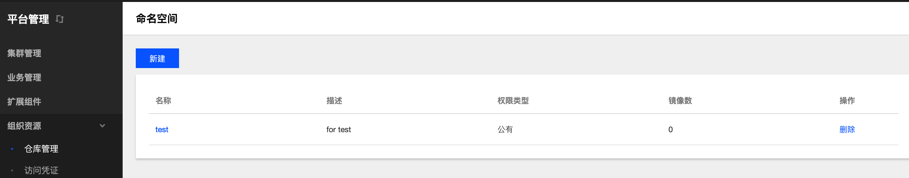
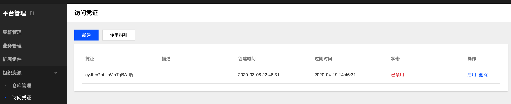

# 组织资源

## 概念
**这里用户可以管理镜像仓库和凭据。**

## 镜像仓库管理
**这里用户可以在镜像仓库里创建属于自己的命名空间，管理镜像。**

### 操作步骤
#### 新建命名空间
  1. 登录 TKEStack。
  2. 切换至 平台管理控制台，选择 组织资源->仓库管理。
  3. 点击【新建】按钮。如下图所示：
      
  4. 在弹出的新建命名空间页面，填写命名空间信息，如下图所示：
      
     + **名称：** 命名空间名字，不超过63字符
     + **描述：** 命名空间描述信息
     + **权限类型：** 选择命名空间权限类型
       + **公有：** 所有人均可访问该命名空间下的镜像
       + **私有：** 个人用户命名空间
  5. 单击【确认】按钮
 #### 删除命名空间
  1. 登录 TKEStack。
  2. 切换至 平台管理控制台，选择 组织资源->仓库管理，查看命名空间列表。如下图所示：
      
  3. 点击列表最右侧【删除】按钮。如下图所示：
      
#### 镜像上传
  1. 登录 TKEStack。
  2. 切换至 平台管理控制台，选择 组织资源->仓库管理，查看命名空间列表。如下图所示：
      
  3. 点击列表中命名空间【名称】。如下图所示：
      
  4. 点击命名空间的【镜像上传指引】按钮。如下图所示：
      
  5. 根据指引内容，在物理节点上执行相应命令。如下图所示：
      
#### 镜像删除
#### 镜像查看
#### 镜像使用指引

## Chart 包仓库管理
**这里用户可以在 Chart 包仓库里创建属于自己的 Chart 包命名空间，管理 Chart。**

### 操作步骤
#### 新建 Chart 包命名空间
  1. 登录 TKEStack。
  2. 切换至 平台管理控制台，选择 组织资源-> Chart 包仓库管理，查看 Chart 包命名空间列表
  3. 点击【新建】按钮。如下图所示：
      
  4. 在弹出的新建 ChartGroup 页面，填写 ChartGroup 信息，如下图所示：
      
     + **名称：** ChartGroup 名字，不超过63字符
     + **描述：** ChartGroup 描述信息
     + **权限类型：** 选择 ChartGroup 权限类型
       + **公有：** 所有人均可访问该 ChartGroup 下的Chart
       + **私有：** 个人用户C hartGroup
  5. 单击【确认】按钮
 #### 删除 Chart 包命名空间
  1. 登录 TKEStack。
  2. 切换至 平台管理控制台，选择 组织资源-> Chart 包仓库管理，查看 Chart 包命名空间列表。
  3. 点击列表最右侧【删除】按钮。如下图所示：
      
#### Chart上传
  1. 登录 TKEStack。
  2. 切换至 平台管理控制台，选择 组织资源-> Chart 包仓库管理，查看 Chart 包命名空间列表。
  3. 点击列表中 Chart 包命名空间【名称】。如下图所示：
      
  4. 点击命名空间的【镜像上传指引】按钮。如下图所示：
      
  5. 根据指引内容，在物理节点上执行相应命令。如下图所示：
      

## 访问凭证
**这里用户可以管理自己的凭据**
### 操作步骤
#### 新建访问凭证
  1. 登录 TKEStack。
  2. 切换至 平台管理控制台，选择 组织资源->访问凭证，点击【新建】按钮。如下图所示：
      
  3. 在弹出创建访问凭证页面，填写凭证信息。如下图所示：
      
   + **凭证描述：** 描述当前凭证信息
   + **过期时间：** 填写过期时间，选择小时/分钟为单位
  4. 单击【确认】按钮。
#### 停用/启用访问凭证
  1. 登录 TKEStack。
  2. 切换至 平台管理控制台，选择 组织资源->访问凭证，查看访问凭证列表。如下图所示：
      
  3. 单击列表右侧【禁用】/【启用】按钮。如下图所示：
      
  4. 单击【确认按钮】
#### 删除访问凭证
  1. 登录 TKEStack。
  2. 切换至 平台管理控制台，选择 组织资源->访问凭证，查看访问凭证列表。如下图所示：
      
  3. 单击列表最右侧【删除】按钮。如下图所示：
      
  4. 单击【确认按钮】
