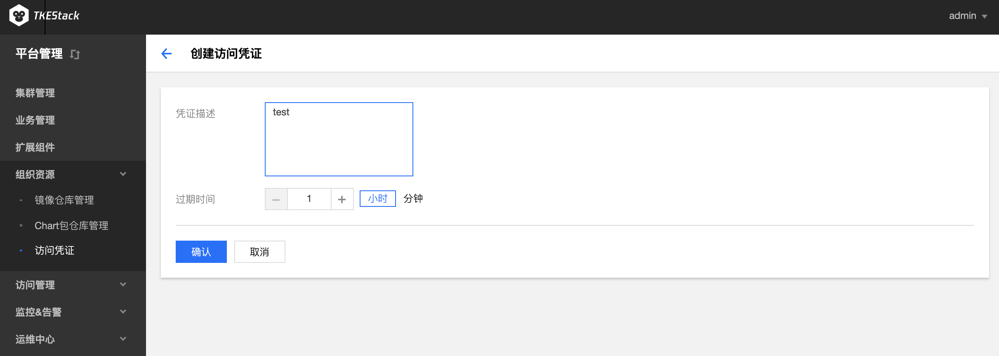

# 访问凭证
**这里用户可以管理自己的凭据，用来登陆平台创建的[镜像仓库](registry.md)和[应用仓库](helm.md)。**

## 新建访问凭证
  1. 登录 TKEStack
  2. 切换至 【平台管理】控制台，选择 【组织资源】下的【访问凭证】，点击【新建】按钮，如下图所示：
      
  3. 在弹出创建访问凭证页面，填写凭证信息，如下图所示：
      
      * **凭证描述：** 描述当前凭证信息
      
      * **过期时间：** 填写过期时间，选择小时/分钟为单位
  4. 单击【确认】按钮

## 使用指引

1. 登录 TKEStack
2. 切换至 【平台管理】控制台，选择 【组织资源】下的【访问凭证】，点击【新建】按钮，如下图所示：
   
3. 根据指引内容，在物理节点上执行相应命令

## 停用/启用/删除访问凭证
  1. 登录 TKEStack

  2. 切换至 【平台管理】控制台，选择 【组织资源】-> 【访问凭证】，查看“访问凭证”列表，单击列表右侧【禁用】/【启用】/【删除】按钮。如下图所示：
     
      > 注意：点击【禁用】之后，【禁用】按钮就变成了【启用】
      
      
      
  3. 单击【确认】按钮