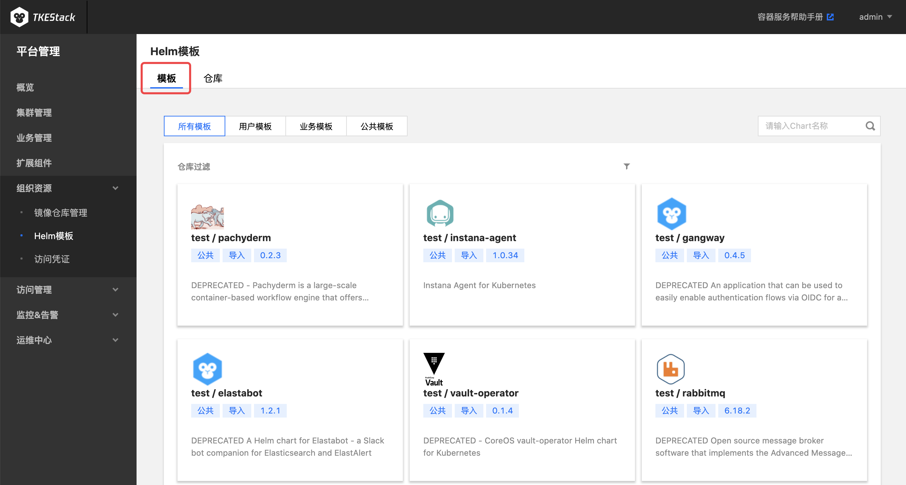
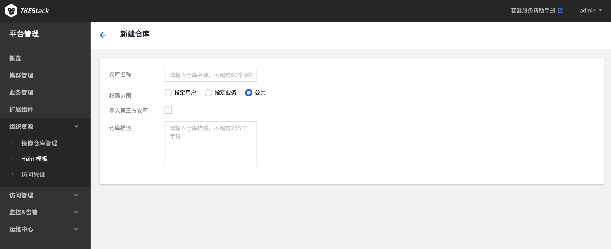
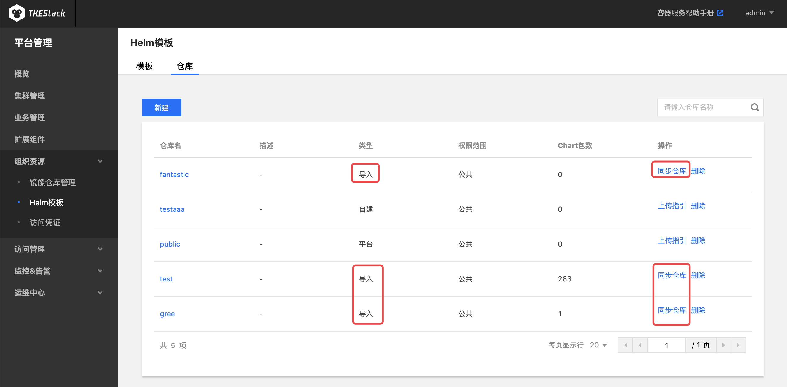

# Helm模板
应用功能是 TKEStack 集成的 [Helm 3.0](https://helm.sh/) 相关功能，为您提供创建 helm chart、容器镜像、软件服务等各种产品和服务的能力。已创建的应用将在您指定的集群中运行，为您带来相应的能力。

## 模板

1. 登录 TKEStack
2. 切换至 【平台管理】控制台，选择 【组织资源】->【 Helm模板】，点击【模板】
     1. **所有模板**：包含下列所有模板
     2. **用户模板**：权限范围为“指定用户”的仓库下的所有模板
     3. **业务模板**：权限范围为“指定业务”的仓库下的所有模板
     4. **公共模板**：权限范围为“公共”的仓库下的所有模板
     
     

## 仓库

  1. 登录 TKEStack
  2. 切换至 【平台管理】控制台，选择 【组织资源】->【 Helm模板】，点击【仓库】
  3. 点击【新建】按钮，如下图所示：
     

     * 在弹出的 “新建仓库” 页面，填写 仓库 信息，如下图所示：
     
     + **仓库名称：** 仓库名字，不超过60个字符
     + **权限访问**
       + **指定用户**：选择当前仓库可以被哪些平台的用户访问
       + **指定业务**：选择当前仓库可以被哪些平台的业务访问，业务下的成员对该仓库的访问权限在【业务管理】中完成
       + **公共**：平台所有用户都能访问该仓库
     + **导入第三方仓库：** 若已有仓库想导入 TKEStack 中使用，请勾选
       + **第三方仓库地址**：请输入第三方仓库地址
       + **第三方仓库用户名**：若第三方仓库开启了鉴权，需要输入第三方仓库的用户名
       + **第三方仓库密码**：若第三方仓库开启了鉴权，需要输入第三方仓库的密码
     + **仓库描述：** 请输入仓库描述，不超过255个字符
  5. 单击【确认】按钮
 ### 删除仓库
  1. 登录 TKEStack
  2. 切换至 【平台管理】控制台，选择 【组织资源】-> 【 Helm 模板】，点击【仓库】，查看 “helm模板仓库”列表
  3. 点击列表最右侧【删除】按钮，如下图所示：
      
### Chart 上传指引
  1. 登录 TKEStack
  2. 切换至 【平台管理】控制台，选择 【组织资源】-> 【 Helm模板】，点击【仓库】，查看 “helm模板仓库”列表
  3. 点击列表最右侧【上传指引】按钮，如下图所示：
      
  5. 根据指引内容，在物理节点上执行相应命令，如下图所示：
      

## 同步导入仓库

  1. 登录 TKEStack

  2. 切换至 【平台管理】控制台，选择 【组织资源】->【 Helm模板】，点击【仓库】

  3. 点击导入仓库的【同步仓库】按钮，如下图所示：

     

