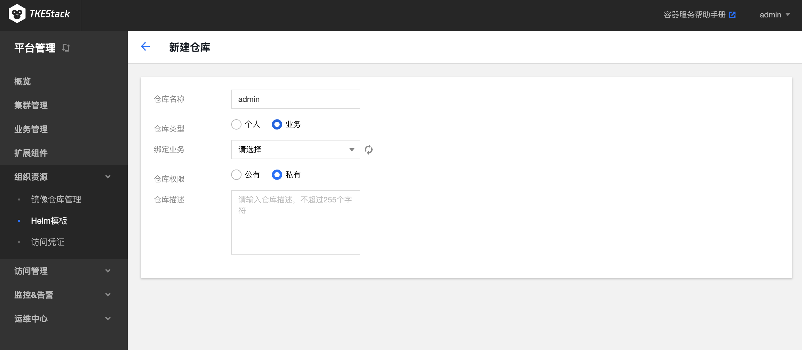
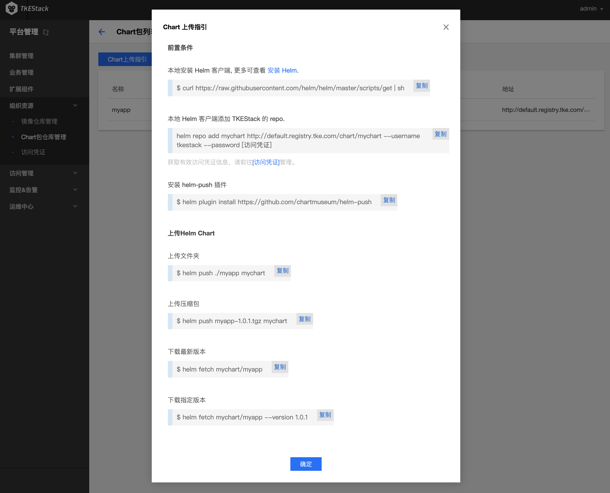

# Helm模板
应用功能是 TKEStack 集成的 [Helm 3.0](https://helm.sh/) 相关功能，为您提供创建 helm chart、容器镜像、软件服务等各种产品和服务的能力。已创建的应用将在您指定的集群中运行，为您带来相应的能力。

## 模板

1. 登录 TKEStack
2. 切换至 【平台管理】控制台，选择 【组织资源】->【 Helm模板】，点击【模板】
     1. **所有模板**：包含下列所有模板
     2. **个人模板**：所有个人仓库类型的模板所
     3. **业务模板**：所有业务仓库类型的模板所
     4. **公共模板**：主要是开源模板

## 仓库

  1. 登录 TKEStack
  2. 切换至 【平台管理】控制台，选择 【组织资源】->【 Helm模板】，点击【仓库】
  3. 点击【新建】按钮，如下图所示：
     

     * 在弹出的 “新建仓库” 页面，填写 仓库 信息，如下图所示：
     
     + **仓库名称：** 仓库名字，不超过6个字符
     + **仓库类型**
       + **个人**：默认当前登录用户
         + **仓库权限：** 
           + **公有：** 所有人均可访问该仓库下的 Chart
           + **私有：** 仅当前用户可以访问该仓库下的 Chart
       + **业务**：选择业务类型后需要选择指定业务
         + **仓库权限：** 
           + **公有：** 所有人均可访问该仓库下的 Chart
           + **私有：** 仅业务下的用户可以访问该仓库下的 Chart
     + **仓库描述：** 请输入仓库描述，不超过255个字符
  5. 单击【确认】按钮
 ### 删除仓库
  1. 登录 TKEStack
  2. 切换至 【平台管理】控制台，选择 【组织资源】-> 【 Helm 模板】，点击【仓库】，查看 “helm模板仓库”列表
  3. 点击列表最右侧【删除】按钮，如下图所示：
      
### Chart 上传指引
  1. 登录 TKEStack
  2. 切换至 【平台管理】控制台，选择 【组织资源】-> 【 Helm模板】，点击【仓库】，查看 “helm模板仓库”列表
  3. 点击列表最右侧【上传指引】按钮，如下图所示：
      
  5. 根据指引内容，在物理节点上执行相应命令，如下图所示：
      