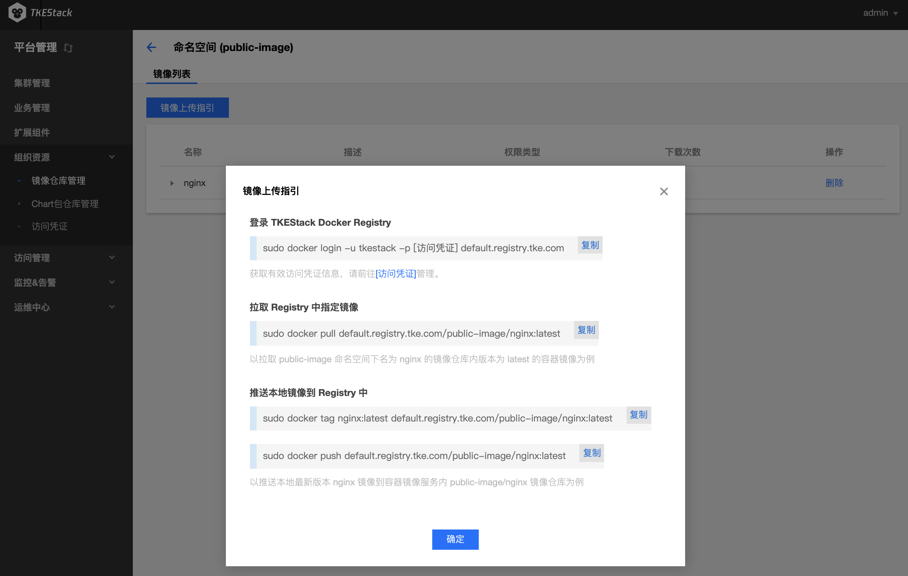

# 镜像仓库管理
## 镜像仓库概述

**镜像仓库**：用于存放 Docker 镜像，Docker 镜像可用于部署容器服务，每个镜像有特定的唯一标识（镜像的 Registry 地址+镜像名称+镜像 Tag）

**镜像类型**：目前镜像支持 Docker Hub 官方镜像和用户私有镜像

**镜像生命周期**：主要包含镜像版本的生成、上传和删除

## 新建命名空间
  1. 登录 TKEStack
  2. 切换至【平台管理】控制台，选择 【组织资源】->【镜像仓库管理】
  3. 点击【新建】按钮，如下图所示：
      
  4. 在弹出的“新建命名空间”页面，填写命名空间信息，如下图所示：
      
     + **名称：** 命名空间名字，不超过63字符
     + **描述：** 命名空间描述信息（可选）
     + **权限类型：** 选择命名空间权限类型
       + **公有：** 所有人均可访问该命名空间下的镜像
       + **私有：** 个人用户命名空间
  5. 单击【确认】按钮
 ## 删除命名空间
  1. 登录 TKEStack
  2. 切换至 【平台管理】控制台，选择 【组织资源】->【镜像仓库管理】。点击列表最右侧【删除】按钮，如下图所示：
      
## 镜像上传
  1. 登录 TKEStack

  2. 切换至 【平台管理】控制台，选择 【组织资源】->【镜像仓库管理】，查看命名空间列表，点击列表中命名空间【名称】，如下图所示：
      
      
  4. 此时进入了“镜像列表”页面，点击【镜像上传指引】按钮，如下图所示：
     
      > 注意：此页面可以通过上传的镜像最右边的【删除】按钮来删除上传的镜像
      
      
      
  4. 根据指引内容，在物理节点上执行相应命令，如下图所示：
      