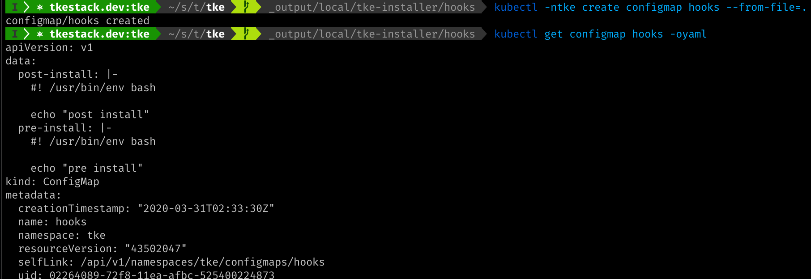
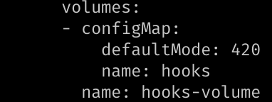
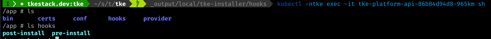
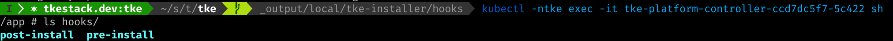

# Using hooks in cluster life ciycle

QianChenglong

2020-03-31

In some scenarios, users want to be able to add custom scripts during cluster creation, such as installing software packages and modifying system configurations.

## Prepare files

The hook file needs to be accessible in tke-platform-api and tke-platform-controller, and can be provided through hostPath, volumeMounts, etc.

- tke-platform-api will validate the files which specified by cluster
- tke-platform-controller will invoke cluster provider for copy the files to every cluster node

The following is demonstrated through ConfigMap

1. Create ConfigMap

    `kubectl -ntke create configmap hooks --from-file=.`
    

2. Mount

    ```bash
    kubectl -ntke edit deploy tke-platform-api
    kubectl -ntke edit deploy tke-platform-controller
    ```
    
    
    
    

## Declaring required files for hooks

The console does not support this feature currently, you can create a cluster through kubectl.

In your global cluster or setup kubeconfig for tke:

`kubectl create -f cluster.yaml`

cluster.yaml:
```yaml
{
    "apiVersion": "platform.tkestack.io/v1",
    "kind": "Cluster",
    "spec": {
        "clusterCIDR": "10.244.0.0/16",
        "type": "Baremetal",
        "version": "1.14.10",
        "machines": [
            {
                "ip": "1.2.3.4",
                "port": 22,
                "username": "root",
                "password": "MTIzNDU2" // echo -n "123456" | base64
            }
        ],
        "features": {
            "files": [
                {
                    "src": "hooks/pre-install", // source file in tke-platform-controller
                    "dst": "/tmp/hooks/pre-install" // destinate file in node
                },
                                {
                    "src": "hooks/post-install",
                    "dst": "/tmp/hooks/post-install"
                }
            ],
            "hooks": {
                "PreInstall": "/tmp/hooks/pre-install", // reference to destinate file which defined in files
                "PostInstall": "/tmp/hooks/post-install"
            }
        }
    }
}
```

## Notes

1. The source file must be a **regular** file!
2. The destinate file parent directories will be created on demand.
3. Every node including master and worker node will copy file and run the hook file!
4. If you wish run only once, your hook file need to guarantee idempotence!
5. If hook file occur error which exit code is's 0, the hook file will retry and cluster conditions will be hang in EnsureXXXHook.