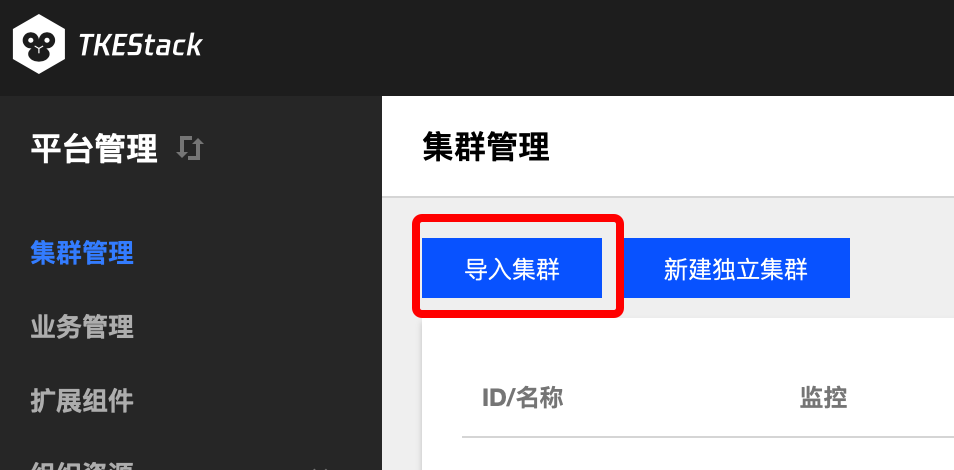

#  快速入门


## 教程介绍

TKEStack是一款面向私有化环境的开源容器编排引擎。在本教程中，您将了解如何创建 TKEStack 控制台，并使用控制台创建和管理容器集群，在集群内快速、弹性地部署您的服务。


## 操作步骤

### 平台安装

为了简化平台安装过程，容器服务开源版基于 tke-installer 安装器，提供了一个向导式的图形化安装指引界面。

1. 准备一台 Installer 节点，下载 tke-installer 安装器至 /data 目录下：

```
version=v1.2.3 && wget https://tke-release-1251707795.cos.ap-guangzhou.myqcloud.com/tke-installer-x86_64-$version.run{,.sha256} && sha256sum --check --status tke-installer-x86_64-$version.run.sha256 && chmod +x tke-installer-x86_64-$version.run
```

> 注：您可以查看 TKEStack [Release](https://github.com/tkestack/tke/releases) 按需选择版本进行安装，建议您安装最新版本。

> 注：tke-installer 约为 5GB，包含安装所需的所有资源。
>

2. 开始安装：在 Installer 节点上通过以下命令安装 tke-installer ：

```
./tke-installer-x86_64-$version.run
```

3. 打开http://[tke-installer-IP]:8080/index.html 访问控制台，按照指引开始安装。

### 控制台安装

1. 填写 TKEStack 控制台基本配置信息


- **用户名**：TKEStack 控制台管理员名称
- **密码**：TKEStack 控制台管理员密码
- **高可用设置**
  - **TKE提供**：在所有 master 节点额外安装 Keepalived 完成 VIP 的配置与连接
  - **使用已有**：对接配置好的外部 LB 实例
  - **不设置**：访问第一台 master 节点 APIServer

2. 填写 TKEStack 控制台集群设置信息


- **网卡名称**：集群节点使用的网卡，根据实际环境填写正确的网卡名称，默认为eth0

- **GPU 类型**：
  - **不使用**：不安装 Nvidia GPU 相关驱动
  - **Virtual**：平台会自动为集群安装 [GPUManager](https://github.com/tkestack/docs/blob/master/features/gpumanager.md)  扩展组件
  - **Physical**：平台会自动为集群安装 [Nvidia-k8s-device-plugin](https://github.com/NVIDIA/k8s-device-plugin)

- **容器网络：** 将为集群内容器分配在容器网络地址范围内的 IP 地址，您可以自定义三大私有网段作为容器网络， 根据您选择的集群内服务数量的上限，自动分配适当大小的 CIDR 段用于 Kubernetes service；根据您选择 Pod 数量上限/节点，自动为集群内每台服务器分配一个适当大小的网段用于该主机分配 Pod 的 IP 地址
- **CIDR：** 集群内 Sevice、 Pod 等资源所在网段
  - **Pod数量上限/节点：** 决定分配给每个 Node 的 CIDR 的大小
  
- **Service数量上限/集群**：决定分配给 Sevice 的 CIDR 大小
  
- **master 节点：** 输入目标机器信息后单击保存，若保存按钮是灰色，单击边上空白处即可变蓝
- **访问地址：** Master 节点内网 IP，请配置至少 8 Cores & 16G内存 及以上的机型
  - **SSH 端口**：请确保目标机器安全组开放 SSH 端口和 ICMP 协议，否则无法远程登录和 PING 服务器


**高级设置**：可以自定义 Global 集群的 Docker、kube-apiserver、kube-controller-manager、kube-scheduler、kubelet 运行参数

3. 填写 TKEStack 控制台认证信息。


- **认证方式：**
  - **TKE提供**：使用 TKE 自带的认证方式
  - **OIDC**：使用 OIDC 认证方式，详见 [OIDC](https://kubernetes.io/docs/reference/access-authn-authz/authentication/#openid-connect-tokens)

4. 填写 TKEStack 控制台镜像仓库信息。


- **镜像仓库类型：**
  - **TKE提供**：使用 TKE 自带的镜像仓库
  - **第三方仓库**：对接配置好的外部镜像仓库，此时，TKEStack 将不会再安装镜像仓库，而是使用您提供的镜像仓库作为默认镜像仓库服务

5. 确认是否开启 TKEStack 控制台业务模块，建议开启。


6. 选择 TKEStack 控制台监控存储类型。


- **监控存储类型**：
  - **TKE提供**：使用 TKE 自带的 Influxdb 作为存储
  - **外部 Influxdb**：对接外部的 Influxdb 作为存储
  - **外部 ES**：对接外部的 Elasticsearch作为存储
  - **不使用**：不使用监控

7. 确认是否开启 TKEStack 控制台，选择开启则需要填写控制台域名及证书。


- **监控存储类型**:
  - **自签名证书**：使用 TKE 带有的自签名证书
  - **指定服务器证书**：填写已备案域名的服务器证书

8. 确认 TKEStack 控制台所有配置是否正确。


9. 开始安装 TKEStack 控制台，安装成功后界面如下


10. 按照指引配置域名访问 TKEStack 控制台。


### 新建独立集群

1. 登录 TKEStack。
2. 切换至 平台管理控制台。
3. 在集群管理页面中，单击 【新建独立集群】。如下图所示：
   

4. 在 新建独立集群 页面，填写集群的基本信息。如下图所示：
   

- **集群名称：** 支持**中文**，小于60字符

+ **Kubernetes版本：** 选择合适的kubernetes版本，各版本特性对比请查看 [Supported Versions of the Kubernetes Documentation](https://kubernetes.io/docs/home/supported-doc-versions/)。
+ **网卡名称：** 最长63个字符，只能包含小写字母、数字及分隔符(' - ')，且必须以小写字母开头，数字或小写字母结尾
+ **VIP** ：高可用 VIP 地址
+ **GPU**：选择是否安装 GPU 相关依赖
  + **pGPU**：平台会自动为集群安装 [GPUManager](https://github.com/tkestack/docs/blob/master/features/gpumanager.md) 扩展组件
  + **vGPU**：平台会自动为集群安装 [Nvidia-k8s-device-plugin](https://github.com/NVIDIA/k8s-device-plugin)
+ **容器网络** ：将为集群内容器分配在容器网络地址范围内的 IP 地址，您可以自定义三大私有网段作为容器网络， 根据您选择的集群内服务数量的上限，自动分配适当大小的 CIDR 段用于 kubernetes service；根据您选择 Pod 数量上限/节点，自动为集群内每台云服务器分配一个适当大小的网段用于该主机分配 Pod 的 IP 地址。
  + **CIDR**： 集群内 Sevice、 Pod 等资源所在网段。

  + **Pod数量上限/节点**： 决定分配给每个 Node 的 CIDR 的大小。

  + **Service数量上限/集群** ：决定分配给 Sevice 的 CIDR 大小。

+ **目标机器** ：输入目标机器信息后单击保存，若保存按钮是灰色，单击边上空白处即可变蓝
  +  **目标机器**：建议: Master&Etcd 节点配置4核及以上的机型
  +  **SSH端口**： 请确保目标机器安全组开放 22 端口和 ICMP 协议，否则无法远程登录和 PING 云服务器。
  +  **主机label**：给主机设置Label,可用于指定容器调度
  +  **认证方式**：连接目标机器的方式
     +  **密码认证**：
        +  **密码**：目标机器密码
     +  **密钥认证**：
        +  **私钥**：目标机器秘钥
        +  **私钥密码**：目标机器私钥密码，可选填
  +  **GPU**： 使用GPU机器需提前安装驱动和runtime

5. **提交**： 集群信息填写完毕后，提交按钮变为可提交状态，单击即可提交。


### 导入集群

1. 登录 TKEStack。
2. 切换至 平台管理控制台。
3. 在集群管理页面，单击【导入集群】。如下图所示：
   

4. 在 导入集群 页面，填写被导入的集群信息。如下图所示：
   

- **名称**： 被导入集群的名称，最长60字符
- **API Server**： 输入要被导入集群的API server的IP和端口
- **CertFile**： 输入被导入集群的cert 文件内容
- **Token**： 输入被导入集群创建时的token值

5. 单击最下方 【提交】 按钮 。

### 创建业务

1. 登录 TKEStack。
2. 在平台管理侧业务管理页面中，单击 【新建业务】。如下图所示：
   
3. 在新建业务页面，填写业务信息。如下图所示：
   

- **业务名称**：不能超过63个字符
- **业务成员**： 用户管理中的用户
- **集群**： 集群管理中的集群
- **上级业务**：支持多级业务管理，可不选


### 创建服务

1. 登录TKEStack，切换到业务管理控制台，选择左侧导航栏中的【应用管理】。

2. 选择需要创建 Deployment 的业务下相应的命名空间，展开工作负载下拉项，进入 Deployment 管理页面。如下图所示：
   

3. 单击【新建】，进入 “新建 Workload ” 页面。根据实际需求，设置 Deployment 参数。关键参数信息如下：

   

 - **工作负载名**：输入自定义名称

 - **标签**：给工作负载添加标签
 - **命名空间**：根据实际需求进行选择
 - **类型**：选择【Deployment（可扩展的部署 Pod）】

4. （可选）设置数据卷，如需指定容器挂载至指定路径时，单击【添加数据卷】


- **临时目录**：主机上的一个临时目录，生命周期和Pod一致
- **主机路径**：主机上的真实路径，可以重复使用，不会随Pod一起销毁
- **NFS盘**：挂载外部NFS到Pod，用户需要指定相应NFS地址，格式：127.0.0.1:/data
- **ConfigMap**：用户选择在业务Namespace下的ConfigMap
- **Secret**：用户选择在业务namespace下的Secret
- **PVC**：用户选择在业务namespace下的PVC

5. 根据实际需求，为 Deployment 的一个 Pod 设置一个或多个不同的容器。如下图所示：


- **名称**：自定义
- **镜像**：根据实际需求进行选择
- **镜像版本（Tag）**：根据实际需求进行填写
- **CPU/内存限制**：可根据 [Kubernetes 资源限制](https://kubernetes.io/docs/concepts/configuration/manage-compute-resources-container/) 进行设置 CPU 和内存的限制范围，提高业务的健壮性
- **GPU限制**：如容器内需要使用GPU，此处填GPU需求
- **镜像拉取策略**：提供以下3种策略，请按需选择
  若不设置镜像拉取策略，当镜像版本为空或 `latest` 时，使用 Always 策略，否则使用 IfNotPresent 策略
    - **Always**：总是从远程拉取该镜像
    - **IfNotPresent**：默认使用本地镜像，若本地无该镜像则远程拉取该镜像
    - **Never**：只使用本地镜像，若本地没有该镜像将报异常
- **高级设置**：可设置 “**工作目录**”、“**运行命令**”、“**运行参数**”、“**容器健康检查**”和“**特权级**”等参数

6. 参考以下信息设置实例数量。如下图所示：


 - **实例数量**：根据实际需求选择调节方式，设置实例数量。
   - **手动调节**：直接设定实例个数
   - **自动调节**：根据设定的触发条件自动调节实例个数，目前支持根据CPU、内存利用率和利用量出入带宽等调节实例个数
 - **定时调节**：根据Crontab 语法周期性设置实例个数

7. 参考以下信息完成其他配置。如下图所示：


 - **imagePullSecrets**：镜像拉取密钥，用于拉取用户的私有镜像
 - **节点调度策略**：根据配置的调度规则，将Pod调度到预期的节点。支持指定节点调度和条件选择调度
 - **注释（Annotations）**：给Pod添加相应Annotation，如用户信息等

8. 参考以下信息完成应用的网络模式选择。如下图所示：


* 网络模式：选择Pod网络模式
   * OverLay（虚拟网络）：基于 IPIP 和 Host Gateway 的 Overlay 网络方案
   * FloatingIP（浮动 IP）：支持容器、物理机和虚拟机在同一个扁平面中直接通过IP进行通信的 Underlay 网络方案。提供了 IP 漂移能力，支持 Pod 重启或迁移时 IP 不变
   * NAT（端口映射）：Kubernetes 原生 NAT 网络方案
   * Host（主机网络）：Kubernetes 原生 Host 网络方案

9. 参考以下信息进行访问设置。如下图所示：


 - **访问设置（Service）**：勾选【启用】按钮，配置负载端口访问
   - **服务访问方式**：选择是在集群内部访问该负载还是集群外部访问负载
- **仅在集群内访问**：使用 Service 的 ClusterIP 模式，自动分配 Service 网段中的 IP，用于集群内访问。数据库类等服务如 MySQL 可以选择集群内访问，以保证服务网络隔离
     - **主机端口访问**：提供一个主机端口映射到容器的访问方式，支持 TCP、UDP、Ingress。可用于业务定制上层 LB 转发到 Node
     - **Headless Service**：解析域名时返回相应 Pod IP 而不是 Cluster IP
- **端口映射**：输入负载要暴露的端口并指定通信协议类型

10. 单击【创建Workload】，完成创建。如下图所示：


​	当运行数量=期望数量时，即表示 Deployment 下的所有 Pod 已创建完成。

### 删除资源

在本节中，启动了集群和服务两种资源，此步骤介绍如何清除所有资源。

#### 删除服务

1. 选择左侧导航栏中【集群】，进入“集群管理”页面并单击需删除服务的集群 ID。
2. 在 “Deployment” 管理页面中，选择【服务】>【Service】。
3. 在 “Service” 管理页面，单击 Service 所在行右侧的【删除】。如下图所示：
   
4. 在弹出框中单击【确定】，即可删除服务。

#### 删除集群

1. 选择左侧导航栏中的【集群】，在“集群管理”页面选择需删除集群所在行右侧【更多】>【删除】。如下图所示：
   
2. 在弹出框中确认信息后，单击【确定】即可删除集群。
