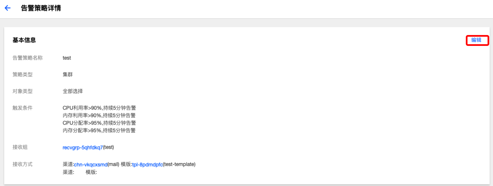

# 监控和告警
## 概念
**这里用户可以管理设置平台告警和消息通知。**

## 告警设置
### 概念
**这里用户配置平台告警。**

### 操作步骤
#### 新建告警设置
  1. 登录 TKEStack。
  2. 切换至 业务管理控制台，选择 监控&告警->告警设置。
  3. 选择相应【项目】和【namespace】，点击【新建】按钮。如下图所示：
      
  4. 在新建策略页面填写告警策略信息。
   + **告警策略名称：** 输入告警策略名称，最长60字符
   + **策略类型：** 选择告警策略应用类型
     + **告警对象：** 选择Pod相关的告警对象，支持对namespace下不同对deployment、stateful和daemonset 进行监控报警
       + **按工作负载选择：** 选择namespace下的某个工作负载
       + **全部选择：** 不区分namespace，全部监控
   + **统计周期：** 选择数据采集周期，支持1、2、3、4、5分钟
   + **指标：** 选择告警指标，支持对监测值与指标值进行【大于/小于】比较，选择结果持续周期。如下图：

   + **接收组：** 选择接收组，当出现满足条件当报警信息时，向组内人员发送消息。**接收组需要先在 监控&告警 -> 通知设置 创建**
   + **通知方式：** 选择通知渠道和消息模版。**通知渠道和消息模版需要先在 监控&告警 -> 通知设置 创建**
     + **添加通知方式** 如需要添加多种通知方式，点击该按钮。
  1. 单击【提交】按钮。
#### 复制告警设置
  1. 登录 TKEStack。
  2. 切换至 业务管理控制台，选择 监控&告警->告警设置，查看告警设置列表。
  3. 选择相应【项目】和【namespace】，点击告警设置列表最右侧的【复制】按钮。如下图所示：
        
  4. 在复制策略页面，编辑告警策略信息。
  5. 单击【提交】按钮。
#### 编辑告警设置
  1. 登录 TKEStack。
  2. 切换至 业务管理控制台，选择 监控&告警->告警设置，查看告警设置列表。
  3. 选择相应【项目】和【namespace】，点击【告警名称】。如下图所示：
      
  4. 在告警策略详情页面，单击【基本信息】右侧的【编辑】按钮。如下图所示：
      
  5. 在更新策略页面，编辑策略信息。
  6. 单击【提交】按钮。
#### 删除告警设置
  1. 登录 TKEStack。
  2. 切换至 业务管理控制台，选择 监控&告警->告警设置，查看告警设置列表。
  3. 选择相应【项目】和【namespace】，点击列表最右侧的【删除】按钮。如下图所示：
      
  4. 在弹出的删除告警窗口，单击【确定】按钮。
#### 批量删除告警设置
  1. 登录 TKEStack。
  2. 切换至 业务管理控制台，选择 监控&告警->告警设置，查看告警设置列表。
  3. 选择相应【项目】和【namespace】，选择多个告警策略，单击告警设置下方的【删除】按钮。如下图所示：
      
  4. 在弹出的删除告警窗口，单击【确定】按钮。
