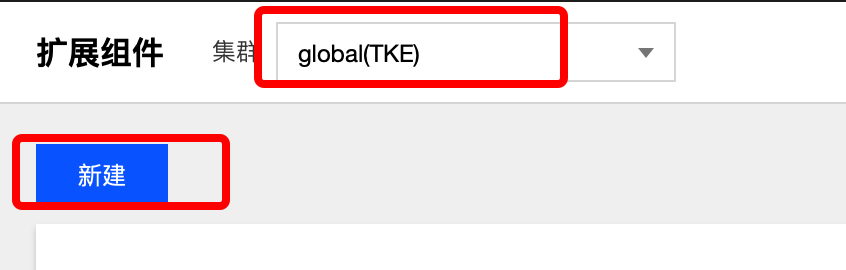
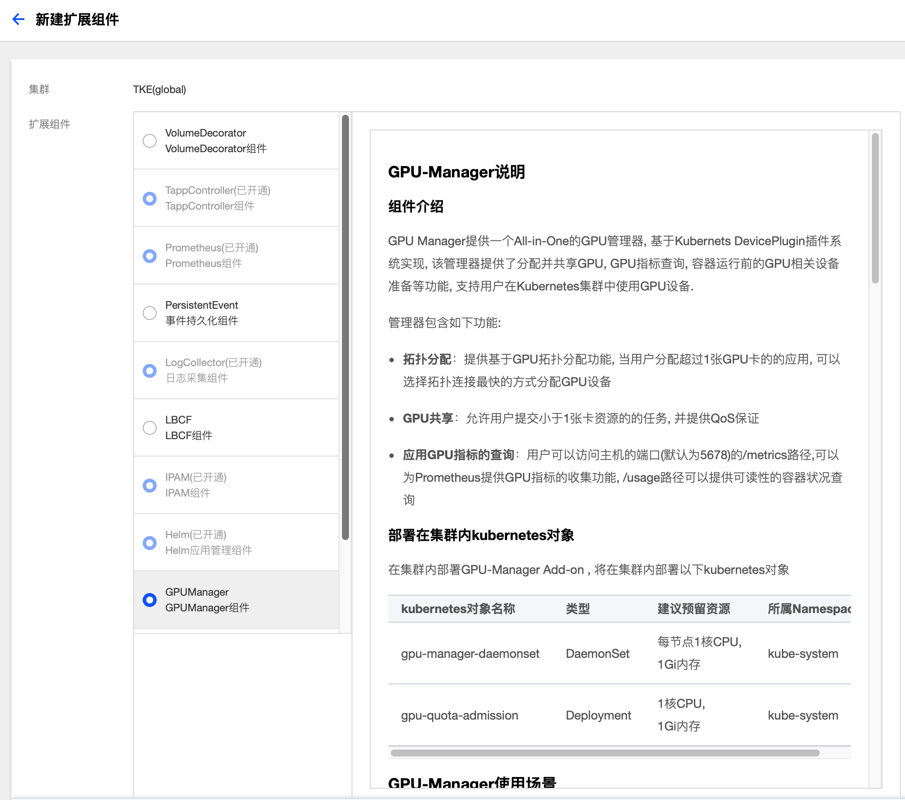
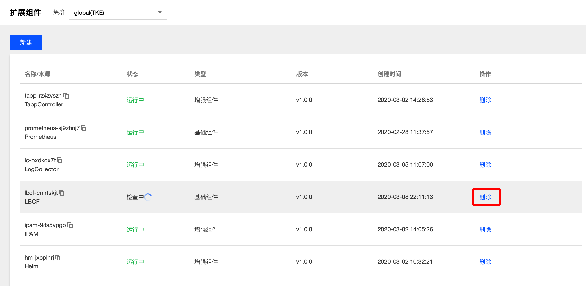

# 扩展组件

## 概念
**这里用户可以管理集群扩展组件。**

## 操作步骤
### 创建组件
  1. 登录 TKEStack。
  2. 切换至 平台管理控制台，选择扩展组件页面。
  3. 选择需要安装组件的集群，点击【新建】按钮。如下图所示：
      
  4. 在弹出的扩展组件列表里，选择要安装的组件。如下图所示：
      
  5. 单击【完成】。
### 删除扩展组件
  1. 登录 TKEStack。
  2. 切换至 平台管理控制台，选择扩展组件页面。
  3. 点击扩展组件列表最右侧的【删除】按钮。如下图所示：
      
