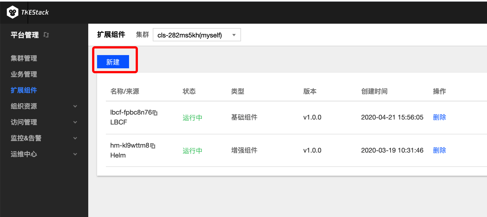
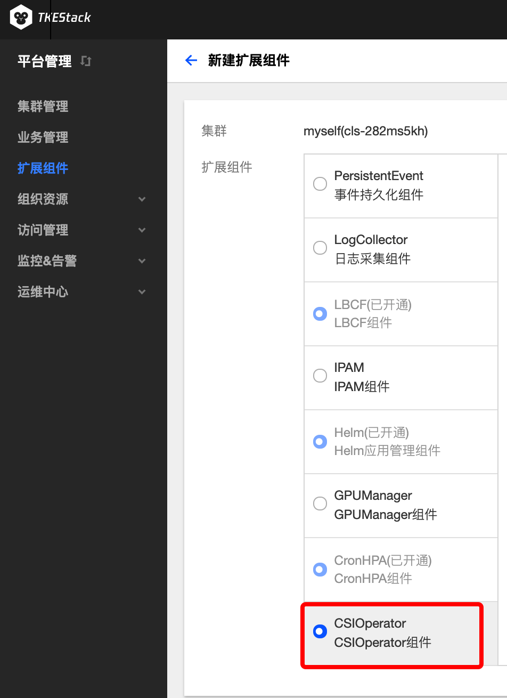
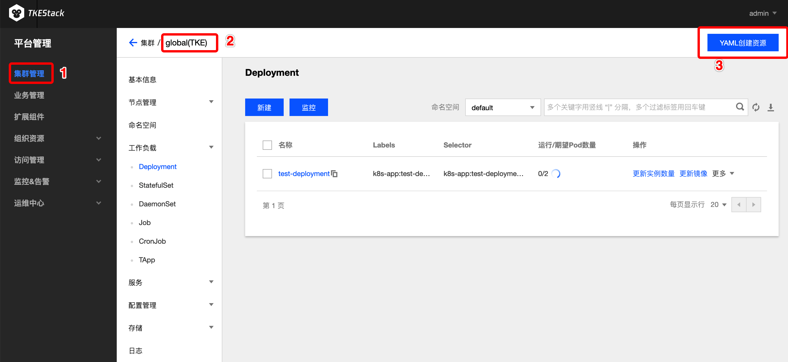
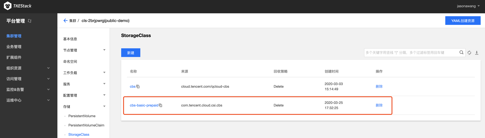

## CSI-Operator说明

### 组件介绍 : Container Storage Interface Operator(CSI-Operator)

部署和更新K8s集群中的CSI驱动和外部组件


### CSI-Operator特点

当前支持的插件包括 rbd、cephfs、tencentcbs 和 tencentcfs（tencentcfs 正在测试中）
* 其中 rbd 和 cephfs 主要用于 IDC 环境
* tencentcbs 和 tencentcfs 用于腾讯云环境


### 部署在集群内kubernetes对象

在集群内部署CSI-Operator Add-on , 将在集群内部署以下kubernetes对象

| kubernetes对象名称 | 类型 | 默认占用资源 | 所属Namespaces |
| ----------------- | --- | ---------- | ------------- |
| csi-operator |Deployment |每节点0.2核CPU, 256MB内存|kube-system|

## CSI-Operator使用方法

### 安装CSI-Operator组件

1. 登录TKEStack
2. 切换至 平台管理控制台，选择 扩展组件 页面。
3. 选择需要安装组件的集群，点击【新建】按钮。如下图所示：

4. 在弹出的扩展组件列表里，滑动列表窗口找到CSI-Operator组件。如下图所示：

5. 单击【完成】。

### 使用CSI-Operator组件
1. 登录TKEStack
2. 切换至 平台管理控制台，选择 集群管理 页面，如下图1所示：
3. 点击集群ID，进入要管理的集群，如下图2所示：
4. 点击【YAML创建资源】，如下图3所示：
5. 文件中指定各自存储插件镜像的名称，这里以`tencentcbs`的 yaml 为例：（前提创建腾讯云账号）
```
apiVersion: storage.tkestack.io/v1
kind: CSI
metadata:
  name: tencentcbsv1
  namespace: kube-system
spec:
  driverName: com.tencent.cloud.csi.cbs
  version: "v1"
  parameters:
    secretID: "xxxxxx"
    secretKey: "xxxxxx"
```
   * secretID、secretKey 来源于 腾讯云控制台 -> 账号中心 -> 访问管理 -> 访问秘钥 -> API密钥管理
6. 创建完部署 CSI 插件的 CRD 对象，同时会为每个存储插件创建默认的 StorageClass 对象（tencentcbs 的 StorageClass 对象名为 cbs-basic-prepaid），如下图：

   其YAML如下：

   

   - tencentcbs 的 provisioner 名称指定为：`com.tencent.cloud.csi.cbs`
   - tencentcfs 的 provisioner 名称指定为：`com.tencent.cloud.csi.cfs`，tencentcfs 仍在测试中，目前仅支持 tencentcbs

   对于磁盘类型（在 StorageClass 的 diskType 中指定）和大小的限制：

   * 普通云硬（ `CLOUD_BASIC` ）盘提供最小 100 GB 到最大 16000 GB 的规格选择，支持 40-100MB/s 的 IO 吞吐性能和 数百-1000 的随机 IOPS 性能
   * 高性能云硬盘（`CLOUD_PREMIUM`）提供最小 50 GB 到最大 16000 GB 的规格选择
   * SSD 云硬盘（`CLOUD_SSD`）提供最小 100 GB 到最大 16000 GB 的规格选择，单块 SSD 云硬盘最高可提供 24000 随机读写IOPS、260MB/s吞吐量的存储性能

7. 默认创建的磁盘类型为普通云硬盘，如果用户希望使用该 StorageClass，可以直接创建使用了该 StorageClass 的 PVC 对象：

   ```shell
   apiVersion: v1
   kind: PersistentVolumeClaim
   metadata:
     name: test-tencentcbs
     namespace: kube-system
   spec:
     accessModes:
       - ReadWriteOnce
     storageClassName: cbs-basic-prepaid
     resources:
       requests:
         storage: 10Gi
   ```

   


详情见[CSI-Operator Example](https://github.com/tkestack/csi-operator/blob/master/examples)


