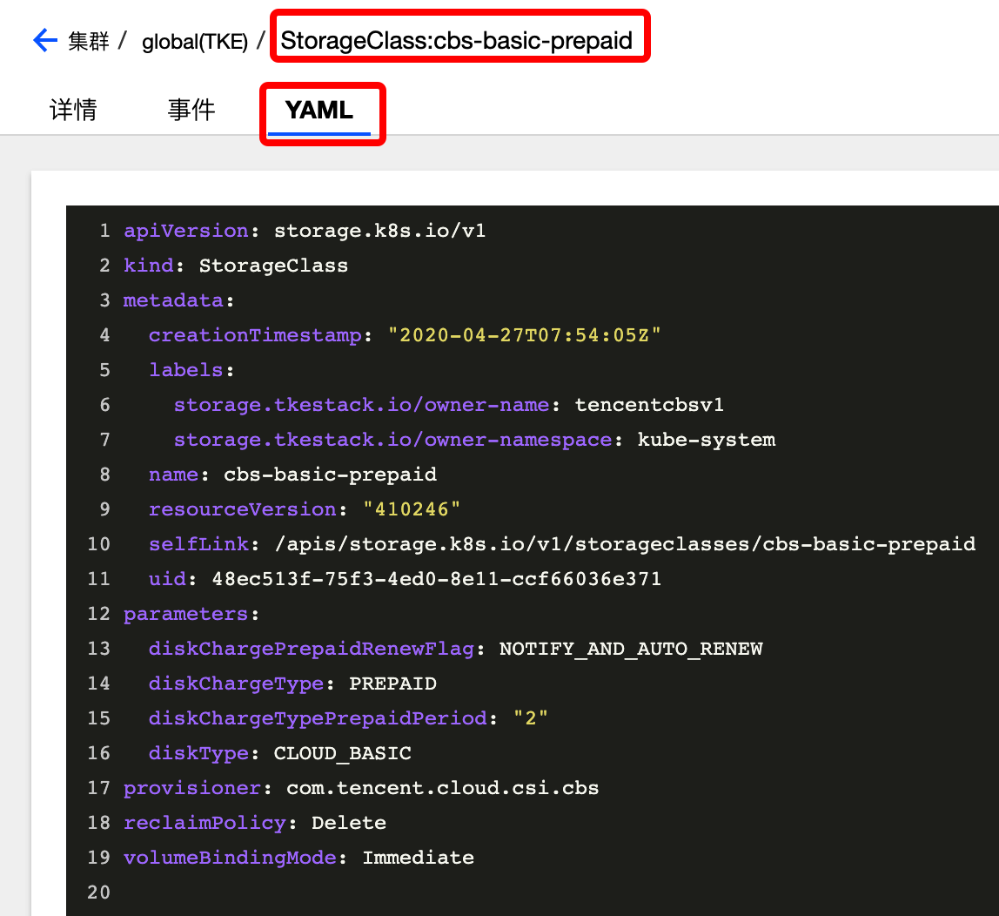

# CSIOperator

## CSIOperator 介绍

Container Storage Interface Operator(CSIOperator)用于部署和更新 Kubernetes 集群中的 CSI 驱动和外部存储组件。


### CSIOperator 使用场景

CSIOperator 用于支持集群方便的使用存储资源，当前支持的存储插件包括 RBD、CephFS、TencentCBS 和 TencentCFS（TencentCFS 正在测试中）
* 其中 RBD 和 CephFS 主要用于部署在 IDC 环境的集群
* TencentCBS 和 TencentCFS 用于部署在腾讯云环境的集群


### 部署在集群内 kubernetes 对象

在集群内部署 CSIOperator，将在集群内部署以下 kubernetes 对象

| kubernetes 对象名称 | 类型 | 默认占用资源 | 所属 Namespaces |
| ----------------- | --- | ---------- | ------------- |
| csi-operator |Deployment |每节点0.2核 CPU, 256MB内存|kube-system|

## CSIOperator 使用方法

### 安装 CSIOperator

1. 登录 TKEStack
2. 切换至 【平台管理】控制台，选择 【扩展组件】 页面
3. 选择需要安装组件的集群，点击【新建】按钮。如下图所示：

4. 在弹出的扩展组件列表里，滑动列表窗口找到 CSIOperator
5. 单击【完成】进行安装

### 镜像准备

当前支持的存储插件包括 RBD、CephFS、TencentCBS 和 TencentCFS（测试中，暂不支持），
针对不同的模式，依赖不同的 csi 镜像

由于支持版本较多，所有镜像都上传的话导致 `TKE Stack` 安装包太大，并且大部分并不会被使用，
因此 所有镜像均已上传 [公网 dockerhub](https://hub.docker.com/u/tkestack):

| csi 类型及版本 |依赖的镜像及拉取命令|
|--------------|--------|
| CephRBD V0 |docker pull tkestack/csi-provisioner:v0.4.2 <br>docker pull tkestack/csi-attacher:v0.4.2 <br>docker pull tkestack/csi-snapshotter:v0.4.1 <br/>docker pull tkestack/livenessprobe:v0.4.1 <br/>docker pull tkestack/driver-registrar:v0.3.0 <br/>docker pull tkestack/rbdplugin:v0.3.0|
| CephRBD V1 |docker pull tkestack/csi-provisioner:v1.0.1 <br>docker pull tkestack/csi-attacher:v1.1.0<br>docker pull tkestack/csi-snapshotter:v1.1.0 <br/>docker pull tkestack/livenessprobe:v1.1.0<br/>docker pull tkestack/csi-node-driver-registrar:v1.1.0 <br/>docker pull tkestack/rbdplugin:v1.0.0|
| CephFS V0 |docker pull tkestack/csi-provisioner:v0.4.2 <br>docker pull tkestack/csi-attacher:v0.4.2 <br>docker pull tkestack/livenessprobe:v0.4.1 <br/>docker pull tkestack/driver-registrar:v0.3.0 <br/>docker pull tkestack/cephfsplugin:v0.3.0|
| CephFS V1 |docker pull tkestack/csi-provisioner:v1.0.1 <br/>docker pull tkestack/csi-attacher:v1.1.0<br/>docker pull tkestack/livenessprobe:v1.1.0<br/>docker pull tkestack/csi-node-driver-registrar:v1.1.0<br/>docker pull tkestack/cephfsplugin:v1.0.0|
| TencentCBS V0 |docker pull tkestack/csi-provisioner:v1.0.1 <br/>docker pull tkestack/csi-attacher:v1.1.0<br/>docker pull tkestack/driver-registrar:v0.3.0<br/>docker pull tkestack/csi-tencentcloud-cbs:v0.2.1|
| TencentCBS V1 |docker pull tkestack/csi-provisioner:v1.2.0 <br/>docker pull tkestack/csi-attacher:v1.1.0<br/>docker pull tkestack/csi-snapshotter:v1.2.2<br/>docker pull tkestack/csi-node-driver-registrar:v1.1.0<br/>docker pull tkestack/csi-tencentcloud-cbs:v1.0.0 <br />docker pull tkestack/csi-resizer:v0.5.0|
| TencentCBS V1P1 |docker pull tkestack/csi-provisioner:v1.2.0 <br/>docker pull tkestack/csi-attacher:v1.1.0<br/>docker pull tkestack/csi-snapshotter:v1.2.2<br/>docker pull tkestack/csi-node-driver-registrar:v1.1.0<br/>docker pull tkestack/csi-tencentcloud-cbs:v1.2.0 <br />docker pull tkestack/csi-resizer:v0.5.0|


使用时 `csi-operator`根据配置的存储类型拉取所需的镜像

### 通过 CSIOperator 使用腾讯云存储资源
1. 登录 TKEStack

2. 切换至 【平台管理】控制台，选择 【集群管理】 页面，如下图1所示：

3. 点击安装了 CSIOperator 组件的【集群ID】，进入要管理的集群，如下图2所示：

4. 点击【YAML创建资源】，如下图3所示：

5. 文件中指定各自存储插件镜像的名称，这里以`tencentcbs`的 YAML 为例：（前提：需要拥有腾讯云账号）

   ```yaml
   apiVersion: storage.tkestack.io/v1
   kind: CSI
   metadata:
     name: tencentcbsv1
     namespace: kube-system
   spec:
     driverName: com.tencent.cloud.csi.cbs
     version: "v1"
     parameters:
       secretID: "xxxxxx"
       secretKey: "xxxxxx"
   ```

   * secretID、secretKey 来源于 腾讯云控制台 -> 账号中心 -> 访问管理 -> 访问秘钥 -> API密钥管理

6. 创建完 CSIOperator 的 CRD 对象，同时会为每个存储插件创建默认的 StorageClass 对象（tencentcbs 的 StorageClass 对象名为 cbs-basic-prepaid），如下图：

   其 YAML 如下：

   

   - tencentcbs 的 provisioner 名称指定为：`com.tencent.cloud.csi.cbs`
   - tencentcfs 的 provisioner 名称指定为：`com.tencent.cloud.csi.cfs`，tencentcfs 仍在测试中，目前仅支持 tencentcbs
   - 对于磁盘类型（在 StorageClass 的 `diskType` 中指定）和大小的限制：
     - 普通云硬（ `CLOUD_BASIC` ）盘提供最小 100 GB 到最大 16000 GB 的规格选择，支持 40-100MB/s 的 IO 吞吐性能和 数百-1000 的随机 IOPS 性能
     - 高性能云硬盘（`CLOUD_PREMIUM`）提供最小 50 GB 到最大 16000 GB 的规格选择
     - SSD 云硬盘（`CLOUD_SSD`）提供最小 100 GB 到最大 16000 GB 的规格选择，单块 SSD 云硬盘最高可提供 24000 随机读写IOPS、260MB/s吞吐量的存储性能

7. 默认创建的磁盘类型为普通云硬盘，如果用户希望使用该 StorageClass，可以直接创建使用了该 StorageClass 的 PVC 对象：

   ```yaml
   apiVersion: v1
   kind: PersistentVolumeClaim
   metadata:
     name: test-tencentcbs
     namespace: kube-system
   spec:
     accessModes:
       - ReadWriteOnce
     storageClassName: cbs-basic-prepaid
     resources:
       requests:
         storage: 10Gi
   ```


详情请见 [CSIOperator Example](https://github.com/tkestack/csi-operator/blob/master/examples)

