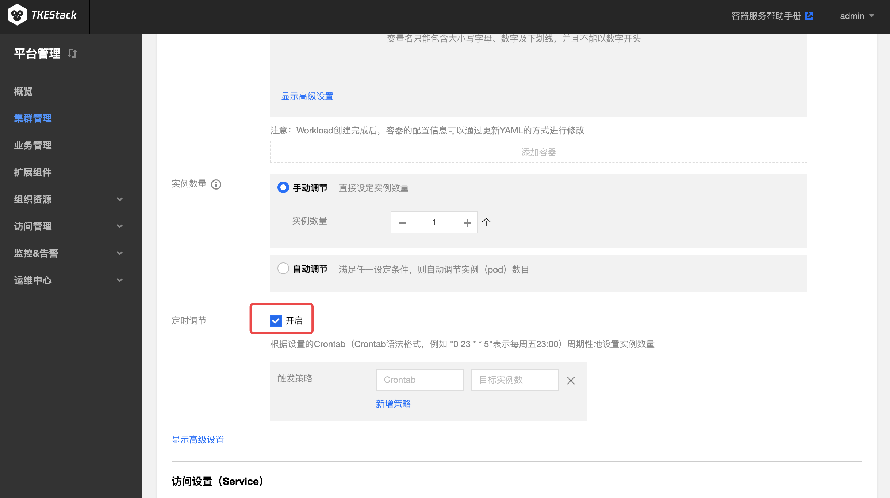
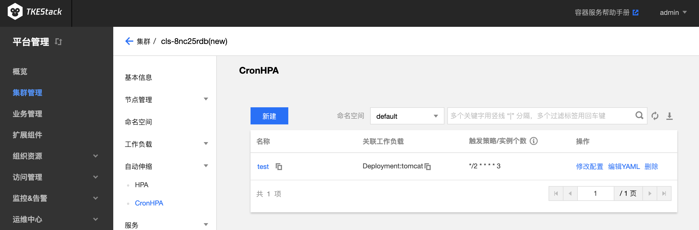

# CronHPA

## CronHPA 介绍

Cron Horizontal Pod Autoscaler([CronHPA](https://github.com/tkestack/cron-hpa)) 可让用户利用 [CronTab](https://en.wikipedia.org/wiki/Cron) 实现对负载（Deployment、StatefulSet、[TApp](TappController.md) 这些支持扩缩容的资源对象）**定期自动扩缩容**。

[CronTab](https://en.wikipedia.org/wiki/Cron) 格式说明如下：

```
# 文件格式说明
#  ——分钟（0 - 59）
# |  ——小时（0 - 23）
# | |  ——日（1 - 31）
# | | |  ——月（1 - 12）
# | | | |  ——星期（0 - 6）
# | | | | |
# * * * * *
```

CronHPA 定义了一个新的 CRD，cron-hpa-controller 是该 CRD 对应的 Controller/operator，它解析 CRD 中的配置，根据系统时间信息对相应的工作负载进行扩缩容操作。


### CronHPA 使用场景

以游戏服务为例，从星期五晚上到星期日晚上，游戏玩家数量暴增。如果可以将游戏服务器在星期五晚上扩大规模，并在星期日晚上缩放为原始规模，则可以为玩家提供更好的体验。这就是游戏服务器管理员每周要做的事情。

其他一些服务也会存在类似的情况，这些产品使用情况会定期出现高峰和低谷。CronHPA 可以自动化实现提前扩缩 Pod，为用户提供更好的体验。

### 部署在集群内 kubernetes 对象

在集群内部署 CronHPA Add-on , 将在集群内部署以下 kubernetes 对象：

| kubernetes 对象名称 | 类型 | 默认占用资源 | 所属 Namespaces |
| ----------------- | --- | ---------- | ------------- |
| cron-hpa-controller |Deployment |每节点1核 CPU, 512MB内存|kube-system|
| cronhpas.extensions.tkestack.io |CustomResourceDefinition |/|/|
| cron-hpa-controller |ClusterRoleBinding（ClusterRole/cluster-admin） |/|/|
| cron-hpa-controller |ServiceAccount |/|kube-system|

## CronHPA 使用方法

### 安装 CronHPA

1. 登录 TKEStack
2. 切换至【平台管理】控制台，选择【扩展组件】页面
3. 选择需要安装组件的集群，点击【新建】按钮，如下图所示：
   
4. 在弹出的扩展组件列表里，滑动列表窗口找到 CronHPA 组件
5. 单击【完成】

### 在控制台上使用 CronHPA

TKEStack 已经支持在页面多处位置为负载配置 CronHPA

1. 新建负载页（负载包括Deployment、StatefulSet、TApp）这里新建负载时将会同时新建与负载同名的 CronHPA 对象：

   

   每条触发策略由两条字段组成

   1. **Crontab** ：例如 "0 23 * * 5"表示每周五23:00，详见[crontab](https://en.wikipedia.org/wiki/Cron)
   2. **目标实例数** ：设置实例数量

2. 自动伸缩的 CronHPA 列表页。此处可以查看/修改/新建 CronHPA：

   

### 通过 YAML 使用 CronHPA

#### 创建 CronHPA 对象

示例1：指定 Deployment 每周五20点扩容到60个实例，周日23点缩容到30个实例

```yaml
apiVersion: extensions.tkestack.io/v1
kind: CronHPA
metadata:
  name: example-cron-hpa	# CronHPA 名
spec:
  scaleTargetRef:
    apiVersion: apps/v1
    kind: Deployment	# CronHPA 操作的负载类型
    name: demo-deployment	# CronHPA 操作的负载类型名
  crons:
    - schedule: "0 20 * * 5"	# Crontab 语法格式
      targetReplicas: 60			# 负载副本（Pod）的目标数量
    - schedule: "0 23 * * 7"
      targetReplicas: 30
```

示例2：指定 Deployment 每天8点到9点，19点到21点扩容到60，其他时间点恢复到10

```yaml
apiVersion: extensions.tkestack.io/v1
kind: CronHPA
metadata:
  name: web-servers-cronhpa
spec:
  scaleTargetRef:
    apiVersion: apps/v1
    kind: Deployment
    name: web-servers
  crons:
    - schedule: "0 8 * * *"
      targetReplicas: 60
    - schedule: "0 9 * * *"
      targetReplicas: 10
    - schedule: "0 19 * * *"
      targetReplicas: 60
    - schedule: "0 21 * * *"
      targetReplicas: 10
```

#### 查看已有 CronHPA

```shell
# kubectl get cronhpa
NAME               AGE
example-cron-hpa   104s

# kubectl get cronhpa example-cron-hpa -o yaml
apiVersion: extensions.tkestack.io/v1
kind: CronHPA
...
spec:
  crons:
  - schedule: 0 20 * * 5
    targetReplicas: 60
  - schedule: 0 23 * * 7
    targetReplicas: 30
  scaleTargetRef:
    apiVersion: apps/v1
    kind: Deployment
    name: demo-deployment

```

#### 删除已有 CronHPA

```shell
kubectl delete cronhpa example-cron-hpa
```

CronHPA 项目请参考 [CronHPA Repository](https://github.com/tkestack/cron-hpa)
