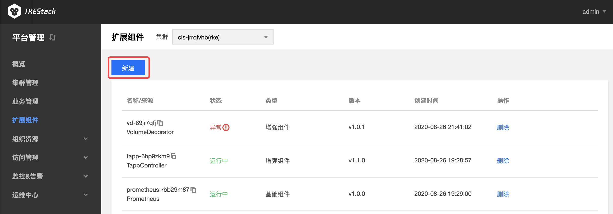
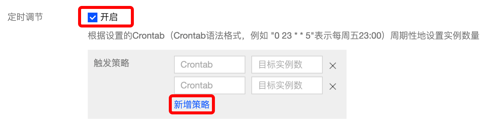

# CronHPA

## 组件介绍

### Cron Horizontal Pod Autoscaler(CronHPA)

CronHPA 可让用户利用[crontab](https://en.wikipedia.org/wiki/Cron)实现对负载（deployment, statefulset，tapp这些支持扩缩容的子资源）**定期自动扩缩容**。

### CronHPA使用场景

以游戏服务为例，从星期五晚上到星期日晚上，游戏玩家数量暴增。如果可以将游戏服务器在星期五晚上扩大规模，并在星期日晚上缩放为原始规模，则可以为玩家提供更好的体验。这就是游戏服务器管理员每周要做的事情。

其他一些服务也会存在类似的情况，这些产品使用情况会定期出现高峰和低谷。CronHPA可以自动化实现提前扩缩Pod，为用户提供更好的体验。

### 部署在集群内kubernetes对象

在集群内部署CronHPA Add-on , 将在集群内部署以下kubernetes对象

| kubernetes对象名称 | 类型 | 默认占用资源 | 所属Namespaces |
| ----------------- | --- | ---------- | ------------- |
| cron-hpa-controller |Deployment |每节点1核CPU, 512MB内存|kube-system|

## CronHPA使用方法

### 安装CronHPA组件

1. 登录TKEStack
2. 切换至 平台管理控制台，选择扩展组件页面。
3. 选择需要安装组件的集群，点击【新建】按钮。如下图所示：

4. 在弹出的扩展组件列表里，滑动列表窗口找到CronHPA组件。如下图所示：
5. 单击【完成】。

### 使用CronHPA组件

1. 登录TKEStack
2. 切换至【平台管理】控制台，选择【集群管理】页面。
3. 点击要处理的【集群id】
4. 选择工作负载里的你需要的负载类型，这里以 Deployment 为例，点击【新建】
5. 在“新建Workload”页面中，点击【开启】定时调节，如下图所示：
6. 【新增策略】按钮可以新增策略，策略右边的叉可以减少策略
7. 每条触发策略由两条字段组成
   1. **Crontab** ：例如 "0 23 * * 5"表示每周五23:00，详见[crontab](https://en.wikipedia.org/wiki/Cron)
   2. **目标实例数** ：设置实例数量

