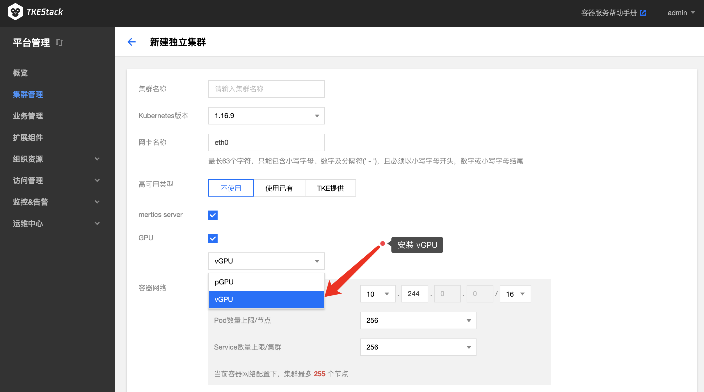
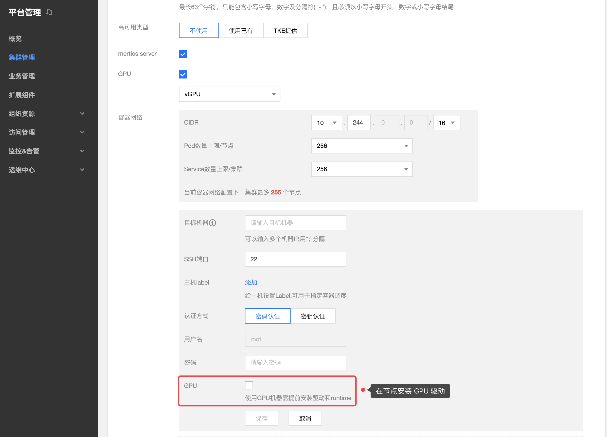
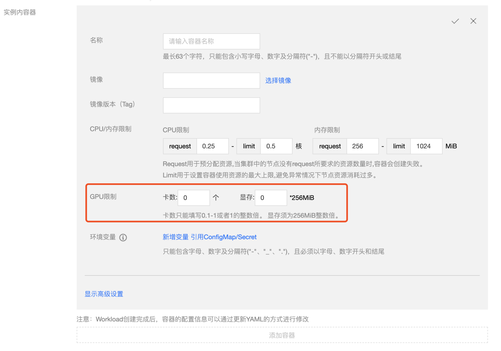
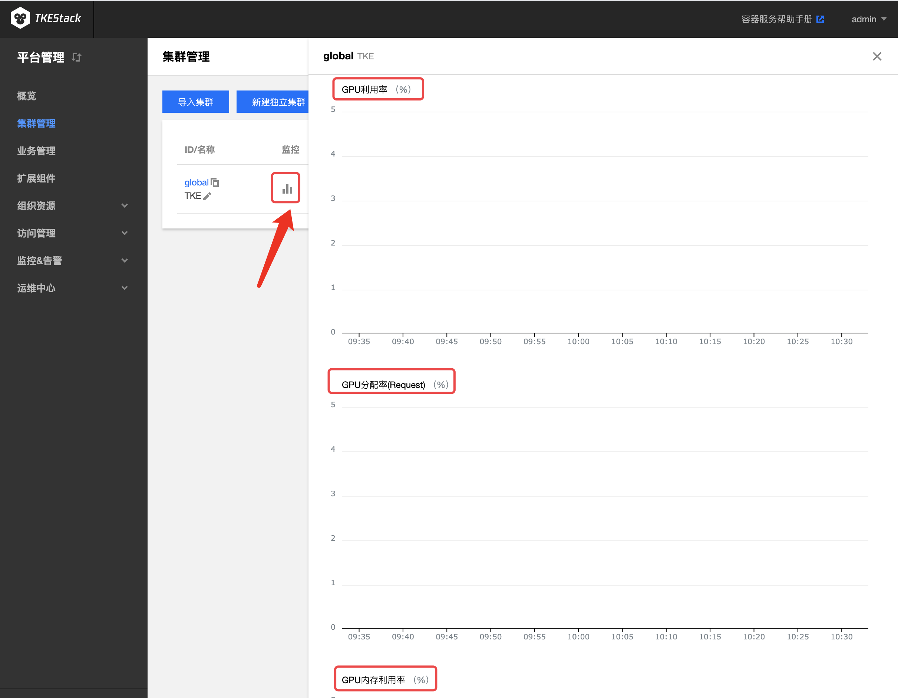
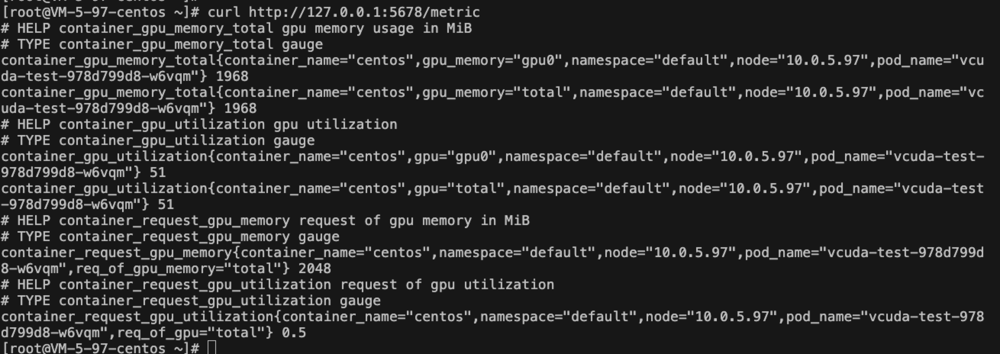

# GPUManager

## GPUManager 介绍

[GPUManager ](https://github.com/tkestack/gpu-manager) 提供一个 All-in-One 的 GPU 管理器, 基于 Kubernets Device Plugin 插件系统实现，该管理器提供了分配并共享 GPU，GPU 指标查询，容器运行前的 GPU 相关设备准备等功能，支持用户在 Kubernetes 集群中使用 GPU 设备。

GPU-Manager 包含如下功能:

- **拓扑分配**：提供基于 GPU 拓扑分配功能，当用户分配超过1张 GPU 卡的应用，可以选择拓扑连接最快的方式分配GPU设备

- **GPU 共享**：允许用户提交小于1张卡资源的的任务，并提供 QoS 保证

- **[应用 GPU 指标的查询](#通过后台手工查询)**：用户可以访问主机的端口(默认为5678)的`/metrics` 路径，可以为 Prometheus 提供 GPU 指标的收集功能，`/usage` 路径可以提供可读性的容器状况查询

### GPU-Manager 使用场景

在 Kubernetes 集群中运行 GPU 应用时，可以解决 AI 训练等场景中申请独立卡造成资源浪费的情况，让计算资源得到充分利用。

### GPU-Manager 限制条件

1. 该组件基于 Kubernetes DevicePlugin 实现，只能运行在支持  DevicePlugin 的 kubernetes版本（Kubernetes 1.10 之上的版本）

2. 使用 GPU-Manager 要求集群内包含 GPU 机型节点

3. TKEStack 的 GPU-Manager 将每张 GPU 卡视为一个有100个单位的资源

   > 特别注意：
   >
   > 1. 当前仅支持 0-1 的小数张卡，如 20、35、50；以及正整数张卡，如200、500等；不支持类似150、250的资源请求
   > 2. 显存资源是以 256MiB 为最小的一个单位的分配显存

### 部署在集群内 kubernetes 对象

在集群内部署 GPU-Manager，将在集群内部署以下 kubernetes 对象：

| kubernetes 对象名称   | 类型       | 建议预留资源           | 所属 Namespaces |
| --------------------- | ---------- | ---------------------- | --------------- |
| gpu-manager-daemonset | DaemonSet  | 每节点1核 CPU, 1Gi内存 | kube-system     |
| gpu-quota-admission   | Deployment | 1核 CPU, 1Gi内存       | kube-system     |

## GPU-Manager 使用方法

### 安装 GPU-Manager

集群部署阶段选择 vGPU，平台会为集群部署 GPU-Manager ，如下图新建独立集群所示，Global 集群的也是如此安装。



### 在节点安装 GPU 驱动

集群部署阶段添加 GPU 节点时有勾选 GPU 选项，平台会自动为节点安装 GPU 驱动，如下图所示：

> 注意：如果集群部署阶段节点没有勾选 GPU，需要自行在有 GPU 的节点上安装 GPU 驱动



### 工作负载使用 GPU

#### 通过控制台使用

在安装了 GPU-Manager 的集群中，创建工作负载时可以设置 GPU 限制，如下图所示：

> 注意：
>
> 1. 卡数只能填写 0.1 到 1 之间的两位小数或者是所有自然数，例如：0、0.3、0.56、0.7、0.9、1、6、34，不支持 1.5、2.7、3.54
> 2. 显存只能填写自然数 n，负载使用的显存为 n*256MiB



#### 创建使用GPU的Pod

如果使用 YAML 创建使用 GPU 的工作负载，提交的时候需要在 YAML 为容器设置 GPU 的使用资源。

* CPU 资源需要在 resource 上填写`tencent.com/vcuda-core`
* 显存资源需要在 resource 上填写`tencent.com/vcuda-memory`

例1：使用1张卡的 Pod

```
apiVersion: v1

kind: Pod

...

spec:

  containers:

    - name: gpu

      resources:
        limits:
          tencent.com/vcuda-core: 100
        requests:
          tencent.com/vcuda-core: 100
```

例2，使用 0.3 张卡、5GiB 显存的应用（5GiB = 20*256MB）

```
apiVersion: v1
kind: Pod
metadata:
  name: nginx
spec:
  containers:
  - name: nginx
    image: nginx
    imagePullPolicy: IfNotPresent
    resources:
      limits:
        tencent.com/vcuda-core: 30
        tencent.com/vcuda-memory: 20
      requests:
        tencent.com/vcuda-core: 30
        tencent.com/vcuda-memory: 20
```

如果pod在创建过程中出现`CrashLoopBackOff `的状态，且error log如下所示：
```
failed to create containerd task: OCI runtime create failed: container_linux.go:380: starting container process caused: process_linux.go:545: container init caused: Running hook #0:: error running hook: exit status 1, stdout: , stderr: nvidia-container-cli: mount error: open failed: /sys/fs/cgroup/devices/system.slice/containerd.service/kubepods-besteffort-podfd3b355a_665c_4c95_8e7f_61fd2111689f.slice/devices.allow: no such file or directory: unknown
```
需要在GPU主机上手动安装`libnvidia-container-tools`这个组件，首先需要添加repo源：[添加repo源](https://nvidia.github.io/libnvidia-container/)，
添加repo源后执行如下命令：
```
yum install libnvidia-container-tools
```
如果pod在创建过程中出现如下error log：
```
failed to generate spec: lstat /dev/nvidia-uvm: no such file or directory
```
需要在pod所在的主机上手动mount这个设备文件：
```
nvidia-modprobe -u -c=0
```

## GPU 监控数据查询

### 通过控制台查询

> 前提：在集群的[【基本信息】](../../../docs/guide/zh-CN/products/platform/cluster.md#基本信息)页里打开“监控告警”

可以通过集群多个页面的监控按钮里查看到 GPU 的相关监控数据，下图以 集群管理 页对集群的监控为例：



### 通过后台手动查询

手动获取 GPU 监控数据方式（需要先安装 [socat](http://www.dest-unreach.org/socat/)）：

```
kubectl port-forward svc/gpu-manager-metric -n kube-system 5678:5678 &
curl http://127.0.0.1:5678/metric
```

结果示例：



GPUManager 项目请参考：[GPUManager Repository ](https://github.com/tkestack/gpu-manager)
