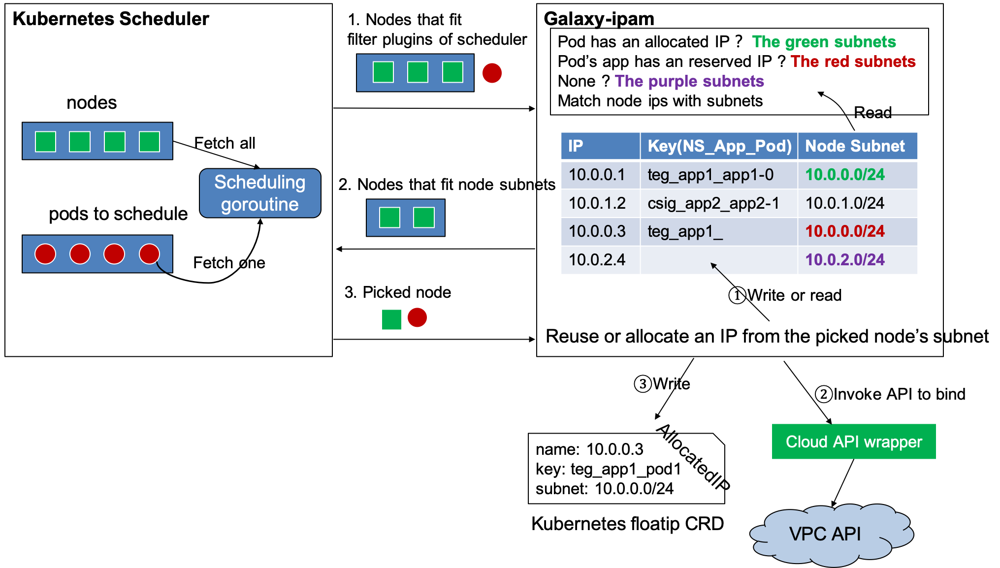

# IPAM

Galaxy-ipam is a [Kubernetes Scheudler Extender](https://kubernetes.io/docs/concepts/extend-kubernetes/extend-cluster/#scheduler-extensions). Scheduler calls Galaxy-ipam for filtering and binding via HTTP, so we need to create a scheduler policy configuration.

## Kubernetes Scheduler Configuration

Because of https://github.com/kubernetes/kubernetes/pull/59363 (Released in 1.10), we don't need to configure predicates/priorities in policy config, scheduler applies built-in default sets of predicate/prioritizer on pod scheduling.

```
# Creating scheduler Policy ConfigMap
cat <<EOF | kubectl create -f -
apiVersion: v1
kind: ConfigMap
metadata:
  name: scheduler-policy
  namespace: kube-system
data:
  policy.cfg: |
    {
      "kind": "Policy",
      "apiVersion": "v1",
      "extenders": [
        {
          "urlPrefix": "http://127.0.0.1:9040/v1",
          "httpTimeout": 10000000000,
          "filterVerb": "filter",
          "BindVerb": "bind",
          "weight": 1,
          "enableHttps": false,
          "managedResources": [
            {
              "name": "tke.cloud.tencent.com/eni-ip",
              "ignoredByScheduler": false
            }
          ]
        }
      ]
    }
EOF

# Add the following config to kube-scheduler and restart it
--policy-configmap=scheduler-policy
```

Note: If you want to limit each node's max float IPs, please set ignoredByScheduler to false, then the float IP resource will be judge by scheduler's PodFitsResource algorithm.

## Galaxy-ipam Configuration

Galaxy uses CRD to persist allocated IPs.

```
  galaxy-ipam.json: |
    {
      "schedule_plugin": {
        "cloudProviderGrpcAddr": "127.0.0.2:80"
      }
    }
```

## float IP Configuration

If running on bare metal environment, please create a ConfigMap floatingip-config.

```
kind: ConfigMap
apiVersion: v1
metadata:
 name: floatingip-config
 namespace: kube-system
data:
 floatingips: '[{"nodeSubnets":["10.0.0.0/16"],"ips":["10.0.70.2~10.0.70.241"],"subnet":"10.0.70.0/24","gateway":"10.0.70.1"}]'
```

| field       | required | comment                                                      |
| ----------- | -------- | ------------------------------------------------------------ |
| nodeSubnets | required | the node cidr, the below configure means `10.0.70.2~10.0.70.241` can be allocated to pods running on nodes of `10.0.0.0/16` |
| ips         | required | available pod IPs, please configure the router to route packets destination for these IPs to nodes of `10.0.0.0/16`. |
| subnet      | required | the pod IP subnet.                                           |
| vlan        | optional | the pod IP vlan id. If pod IPs are not belong to the same vlan as node IP, please specify the vlan id and make sure the node's connected switch port is a trunk port. Leave it empty if not required. |

A nodeSubnet may have multiple pod subnets. The following example means pod running on `10.49.28.0/26` may have allocated ips from `10.0.80.2~10.0.80.4` or `10.0.81.2~10.0.81.4`. But if it runs on `10.49.29.0/24`, its ip is in range `10.0.80.2~10.0.80.4`.

```
[{
	"nodeSubnets": ["10.49.28.0/26", "10.49.29.0/24"],
	"ips": ["10.0.80.2~10.0.80.4"],
	"subnet": "10.0.80.0/24",
	"gateway": "10.0.80.1"
}, {
	"nodeSubnets": ["10.49.28.0/26"],
	"ips": ["10.0.81.2~10.0.81.4"],
	"subnet": "10.0.81.0/24",
	"gateway": "10.0.81.1",
	"vlan": 3
}]
```

Multiple nodeSubnets may share the same pod subnet with none overlapping ips. Overlapping ips is a not allowed. The following example means `10.180.154.2~10.180.154.3` can only be allocated to pods running on `10.180.1.2/32` and `10.180.154.7~10.180.154.8` can only be allocated to pods running on `10.180.1.3/32`.

```
[{
	"routableSubnet": "10.180.1.2/32",
	"ips": ["10.180.154.2~10.180.154.3"],
	"subnet": "10.180.154.0/24",
	"gateway": "10.180.154.1",
	"vlan": 3
}, {
	"routableSubnet": "10.180.1.3/32",
	"ips": ["10.180.154.7~10.180.154.8"],
	"subnet": "10.180.154.0/24",
	"gateway": "10.180.154.1",
	"vlan": 3
}]
```

For a more complex configuration, please take a look at [test_helper.go](https://github.com/tkestack/galaxy/blob/master/pkg/ipam/utils/test_helper.go)

## Reserve IP to prevent allocation

You can either delete it from floatingip-config ConfigMap or creating an floatingip crd object. You can also delete it to stop reserving. But please don't delete any floatingip that is not created by youself.

```
# creating a floatingip crd object to reserve IP
# please replace name with the IP you want to reserve.
# don't delete ipType/reserved label or it won't work

apiVersion: galaxy.k8s.io/v1alpha1
kind: FloatingIP
metadata:
  name: 10.0.0.1
  labels:
    ipType: internalIP
    reserved: this-is-not-for-pods
spec:
  key: pool__reserved-for-node_
  policy: 2
```

## CNI network configuration

You can use [Vlan CNI or TKE route ENI CNI plugin](https://github.com/tkestack/galaxy/blob/master/doc/supported-cnis.md) to launch float IP Pods. Make sure to update `DefaultNetworks` to `galaxy-k8s-vlan` of galaxy-etc ConfigMap or add `k8s.v1.cni.cncf.io/networks=galaxy-k8s-vlan` annotation to Pod spec.

## Cloud Provider

If running on public or private clouds, Galaxy leverage ENI feature to provide float IPs for PODs. Please update `cloudProviderGrpcAddr` in galaxy-ipam-etc ConfigMap.

Cloud provider is responsible for

1. Creating and binding ENI for each kubelet node
2. Provide float IP configuration for Galaxy-ipam
3. Implement a GRPC server based on the [ip_provider.proto](https://github.com/tkestack/galaxy/blob/master/pkg/ipam/cloudprovider/rpc/ip_provider.proto)
4. Update Node status to add [float IP extend resource](https://github.com/tkestack/galaxy/blob/master/doc/float-ip.md) numbers if requiring to limit each node's max float IPs.

## How Galaxy-ipam works


This is how Galaxy-ipam supports running underlay network.

1. On private cloud the cluster administrator needs to config the floatingip-config ConfigMap. While on public cloud Cloud provider should provide that for Galaxy-ipam
2. Kubernetes scheduler calls Galaxy-ipam on filter/priority/bind method
3. Galaxy-ipam checks if POD has a reserved IP, if it does, Galaxy-ipam marks only the nodes within the available subnets of this IP as valid node, otherwise all nodes that has float IP left. During binding, Galaxy-ipam allocates an IP and writes it into POD annotation.
4. On public cloud, scheduler plugin calls cloud provider to Assign and UnAssign ENI IP.
5. Galaxy gets IP from POD annotation and calls CNIs with them as CNI args.



The above picture shows how Galaxy-ipam allocates IP according to the network typology. Floatingip-config ConfigMap has the information of network typology that which node subnets POD IPs can be placed in. All Galaxy-ipam needs to do is to follow the rules, so the following is the scheduling process.

1. Scheduler sends all nodes that fit all filter plugins of itself and the POD to be scheduled to Galaxy-ipam.
2. Galaxy-ipam queries its memory table to find node subnets with full pod name matching the to be scheduled POD. If not, it finds those with pods' app full name matching. And again if not, it finds all from unallocated IPs. Then it matches all nodes' IPs with these node subnetes and return the matched nodes to Scheduler.
3. Scheduler priorities these nodes and picks the top one and calls Galaxy-ipam for binding.
4. Galaxy-ipam updates its memory table to reuse or allocate an IP from the picked node's corresponding subnet. It then invokes cloud provider to assign the ENI IP. And finally stores the IP in floatip crd.
5. Galaxy-ipam has a memory table and a floatip crd storage for storing allocated IPs. When restarting, it allocates all IPs in memory by reading floatip crds. It watches POD delete event from Apiserver to release IPs and runs a regular goroutine to release IPs that should be done but somehow haven't done.

There is something more that worth talking about.

1. For deployment, in order to allocate the same IPs for its' PODs when rolling upgrade. Galaxy-ipam updates keys of allocated IPs from POD full name to app full name to reserve these IPs. e.g. from `dp_$namespace_$deploymentName_$podName` to `dp_$namespace_$deploymentName_`. `dp` is short for `deployment`. Then it updates keys of reserved IPs to new Pods by updating keys from app full name to POD full name.
2. Since Scheduler starts a next loop of scheduling without waiting for the previous binding process to finish, for deployment pod, Galaxy-ipam allocates reused IP at filtering stage instead of binding stage to make sure IPs don't over allocate for a node subnet.

## Reference：

https://github.com/tkestack/galaxy

https://github.com/tkestack/galaxy/blob/master/doc/galaxy-ipam-config.md