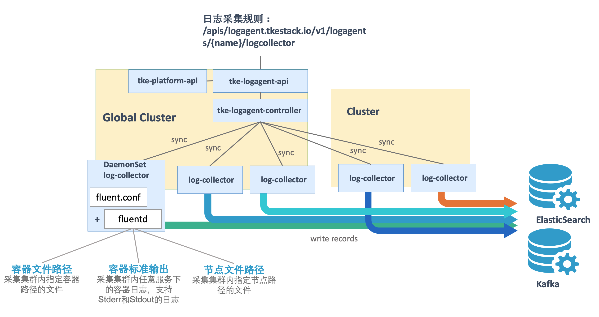
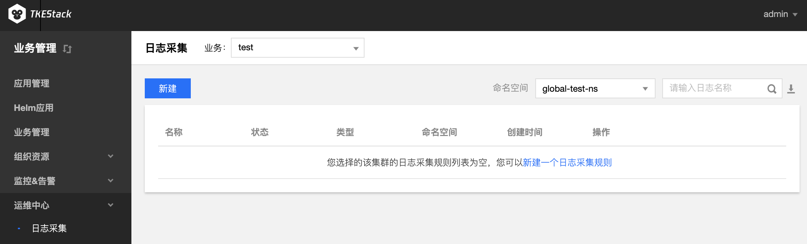
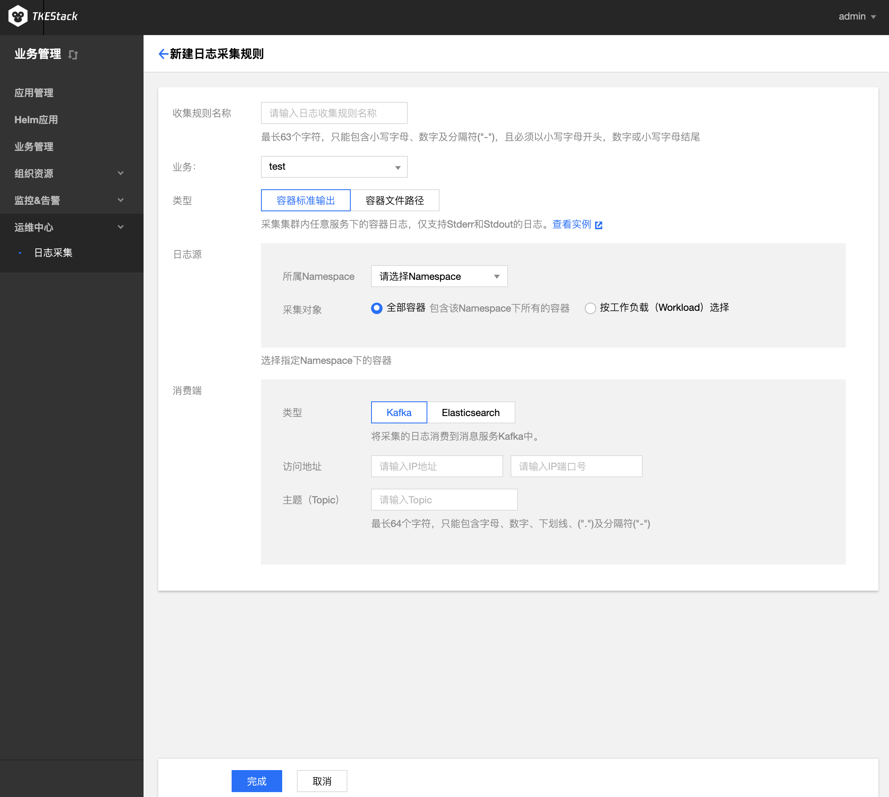
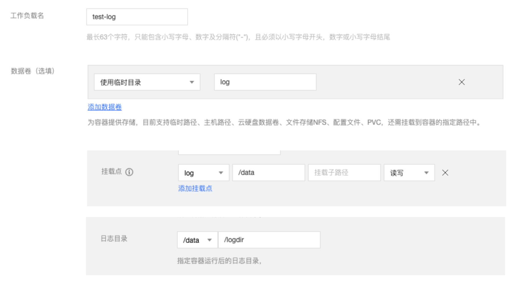
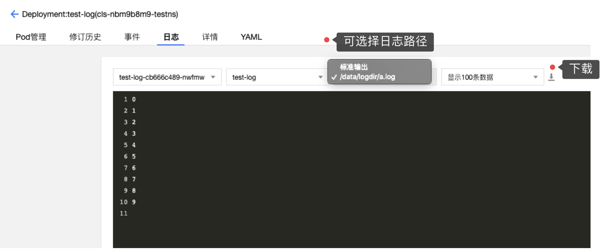

# 日志采集

## LogAgent 介绍

TKESTack 通过 logagent 提供的集群内日志采集功能，支持将集群内服务或集群节点特定路径文件的日志发送至 Kafka、Elasticsearch 等消费端，支持采集容器标准输出日志，容器内文件日志以及主机内文件日志。更提供事件持久化、审计等功能，实时记录集群事件及操作日志记录，帮助运维人员存储和分析集群内部资源生命周期、资源调度、异常告警等情况。

> TKEStack 老版本日志使用 LogCollector 扩展组件。LogAgent 用于替换 LogCollector，新版本统一用 LogAgent 完成日志采集功能。

日志收集功能需要为每个集群手动开启。日志收集功能开启后，日志收集组件 logagent 会在集群内以 Daemonset 的形式运行。用户可以通过日志收集规则配置日志的采集源和消费端，日志收集 Agent 会从用户配置的采集源进行日志收集，并将日志内容发送至用户指定的消费端。需要注意的是，**使用日志收集功能需要您确认 Kubernetes 集群内节点能够访问日志消费端。**

- **采集容器标准输出日志** ：采集集群内指定**容器的 Stderr 和 Stdout 日志。**，采集到的日志信息将会以 JSON 格式输出到用户指定的消费端，并会自动附加相关的 Kubernetes metadata， 包括容器所属 Pod 的 label 和 annotation 等信息。
- **采集容器内文件日志** ：采集集群内指定**容器内文件路径的日志**，用户可以根据自己的需求，灵活的配置所需的容器和路径，采集到的日志信息将会以 JSON 格式输出到用户指定的消费端， 并会附加相关的 Kubernetes metadata，包括容器所属 Pod 的 label 和 annotation 等信息。
- **采集主机内文件日志** ：采集集群内所有节点的指定**主机文件路径的日志**，logagent 会采集集群内所有节点上满足指定路径规则的文件日志，以 JSON 格式输出到用户指定的输出端， 并会附加用户指定的 metadata，包括日志来源文件的路径和用户自定义的 metadata。

### 部署在集群内 kubernetes 对象

在集群内部署 logagent Add-on , 将在集群内部署以下 kubernetes 对象

| kubernetes 对象名称 | 类型           | 默认占用资源                | 所属Namespaces |
| ------------------- | -------------- | --------------------------- | -------------- |
| logagent            | DaemonSet      | 每节点0.3核 CPU, 250MB 内存 | kube-system    |
| logagent            | ServiceAccount |                             | kube-system    |

## 使用日志采集服务

> 注意：日志采集对接外部 Kafka 或 Elasticsearch，该功能需要额外开启，位置在集群 [基本信息](../../platform/cluster.md#基本信息) 下面，点击开启“日志采集”服务。

### 业务管理侧

  1. 登录 TKEStack

  2. 切换至【业务管理】控制台，选择 【运维中心】->【日志采集】

  3. 选择相应【业务】和【命名空间】，单击【新建】按钮，如下图所示：
     

  4. 在“新建日志采集”页面填写日志采集信息，如下图所示：
     

     + **收集规则名称：** 输入规则名，1～63字符，只能包含小写字母、数字及分隔符("-")，且必须以小写字母开头，数字或小写字母结尾

     + **业务：** 选择所属业务（业务管理侧才会出现）

     + **集群：** 选择所属集群（平台管理侧才会出现）

     + **类型：** 选择采集类型

       + **容器标准输出：** 容器 Stderr 和 Stdout 日志信息采集

         + **日志源：** 可以选择所有容器或者某个 Namespace 下的所有容器/工作负载
           + **所有容器：** 所有容器
           + **指定容器：** 某个 Namespace 下的所有容器或者工作负载

       + **容器文件路径：** 容器内文件内容采集

         + **日志源：** 可以采集具体容器内的某个文件路径下的文件内容

           + **工作负载选项：** 选择某个 Namespace 下的某种工作负载类型下的某个工作负载
           + **配置采集路径：** 选择某个容器下的某个文件路径

           > * 文件路径若输入`stdout`，则转为容器标准输出模式
           >
           > * 可配置多个路径。路径必须以`/`开头和结尾，文件名支持通配符（*）。文件路径和文件名最长支持63个字符
           >
           > * 请保证容器的日志文件保存在数据卷，否则收集规则无法生效，详见[指定容器运行后的日志目录](#指定容器运行后的日志目录)

       + **节点文件路径：**  收集节点上某个路径下的文件内容，不会重复采集，因为采集器会记住之前采集过的日志文件的位点，只采集增量部分

         + **日志源：** 可以采集具体节点内的某个文件路径下的文件内容
            + **收集路径：** 节点上日志收集路径。路径必须以`/`开头和结尾，文件名支持通配符（*）。文件路径和文件名最长支持63个字符
            + **metadata：** key：value 格式，收集的日志会带上 metadata 信息上报给消费端

     + **消费端：** 选择日志消费端

       + **Kafka：** 

         + **访问地址：** Kafka IP 和端口
         + **主题（Topic）：** Kafka Topic 名

       + **Elasticsearch：** 

         + **Elasticsearch 地址：** ES 地址，如：http://190.0.0.1:200

           > 注意：当前只支持未开启用户登录认证的 ES 集群

         + **索引：** ES索引，最长60个字符，只能包含小写字母、数字及分隔符("-"、"_"、"+")，且必须以小写字母开头

  5. 单击【完成】按钮

### 平台管理侧

在平台管理侧也支持日志采集规则的创建，创建方式和业务管理处相同。详情可点击平台侧的[日志采集](../../platform/operation/log.md)。

### 指定容器运行后的日志目录

LogAgent 除了支持日志规则的创建，也支持指定容器运行后的日志目录，可实现日志文件展示和下载。

> 前提：需要在创建负载时挂载数据卷，并指定日志目录

创建负载以后，在容器内的`/data/logdir`目录下的所有文件可以展示并下载，例如我们在容器的`/data/logdir`下新建一个名为`a.log`的文件，如果有内容的话，也可以在这里展示与下载：

