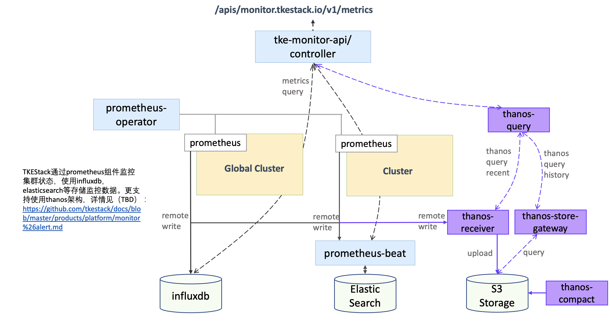
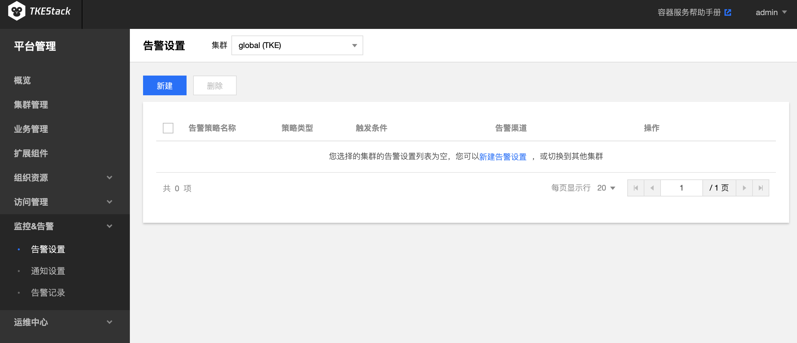
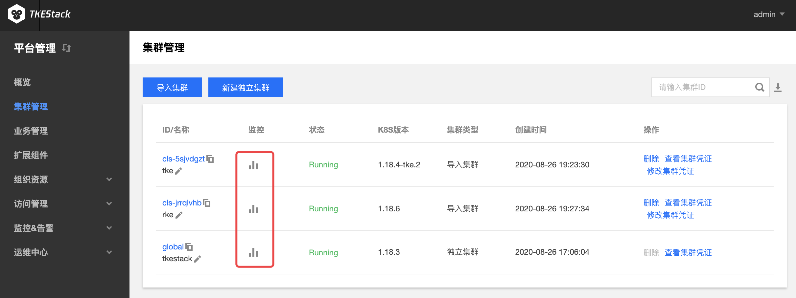

# Prometheus

## Prometheus 介绍

良好的监控环境为 TKEStack 高可靠性、高可用性和高性能提供重要保证。您可以方便为不同资源收集不同维度的监控数据，能方便掌握资源的使用状况，轻松定位故障。

TKEStack 使用 Prometheus 为 Kubernetes 集群提供监控告警服务。旨在降低对容器平台监控告警方案的实现难度，为用户提供开箱即用的监控告警能力，同时提供灵活的扩展能力以满足用户在使用监控告警时的个性化需求。允许用户自定义对接 influxdb，ElasticSearch 等后端存储监控数据。针对在可用性和可扩展性方面，支持使用 thanos 架构提供可靠的细粒度监控和警报服务，构建具有高可用性和可扩展性的细粒度监控能力。

> 指标具体含义可参考：[监控 & 告警指标列表](../FAQ/Platform/alert&monitor-metrics.md)

### Prometheus 使用场景

Prometheus 是 Kubernetes 监控的事实标准，为容器平台提供了一整套的监控告警解决方案。因为相关的组件众多，配置灵活多变，为了降低使用门槛， TKEStack 使用 Prometheus 为用户提供了一键部署的监控告警方案：

1. 方案预置了涵盖 Cluster、Namespace、Workload、Pod、Container 以及**业务**等层级的监控项，包括了 CPU、内存、IO、网络以及 GPU 等监控指标并自动绘制趋势曲线，帮助运维人员全维度的掌握平台运行状态。

2. 利用 AlertManager 的能力，结合 TKEStack 提供的告警模版和渠道，提供灵活的告警策略与告警管理。

3. 方案基于 Prometheus Operator 实现，利用其能力，用户可以非常方便的进行二次开发。

### Prometheus 限制条件

1. 安装 Prometheus 将占用集群 1核 CPU,600MB 内存的资源。同时随着集群规模的扩大，Prometheus 会占用更多的系统资源

2. 仅在1.8版本以上的 kubernetes 集群支持

### 部署在集群内 kubernetes 对象

在集群内部署 Prometheus , 将在集群内部署以下 kubernetes 对象

| kubernetes 对象名称                        | 类型                           | 默认占用资源 | 所属 Namespaces |
| ------------------------------------------| ------------------------------ | ---------- | ------------- |
| kube-state-metrics                        | Deployment                     | 0.1核CPU,128MB内存      | kube-system  |
| kube-state-metrics                        | ServiceAccount                 | /      | kube-system  |
| kube-state-metrics                        | ClusterRole                    | /      | /            |
| kube-state-metrics                        | ClusterRoleBinding             | /      | /            |
| kube-state-metrics                        | Service                        | /      | kube-system  |
| prometheus-operator                       | Deployment                     | 0.1核CPU,100MB内存      | kube-system  |
| prometheus-operator                       | ServiceAccount                 | /      | kube-system  |
| prometheus-operator                       | ClusterRole                    | /      | /            |
| prometheus-operator                       | ClusterRoleBinding             | /      | /            |
| prometheus-operator                       | Service                        | /      | kube-system  |
| alertmanager-main                         | StatefulSet                   | 0.3核CPU,75MB内存      | kube-system  |
| alertmanager                              | Service                        | /      | kube-system  |
| prometheus-k8s                            | StatefulSet                   | 0.3核CPU,200MB内存      | kube-system  |
| prometheus-k8s                            | ServiceAccount                 | /      | kube-system  |
| prometheus-k8s                            | ClusterRole                    | /      | /            |
| prometheus-k8s                            | ClusterRoleBinding             | /      | /            |
| prometheus                                | Service                        | /      | kube-system  |
| node-exporter                             | Daemonset                      | 0.1核CPU,128MB内存      | kube-system  |
| alertmanagers.monitoring.coreos.com       | CustomResourceDefinition       | /      | /            |
| podmonitors.monitoring.coreos.com         | CustomResourceDefinition       | /      | /            |
| prometheuses.monitoring.coreos.com        | CustomResourceDefinition       | /      | /            |
| prometheusrules.monitoring.coreos.com     | CustomResourceDefinition       | /      | /            |
| servicemonitors.monitoring.coreos.com     | CustomResourceDefinition       | /      | /            |
| thanosrulers.monitoring.coreos.com | CustomResourceDefinition | / | / |

## Prometheus 使用方法

### 安装

Prometheus 为 TKEStack 扩展组件，需要在集群的 [【基本信息】](../../../docs/guide/zh-CN/products/platform/cluster.md#基本信息) 页里开启 “监控告警”

### 使用

1. 在左侧导航栏中，单击【监控&告警】，进入监控告警管理页面，可管理告警项及通知相关设置。

   

   > 更多请参考 [告警设置](../../../docs/guide/zh-CN/products/platform/monitor&alert/alertsetting.md)

2. 在左侧导航栏中，单击【集群管理】，进入集群管理页面，可查看集群及工作负载的监控数据。

   

   > 更多使用请参考 [利用 Prometheus 监控](../../../docs/guide/zh-CN/features/prometheus.md)
