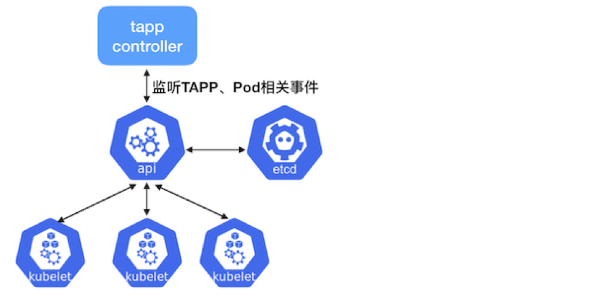
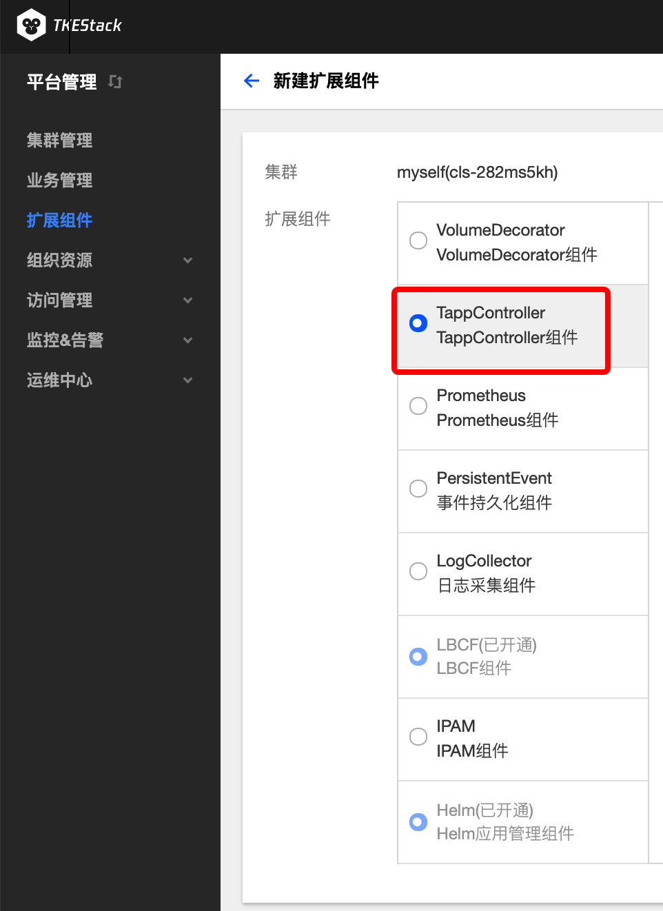
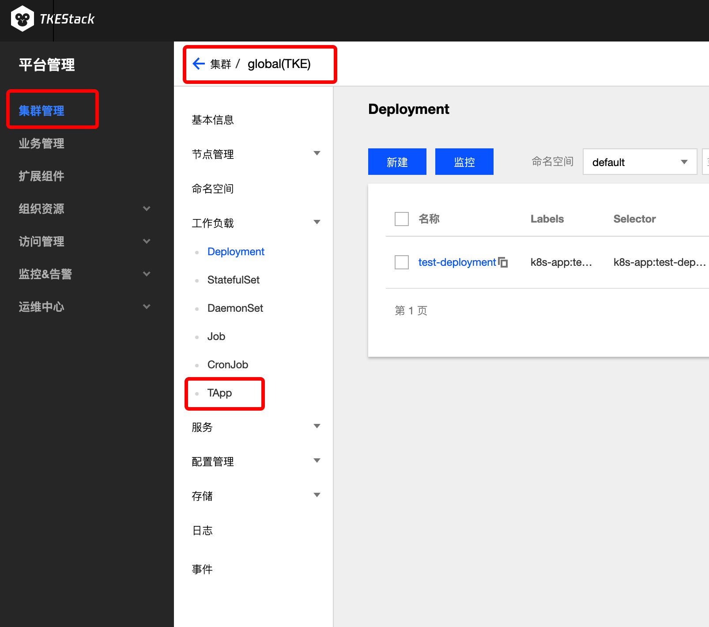

# TApp

## TApp 介绍

Kubernetes 现有应用类型（如：Deployment、StatefulSet等）无法满足很多非微服务应用的需求。比如：操作（升级、停止等）应用中的指定 Pod；应用支持多版本的 Pod。如果要将这些应用改造为适合于这些 Workload 的应用，需要花费很大精力，这将使大多数用户望而却步。

为解决上述复杂应用管理场景，TKEStack 基于 Kubernetes CRD 开发了一种新的应用类型 [**TApp**](https://github.com/tkestack/tapp)，它是一种通用类型的 Workload，同时支持 service 和 batch 类型作业，满足绝大部分应用场景，它能让用户更好的将应用迁移到 Kubernetes 集群。

### TApp 使用场景

Kubernetes 凭借其强大的声明式 API、丰富的特性和可扩展性，逐渐成为容器编排领域的霸主。越来越多的用户希望使用 Kubernetes，将现有的应用迁移到 Kubernetes 集群，但 Kubernetes 现有 Workload（如：`Deployment`、`StatefulSet`等）无法满足很多非微服务应用的需求，比如：操作（升级、停止等）应用中的指定 Pod、应用支持多版本的 Pod。如果要将这些应用改造为适合于这些 Workload的应用，需要花费很大精力，这将使大多数用户望而却步。

腾讯有着多年的容器编排经验，基于 Kuberentes CRD（Custom Resource Definition，使用声明式API方式，无侵入性，使用简单）开发了一种新的 Workload 类型 TApp，它是一种通用类型的 Workload，同时支持 service 和 batch 类型作业，满足绝大部分应用场景，它能让用户更好的将应用迁移到 Kubernetes 集群。如果用 Kubernetes 的 Workload 类比，TAPP ≈ Deployment + StatefulSet + Job ，它包含了 Deployment、StatefulSet、Job 的绝大部分功能，同时也有自己的特性，并且和原生 Kubernete s相同的使用方式完全一致。经过这几年用户反馈， TApp 也得到了逐渐的完善。

### TApp 特点

1. **同时支持 service 和 batch 类型作业**。通过 RestartPolicy 来对这两种作业进行区分。RestartPolicy值有三种：RestartAlways、Never、OnFailure
   1. **RestartAlways**：表示 Pod 会一直运行，如果结束了也会被重新拉起（适合 service 类型作业）
   2. **Never**：表示 Pod 结束后就不会被拉起了（适合 batch 类型作业）
   3. **OnFailure**：表示 Pod 结束后，如果 exit code 非0，将会被拉起，否则不会（适合 batch 类型作业）

2. **固定ID**：每个实例（Pod）都有固定的 ID(0, 1, 2 … N-1，其中N为实例个数)，它们的名字由 **TApp 名字+ID** 组成，因此名字也是唯一的。 有了固定的ID和名字后，我们便可以实现如下能力：

   1. 将实例用到的各种资源（将实例用到的存储资源(如：云硬盘)，或者是IP）和实例一一对应起来，这样即使实例发生迁移，实例对应的各种资源也不会变
   2. 通过固定 ID，我们可以为实例分配固定的 IP（float ip）。唯一的实例名字还可用来跟踪实例完整的生命周期
   3. 对于同一个实例，可以由于机器故障发生了迁移、重启等操作，虽然不是一个 Pod 了，但是我们用实例 ID 串联起来，就获得了实例真正的生命周期的跟踪，对于判断业务和系统是否正常服务具有特别重要的意义
3. **操作指定实例**：有了固定的 ID，我们就能操作指定实例。我们遵循了 Kubernetes 声明式的 API，在 spec 中 statuses 记录实例的目标状态， instances 记录实例要使用的 template，用于停止、启动、升级指定实例。
4. **支持多版本实例**：在 TApp spec 中，不同的实例可以指定不同的配置（image、resource 等）、不同的启动命令等，这样一个应用可以存在多个版本实例。
5. **原地更新(in place update)**：Kubernetes 的更新策略是删除旧 Pod，新建一个 Pod，然后调度等一系列流程，才能运行起来，而且 Pod原先的绑定的资源（本地磁盘、IP 等）都会变化。TApp 对此进行了优化：如果只修改了 container 的 image，TApp 将会对该 Pod 进行本地更新，原地重启受影响的容器，本地磁盘不变，IP 不变，最大限度地降低更新带来的影响，这能极大地减少更新带来的性能损失以及服务不可用。
6. **云硬盘**：云硬盘的底层由分布式存储 Ceph 支持，能很好地支持有状态的作业。在实例发生跨机迁移时，云硬盘能跟随实例一起迁移。TApp 提供了多种云硬盘类型供选择。
7. **多种升级发布方式**：TApp除了支持常规的蓝绿布署、滚动发布、金丝雀部署等升级发布方式，还有其特有的升级发布方式：用户可以指定升级任意的实例。
8. **自动扩缩容**：根据 CPU/MEM/用户自定义指标对 TAPP 进行自动扩缩容。 除了自动扩缩容，我们还开发了周期性扩缩容 [CronHPA](CronHPA.md) 支持对 TApp 等(包括 Kubernetes 原生的 Deployment 和 StatefulSet)进行周期性扩缩容，支持 CronTab 语法格式，满足对资源使用有周期性需求的业务。
9. **Gang scheduling**：有些应用必须要等到获取到资源能运行的实例达到一定数量后才开始运行，TApp 提供的 Gang scheduling 正是处理这种情况的。

### 部署在集群内 kubernetes 对象

在集群内部署 TApp Add-on , 将在集群内部署以下 kubernetes 对象

| kubernetes 对象名称 | 类型 | 默认占用资源 | 所属Namespaces |
| ----------------- | --- | ---------- | ------------- |
| tapp-controller |Deployment |每节点1核CPU, 512MB内存|kube-system|
| tapps.apps.tkestack.io |CustomResourceDefinition |/|/|
| tapp-controller |ServiceAccount |/|kube-system|
| tapp-controller |Service |/|kube-system|
| tapp-controller |ClusterRoleBinding（ClusterRole/cluster-admin） |/|/|

## TApp 使用方法

### 安装TApp 组件

1. 登录 TKEStack
2. 切换至 平台管理控制台，选择扩展组件页面。
3. 选择需要安装组件的集群，点击【新建】按钮。如下图所示：

4. 在弹出的扩展组件列表里，滑动列表窗口找到tapp组件。如下图所示：

5. 单击【完成】

   安装完成后会在刚刚安装了 TApp 扩展组件的集群里 【工作负载】下面出现【TApp】，如下图所示：

   

### 使用 TApp 组件

在 TKEStack 控制台上使用 TApp 使用请参考：[TApp Workload](../../../docs/guide/zh-CN/products/business-control-pannel/application/workload/tapp.md)

对 TApp 架构和命令行使用请参考：[TApp Repository](https://github.com/tkestack/tapp/blob/master/doc/tutorial.md)

