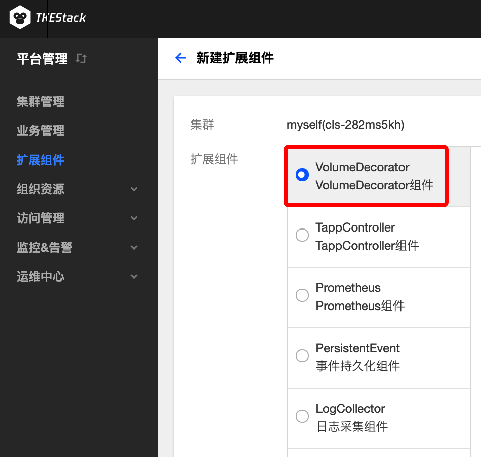

## Volume-Decorator说明

### 组件介绍 

是为Kubernetes volume(PVC)维护更多运行时信息的控制器，例如应用程序身份，实际使用情况等。

### Volume-Decorator特点

创建具有volumes的工作负载时，检查volume的可用性。
收集附加volume的工作负载。
保持volume的实时状态，例如`Pending`,`Expanding`等。
收集volume的当前挂载的节点。
收集volume的实际使用字节数。

### 部署在集群内kubernetes对象

在集群内部署Volume-Decorator Add-on , 将在集群内部署以下kubernetes对象

| kubernetes对象名称 | 类型 | 默认占用资源 | 所属Namespaces |
| ----------------- | --- | ---------- | ------------- |
| volume-decorator |Deployment |每节点0.2核CPU, 256MB内存|kube-system|

## Volume-Decorator使用方法

### 安装Volume-Decorator组件

1. 登录TKEStack
2. 切换至 平台管理控制台，选择扩展组件页面。
3. 选择需要安装组件的集群，点击【新建】按钮。如下图所示：

4. 在弹出的扩展组件列表里，滑动列表窗口找到VolumeDecorator组件。如下图所示：

5. 单击【完成】。

### 使用VolumeDecorator组件

详情见[VolumeDecorator example](https://github.com/tkestack/volume-decorator/tree/master/examples)

