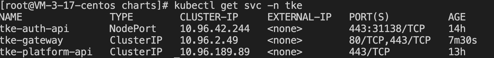
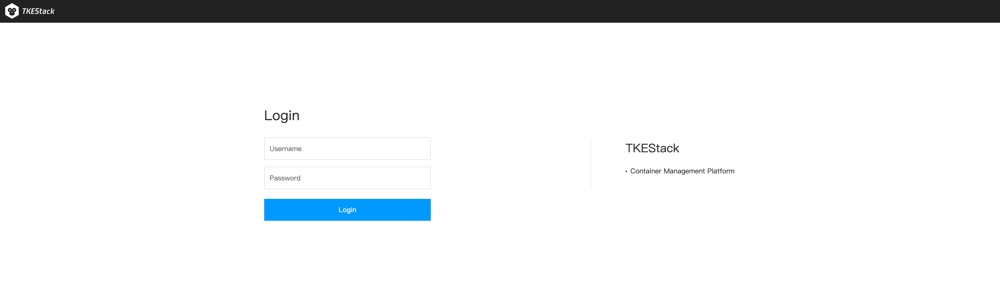
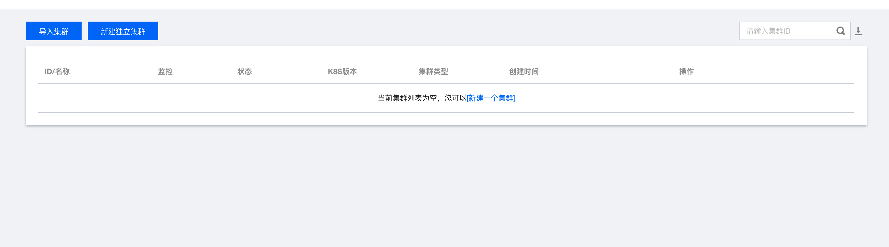
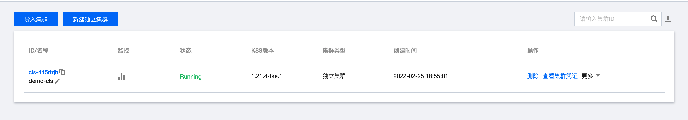
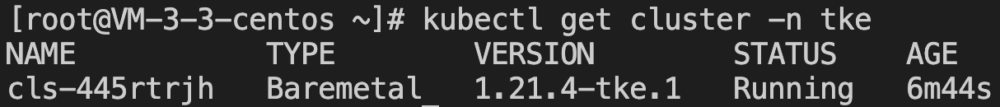

**Author**: 王龙

## 前言

[TKEStack](https://github.com/tkestack/tke) 是一个开源的企业级容器云平台，结合最前沿的先进技术，提供高度可扩展的高性能容器管理服务，可以让您轻松地在任何地方运行 Kubernetes、满足 IT 需求并为 DevOps 团队赋能。

TKEStack 提供了丰富的组件实现用户管理、访问策略管理、集群管理、业务管理、监控、日志、私有镜像库等功能，这也相应地增加了在本地安装 TKEStack 的时间。对于部分用户来说，可能只需要 TKEStack 的用户管理、集群管理、控制台访问等核心功能，但也要付出一样的时间成本。另外，TKEStack 安装过程中会在裸机上部署 global 集群，并通过 global 集群管理独立集群和导入集群的生命周期。因此对于已有的 K8s 集群，用户无法对其安装集成 TKEStack。

基于上述背景，TKEStack 在最新的 v1.9.0 release 中，支持了轻量化安装场景。用户可以实现在已有的 K8s 集群上集成 TKESatck 的用户管理、集群管理、控制台访问等核心功能。

## 前置要求

- 本文介绍的内容是建立在已有一个正常运行的 K8s 集群的基础上，并且以下的操作需要在 master 节点上进行。如果没有 K8s 集群，可以通过 [kind](https://kind.sigs.k8s.io/docs/user/quick-start/) 创建本地集群并进行以下的操作。
- 本文介绍的内容需要通过 [helm](https://helm.sh/zh/docs/) 安装 TKEStack 的核心组件，可参考 [安装手册](https://helm.sh/zh/docs/intro/install/) 安装 helm。

## 轻量化安装 TKEStack

### 1、准备安装文件

通过如下命令拉取 TKEStack 的最新代码：

```sh
git clone https://github.com/tkestack/tke.git
```

### 2、创建本地集群（已有本地集群的可跳过该步骤）

如果用户本地没有 K8s 集群，可通过 kind 进行创建。由于 kind 创建的集群实际运行在镜像容器中，为了确保 TKEStack 核心组件的端口能够从容器外部正常访问，切换到 TKEStack 代码的 `hack/lightweight-install/` 目录，执行如下命令创建集群：

```sh
kind create cluster --config kindConfig.yaml --name {your cluster name} 
```

### 3、创建指定 namespace

tke-auth、tke-platform、tke-gateway 三个核心组件需要运行在指定的 namespace 下，执行如下命令：

```sh
kubectl create namespace tke
```

### 4、安装 chart

TKEStack 提供了 chart 文件来安装 tke-auth、tke-platform、tke-gateway 三个核心组件。

切换到 TKEStack 代码的 `hack/lightweight-install/` 目录，编译二进制执行文件，用于生成安装 chart 文件所需的 `yaml` 文件：

```sh
go build -o gen
```

在 TKEStack 代码的 `hack/lightweight-install/` 目录放置了需要填写的 yaml 文件 `customConfig.yaml`。`customConfig.yaml` 文件中一些注释“必填”的参数，需要填写，其余的参数可根据需要选填，选填部分为空时会自动填充默认值。`customConfig.yaml` 内容如下：

```yaml
# 必填，etcd 访问地址，形式如 https://172.19.0.2:2379
etcd:
  host: https://172.18.0.2:2379 
# 必填，服务器内网 IP，数组形式
serverIPs:
  - 172.18.0.2
# 必填，公网可访问的 IP 地址以及要使用的域名，数组形式
dnsNames:
  - tke.gateway
# 必填，集群 front-proxy-ca.crt 文件地址，默认位置为 /etc/kubernetes/pki/front-proxy-ca.crt
frontProxyCaCrtAbsPath: /etc/kubernetes/pki/front-proxy-ca.crt
# 必填，集群 etcd 的 ca.crt 文件地址，默认位置为 /etc/kubernetes/pki/etcd/ca.crt
etcdCrtAbsPath: /etc/kubernetes/pki/etcd/ca.crt
# 必填，集群 etcd 的 ca.key文件地址，默认位置为 /etc/kubernetes/pki/etcd/ca.key
etcdKeyAbsPath: /etc/kubernetes/pki/etcd/ca.key
tke-auth:
  api:
    # 必填
    replicas: 1
    # 必填
    image: tkestack/tke-auth-api-amd64:74592a3bceb5bebca602bea21aaebf78007a3bb2
    # 必填，数组形式，auth 的重定向访问地址，包括集群服务器 IP 地址（必填）、tke-gateway 的域名（可选）、集群高可用的 VIP 地址（可选，有的话需要填写）和集群的公共可访问域名（可选，有的话需要填写）
    redirectHosts: 
      - 172.18.0.2
    enableAudit: 
    # tke-auth-api 组件在 node 上的对外暴露端口，默认31138
    nodePort: 
    # 集群的租户 id，默认 default
    tenantID: 
    # OIDC 认证方式的 secret，默认自动生成
    oIDCClientSecret: 
    # authentication 用户名，默认为 admin
    adminUsername: 
  controller:
    # 必填
    replicas: 1
    # 必填
    image: tkestack/tke-auth-controller-amd64:74592a3bceb5bebca602bea21aaebf78007a3bb2
    # 控制台登陆的用户名，默认为 admin
    adminUsername: 
    # 控制台登陆的密码，默认自动生成
    adminPassword: 
tke-platform:
  # 必填，VIP 或者公网可访问的集群 IP
  publicIP:
  metricsServerImage: metrics-server:v0.3.6
  addonResizerImage: addon-resizer:1.8.11
  api:
    # 必填
    replicas: 1
    # 必填
    image: tkestack/tke-platform-api-amd64:bc48bed59bff2022d87db5e1484481715357ee7c
    enableAuth: true
    enableAudit: 
    # OIDC 认证方式客户端 id，默认为 default
    oIDCClientID: 
    # OIDC 认证方式的 issuer_url，默认为 https://tke-auth-api/oidc
    oIDCIssuerURL: 
    # 是否开启 OIDC 认证，默认不开启，值为空
    useOIDCCA:
  controller:
    # 必填
    replicas: 1
    # 必填
    providerResImage: tkestack/provider-res-amd64:v1.21.4-1
    # 必填
    image: tkestack/tke-platform-controller-amd64:bc48bed59bff2022d87db5e1484481715357ee7c
    # 默认为 docker.io
    registryDomain:
    # 默认为 tkestack
    registryNamespace:
    # 监控存储类型，默认为 influxdb
    monitorStorageType: 
    # 监控存储地址，默认为集群 master IP 地址加8086端口
    monitorStorageAddresses:
tke-gateway:
  # 必填
  image: tkestack/tke-gateway-amd64:bc48bed59bff2022d87db5e1484481715357ee7c
  # 默认为 docker.io
  registryDomainSuffix:
  # 集群的租户 id，默认为 default
  tenantID:
  # OIDC 认证方式的 secret，默认自动生成
  oIDCClientSecret:
  # 是否开启自签名，默认为 true
  selfSigned: true
  # 第三方 cert 证书，在 selfSigned 为 false 时需要填值
  serverCrt:
  # 第三方 certKey 密钥，在 selfSigned 为 false 时需要填值
  serverKey:
  enableAuth: true
  enableBusiness:
  enableMonitor:
  enableRegistry:
  enableLogagent:
  enableAudit:
  enableApplication:
  enableMesh:

```

`customConfig.yaml` 文件中的参数填写完毕后，在当前 `hack/lightweight-install/` 目录下执行 `gen`：

```sh
./gen
```

会在同级目录生成 `auth-chart-values.yaml`、`platform-chart-values.yaml`、`gateway-chart-values.yaml` 三个 yaml 文件，分别对应三个 chart（tke-auth、tke-platform、tke-gateway）在安装时需要的 `values.yaml` 文件

在当前 `hack/lightweight-install/` 目录下进行三个核心组件的安装：

```sh
# tke-auth 的安装
helm install -f auth-chart-values.yaml tke-auth tke-auth/
```

```sh
# tke-platform 的安装
helm install -f platform-chart-values.yaml tke-platform tke-platform/
```

```sh
# tke-gateway 的安装
helm install -f gateway-chart-values.yaml tke-gateway tke-gateway/
```

通过如下命令如果能查询到三个 chart 的安装状态均为 `deployed`，则表示核心组件安装成功：

```sh
helm list
```

chart 安装完成后，可以查询到以下信息，如图所示：



### 5、修改集群 apiserver 配置

在集群对应的目录 `/etc/kubernetes/pki/` 下新建文件 `tke-authz-webhook.yaml`，文件内容如下（其中 `cluster.server` 参数中的 IP 地址需要修改为 master 的 IP 地址）：

```yaml
apiVersion: v1
kind: Config
clusters:
  - name: tke
    cluster:
      server: https://172.19.0.2:31138/auth/authz
      insecure-skip-tls-verify: true
users:
  - name: admin-cert
    user:
      client-certificate: /etc/kubernetes/pki/webhook.crt
      client-key: /etc/kubernetes/pki/webhook.key
current-context: tke
contexts:
- context:
    cluster: tke
    user: admin-cert
  name: tke
```

将二进制执行文件 `gen` 生成的 `webhook.crt` 和 `webhook.key`（位置在 TKEStack 代码下的 `hack/lightweight-install/data/` 目录）复制到集群的对应目录 `/etc/kubernetes/pki/` 下

修改 K8s 集群中 `/etc/kubernetes/mainfest/kube-apiserver.yaml` 的内容，在 `spec.containers.command` 字段增加以下两个参数：

```yaml
# 如果已有这两个参数，则将其按照以下内容修改
- --authorization-mode=Node,RBAC,Webhook
- --authorization-webhook-config-file=/etc/kubernetes/pki/tke-authz-webhook.yaml
```

### 6、创建独立集群

访问地址 `http://{公网可访问ip}/tkestack`，出现如下登陆界面，输入之前设置的用户名 `adminUsername` 和密码 `adminPassword`，如无设置，默认用户名为 `admin` ，密码为 `YWRtaW4=`。



登陆后，点击集群管理的新建独立集群：



具体的集群创建信息可参考文档[集群创建](https://tkestack.github.io/web/zh/docs/user-guide/platform-console/cluster-mgmt/#%E6%96%B0%E5%BB%BA%E7%8B%AC%E7%AB%8B%E9%9B%86%E7%BE%A4)。

创建集群完成后，可以在页面端看到如下状态：



并且可以在 master 节点上查询到独立集群的信息：



如果在创建独立集群时，Kubernetes 版本显示暂无数据，可以通过在名为 cluster-info（namespace 为 kube-public）的 configmap 中增加如下字段解决（具体字段值可参考 `hack/lightweight-install/` 目录下的 `patch.yaml` 文件）：

```sh
data:
  k8sValidVersions: '["1.21.4-tke.1","1.20.4-tke.1"]'
```

## 总结

- 本文介绍了如何基于 TKEStack 最新的 v1.9.0 release 版本在已有的 K8s 集群上轻量化安装 TKEStack，并以此集成 TKEStack 的用户管理、集群管理、控制台访问等核心功能。